# Smart Development Workflow System

Intelligent routing system that optimizes documentation time based on change complexity. Spend 2-3 minutes on simple changes, 5-8 minutes on medium complexity, 15-25 minutes only on novel features.

## TL;DR - One Command Setup

```bash
curl -fsSL https://raw.githubusercontent.com/gitfudge0/slash-commands/refs/heads/main/setup.sh | bash
```

Then use: `~/.ai-workflows/start-workflow.md "your request"`

## Quick Start

```bash
./start-workflow.md "Add pagination to user endpoints"
./start-workflow.md  # Interactive mode
```

## Workflow Overview

```mermaid
graph TB
    Start([./start-workflow.md]) --> InputCheck{Input provided?}

    %% Input Handling
    InputCheck -->|Yes| ProcessInput[Process input parameter]
    InputCheck -->|No| Prompt[Interactive prompt for input]
    Prompt --> GetInput[User provides: Description/JIRA/GitHub URL]
    ProcessInput --> Analyze[Complexity Analysis Engine]
    GetInput --> Analyze

    %% Complexity Analysis
    Analyze --> Discovery[Auto-Discovery Phase]
    Discovery --> PatternScan[Scan codebase for existing patterns]
    Discovery --> FileScan[Identify relevant files]
    Discovery --> TechScan[Analyze technology stack]

    PatternScan --> ScoreCalc[Calculate Complexity Score]
    FileScan --> ScoreCalc
    TechScan --> ScoreCalc

    %% Scoring Logic
    ScoreCalc --> ScoreFactors{<b>Scoring Factors:</b><br/>Pattern Recognition:<br/>• Existing patterns: -2pts<br/>• Extendable models: -1pt<br/>• New tech needed: +3pts<br/>• Arch changes: +2pts<br/><br/>Input Clarity:<br/>• Detailed reqs: -1pt<br/>• Vague desc: +2pts<br/>• External context: -1pt<br/><br/>Integration:<br/>• Single component: -1pt<br/>• Multiple systems: +2pts<br/>• New infrastructure: +3pts}

    ScoreFactors --> RouteDecision{Score?}

    %% Routing Decision
    RouteDecision -->|≤ 0| ExpressRoute[Route to Express Mode]
    RouteDecision -->|1-2| BalancedRoute[Route to Balanced Mode]
    RouteDecision -->|≥ 3| ComprehensiveRoute[Route to Comprehensive Mode]

    %% Express Mode Flow (2-3 minutes)
    ExpressRoute --> ExpressConfirm[Auto-Discovery Confirmation<br/>• Files to modify<br/>• Patterns found<br/>• Scope validation]
    ExpressConfirm -->|User confirms| ExpressSpec[Generate Implementation Spec<br/>• Read files in parallel<br/>• Apply existing patterns<br/>• Generate complete solution]
    ExpressSpec --> ExpressApproval[Single Approval Gate]
    ExpressApproval -->|Approved| ExpressImplement[Direct Implementation<br/>Using cached context]

    %% Express Mode Output
    ExpressImplement --> ExpressOutput[<b>Generated Content:</b><br/>📄 express-spec.md<br/>• Context analysis<br/>• Files to modify<br/>• Implementation code<br/>• Quality checklist]

    %% Balanced Mode Flow (5-8 minutes)
    BalancedRoute --> BalancedReqs[Smart Requirements Phase<br/>• 2-3 targeted questions<br/>• Multiple choice options<br/>• Pattern-based suggestions]
    BalancedReqs --> BalancedPlan[Implementation Planning<br/>• Adapt existing patterns<br/>• Identify new components<br/>• Integration strategy]
    BalancedPlan --> BalancedImplement[Guided Implementation<br/>• Generate components<br/>• Apply patterns<br/>• Integration code]

    %% Balanced Mode Output
    BalancedImplement --> BalancedOutput[<b>Generated Content:</b><br/>📄 requirements.md<br/>• EARS format requirements<br/>• Pattern analysis<br/>• Integration points<br/><br/>📄 implementation.md<br/>• Technical approach<br/>• Generated code<br/>• Testing strategy]

    %% Comprehensive Mode Flow (15-25 minutes)
    ComprehensiveRoute --> CompReqs[Comprehensive Requirements<br/>• Concept clarification<br/>• Functional deep-dive<br/>• Non-functional analysis<br/>• Research integration]
    CompReqs --> CompResearch[Research & Design Phase<br/>• Technology research<br/>• Architecture decisions<br/>• Design patterns<br/>• Integration analysis]
    CompResearch --> CompTasks[Task Breakdown<br/>• Detailed task list<br/>• Dependencies mapping<br/>• Implementation sequence<br/>• Quality gates]
    CompTasks --> CompImplement[Iterative Implementation<br/>• Task-by-task execution<br/>• Approval gates<br/>• Quality validation<br/>• Progress tracking]

    %% Comprehensive Mode Output
    CompImplement --> CompOutput[<b>Generated Content:</b><br/>📄 requirements.md<br/>• Full EARS requirements<br/>• Research findings<br/>• User stories<br/>• Acceptance criteria<br/><br/>📄 design.md<br/>• Technical architecture<br/>• Design decisions<br/>• Integration patterns<br/>• Data models<br/><br/>📄 tasks.md<br/>• Detailed task breakdown<br/>• Implementation sequence<br/>• Dependencies<br/>• Quality gates<br/><br/>📄 implementation.md<br/>• Implementation progress<br/>• Decision rationale<br/>• Quality validation<br/>• Final deliverables]

    %% Styling
    classDef expressClass fill:#e1f5fe,stroke:#01579b,stroke-width:2px
    classDef balancedClass fill:#f3e5f5,stroke:#4a148c,stroke-width:2px
    classDef comprehensiveClass fill:#fff3e0,stroke:#e65100,stroke-width:2px
    classDef analysisClass fill:#e8f5e8,stroke:#1b5e20,stroke-width:2px
    classDef outputClass fill:#fff9c4,stroke:#f57f17,stroke-width:3px

    class ExpressRoute,ExpressConfirm,ExpressSpec,ExpressApproval,ExpressImplement expressClass
    class BalancedRoute,BalancedReqs,BalancedPlan,BalancedImplement balancedClass
    class ComprehensiveRoute,CompReqs,CompResearch,CompTasks,CompImplement comprehensiveClass
    class Analyze,Discovery,PatternScan,FileScan,TechScan,ScoreCalc,ScoreFactors analysisClass
    class ExpressOutput,BalancedOutput,CompOutput outputClass
```



## Three Workflow Modes

### 🚀 Express Mode (2-3 minutes)

- **Best for**: Extensions, bug fixes, small modifications
- **Output**: 1 file (`express-spec.md`)
- **Process**: Auto-discovery → Implementation spec → Direct implementation

### ⚖️ Balanced Mode (5-8 minutes)

- **Best for**: New components with existing patterns
- **Output**: 2 files (`requirements.md` + `implementation.md`)
- **Process**: Smart requirements → Pattern analysis → Implementation

### 📚 Comprehensive Mode (15-25 minutes)

- **Best for**: Novel features, architectural changes
- **Output**: 4 files (`requirements.md`, `design.md`, `tasks.md`, `implementation.md`)
- **Process**: Full requirements → Research & design → Task breakdown → Implementation

## File Organization

```
tasks/
└── <issue-name>/           # kebab-case naming
    ├── express-spec.md     # Express mode
    ├── requirements.md     # Balanced + Comprehensive
    ├── implementation.md   # All modes
    ├── design.md          # Comprehensive only
    └── tasks.md           # Comprehensive only
```

## Examples

**Express**: `"Add pagination to user list endpoint"` → Found existing patterns → 2-minute implementation

**Balanced**: `"Add password reset functionality"` → Some patterns, new component → 6-minute implementation

**Comprehensive**: `"Add real-time chat system"` → Novel domain, new architecture → 20-minute design + implementation

