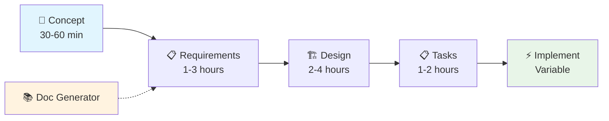

# Slash Commands - Structured Development Workflow System

A comprehensive 5-phase development process offering interactive questioning, rich documentation, and quality-focused implementation for software projects of any scale.

## 🎯 Overview

This markdown-based workflow system transforms how you approach software development by providing a structured, interactive process that ensures thorough planning and high-quality outcomes. Whether you're building a new feature, fixing a complex bug, or starting a greenfield project, this system guides you through a proven methodology that catches issues early and delivers robust solutions.

**Total Investment**: 4.5-10.5 hours for complete workflow  
**Output**: Comprehensive documentation + implementation-ready tasks  
**Approach**: Interactive questioning with user confirmation gates  

## ✨ Key Features

- 🤖 **Interactive Questioning**: Deep clarification sessions prevent requirements gaps
- 📋 **User Confirmation Gates**: Explicit approval required before document generation  
- 🎨 **Rich Visual Documentation**: Mermaid diagrams, ASCII wireframes, structured tables
- 🏗️ **Component-by-Component UI Design**: Comprehensive wireframe→flow→interactions→animations
- ⚡ **Multiple Execution Modes**: Interactive, autonomous, or custom task execution
- 📁 **Clean Organization**: All project files organized in `tasks/<issue-name>/` directories
- ✅ **Quality Gates**: Built-in validation checkpoints throughout all phases

## 🚀 Quick Start

### For Any Development Work
```bash
./concept.md → requirements.md → design.md → tasks.md → implement.md
```

### For Documentation Only
```bash
./doc-generator.md
```

**Getting Started**: Begin with `./concept.md` for any new development work. The system will guide you through comprehensive interactive questioning to ensure thorough planning.

## 🔄 The 5-Phase Development Process



### Phase 1: Concept (`concept.md`)
**Universal entry point** - Interactive problem definition and solution approach analysis
- **Duration**: 30-60 minutes
- **Output**: `tasks/<issue>/01-concept.md`
- **Process**: Problem scope, solution approach, acceptance criteria, and technical constraints
- **Prerequisites**: None (entry point)

### Phase 2: Requirements (`requirements.md`)  
**Product Requirements Document (PRD)** - Comprehensive requirements with user stories
- **Duration**: 1-3 hours
- **Output**: `tasks/<issue>/02-prd.md`
- **Process**: Functional/non-functional requirements, business rules, acceptance criteria
- **Prerequisites**: Completed concept phase

### Phase 3: Design (`design.md`)
**Technical Design Document (TDD)** - Complete system architecture and UI design
- **Duration**: 2-4 hours  
- **Output**: `tasks/<issue>/03-tdd.md`
- **Process**: System architecture, **component-by-component UI design**, API specs, data models
- **Prerequisites**: Completed concept and requirements phases

### Phase 4: Tasks (`tasks.md`)
**Implementation Planning** - User stories with subtasks and dependencies
- **Duration**: 1-2 hours
- **Output**: `tasks/<issue>/04-tasks.md` 
- **Process**: Task breakdown, dependency analysis, risk assessment, priority ordering
- **Prerequisites**: Completed phases 1-3

### Phase 5: Implementation (`implement.md`)
**Interactive Execution** - Multiple execution modes with quality gates
- **Duration**: Variable
- **Output**: `tasks/<issue>/05-*.md` + actual code changes
- **Process**: Implementation planning, task-by-task approval, real-time validation
- **Prerequisites**: Completed phases 1-4

## 📁 File Organization

### Project Structure
```
project-root/
├── README.md                    # This file
├── workflow-guide.md           # Complete process reference
├── quick-start.md              # Brief getting started
├── AGENTS.md                   # Repository guidelines
├── concept.md                  # Phase 1 command
├── requirements.md             # Phase 2 command  
├── design.md                   # Phase 3 command
├── tasks.md                    # Phase 4 command
├── implement.md                # Phase 5 command
├── doc-generator.md            # Independent README generator
└── tasks/                      # Generated project files
    └── <issue-name>/           # All files for one issue
        ├── 01-concept.md           # Problem definition
        ├── 02-prd.md               # Product requirements
        ├── 03-tdd.md               # Technical design
        ├── 04-tasks.md             # Implementation tasks
        └── 05-*.md                 # Implementation logs
```

### Issue-Based Organization
Each development effort gets its own directory:
- **Naming**: Use kebab-case (e.g., `user-authentication-system`)
- **Isolation**: Multiple issues can be developed simultaneously
- **Context**: All related documentation stays together

## 🎮 Interactive Experience

### Question Format
All phases use a consistent, easy-to-answer format:

**Select One Example:**
```
Question 1: What authentication method do you prefer?
A) JWT tokens
B) Session-based cookies  
C) OAuth integration
D) Multi-factor authentication
E) Other, I'll specify

Your answer: 1-B
```

**Select Multiple Example:**
```
Question 2: Which features are required? (Select multiple)
A) User registration
B) Password reset
C) Email verification  
D) Two-factor authentication
E) Social login
F) Other, I'll specify

Your answer: 2-A,C,D,F
```

### Logical Question Groups
Questions are organized in related groups (3-5 questions per group) for efficiency:
- **Phase 1**: Problem Definition & Solution Approach
- **Phase 2**: Authentication & Security, User Management, Business Rules
- **Phase 3**: Architecture & Tech Stack, UI Components, API Design, Data Models
- **Phase 4**: Task Breakdown, Dependencies, Risk Assessment

### Phase Progression 
Between each group and major sections:
```
Question 5: ✓ Authentication requirements complete. 
Ready to move on to user registration requirements? (Y/N)
```

## 🎨 Component-by-Component UI Design

**Imperative Process** - Must complete all identified UI components:

```
UI Components Identified: Login Form, User Dashboard, Settings Panel (3 components)

Working on component 1 of 3: Login Form
- Wireframe design for Login Form... ✓
- User flow for Login Form... ✓  
- Interactions for Login Form... ✓
- Animations for Login Form... ✓

Question: Component 1 complete. Ready for component 2 of 3: User Dashboard? (Y/N)
```

Each component receives complete wireframe→flow→interactions→animations treatment before proceeding.

## 📊 Rich Documentation Features

### Visual Elements
- **Mermaid Diagrams**: Architecture flows, user journeys, dependency graphs
- **ASCII Wireframes**: UI layouts, system diagrams, data flows  
- **Structured Tables**: Requirements matrices, API specifications, task breakdowns
- **Progress Indicators**: Implementation tracking, quality gates, completion status

### Documentation Standards
- **File Naming**: kebab-case for all files (`phase-name.md`, `issue-name/`)
- **Markdown Structure**: `# Phase Name` for main headings, `## Section`, `### Subsection`
- **Content Quality**: Rich documentation with visual elements, complete coverage, no gaps
- **Validation Logic**: Each phase validates prerequisites with clear error messages

## ⚡ Implementation Modes

### Interactive Mode (Recommended)
- Task-by-task approval and modification
- Real-time validation and quality gates
- Maximum quality assurance
- Ideal for complex or unfamiliar work

### Autonomous Mode
- Automated execution with comprehensive logging
- Faster completion for well-understood tasks
- Complete audit trail maintained

### Custom Mode
- Selective task execution
- User-defined priority ordering
- Flexible workflow adaptation

## 🛠️ Supporting Tools

### Doc Generator (`doc-generator.md`)
**Independent README generation** for any directory:
- Comprehensive project analysis
- Technology detection (languages, frameworks, infrastructure)
- Interactive documentation planning
- Multiple README styles and templates
- No workflow dependencies

**Usage:**
```bash
./doc-generator.md
# Analyzes current directory and generates README.md
```

### Workflow Guide (`workflow-guide.md`)
Complete reference documentation covering:
- Detailed process descriptions
- Best practices and tips
- Troubleshooting guidance
- Advanced usage patterns

## 🎯 Use Cases

### ✅ Perfect For
- **New Feature Development**: Complete planning through implementation
- **Complex Bug Fixes**: Root cause analysis and systematic resolution
- **System Architecture**: Comprehensive design and implementation planning
- **UI/UX Projects**: Component-by-component design and development
- **API Development**: Specification through testing and deployment
- **Team Projects**: Standardized process and comprehensive documentation

### ✅ Also Great For  
- **Solo Development**: Structured approach prevents oversight
- **Learning Projects**: Methodical skill building and documentation
- **Client Work**: Professional process and deliverable documentation
- **Open Source**: Consistent contribution process and documentation

## 🌟 Benefits

### For Developers
- **Reduced Rework**: Thorough planning catches issues early
- **Better Documentation**: Rich, visual documentation that stays current
- **Skill Development**: Learn structured development methodologies
- **Quality Assurance**: Built-in validation and testing checkpoints

### For Teams
- **Consistent Process**: Standardized approach across all team members
- **Knowledge Sharing**: Comprehensive documentation enables collaboration
- **Parallel Development**: Clean separation allows simultaneous work streams
- **Stakeholder Communication**: Rich documentation improves understanding

### For Projects
- **Predictable Outcomes**: Structured approach reduces surprises
- **Maintainable Code**: Thorough design leads to better architecture
- **Complete Documentation**: Everything documented from concept to implementation
- **Quality Focus**: Multiple validation gates ensure high standards

## 🚦 Getting Started Examples

### Example 1: New User Authentication System
```bash
# Phase 1: Define the authentication problem
./concept.md
# Issue name: "user-authentication-system"
# → Creates: tasks/user-authentication-system/01-concept.md

# Phase 2: Detail authentication requirements  
./requirements.md
# → Creates: tasks/user-authentication-system/02-prd.md

# Phase 3: Design system architecture + UI components
./design.md
# → Creates: tasks/user-authentication-system/03-tdd.md

# Phase 4: Break down implementation tasks
./tasks.md
# → Creates: tasks/user-authentication-system/04-tasks.md

# Phase 5: Execute with quality gates
./implement.md
# → Creates: tasks/user-authentication-system/05-*.md + code
```

### Example 2: Bug Fix for Payment Processing
```bash
./concept.md
# Issue name: "payment-timeout-bug"
# Analyze root cause and define solution approach

./requirements.md  
# Define fix requirements and validation criteria

./design.md
# Plan technical changes and testing approach

./tasks.md
# Break down debugging and fix implementation

./implement.md
# Execute fix with comprehensive testing
```

### Example 3: Quick Documentation
```bash
./doc-generator.md
# Analyzes current project and generates comprehensive README.md
# Independent of main workflow - perfect for existing projects
```

## 📚 Best Practices

### Workflow Excellence
1. **Never Skip Phases**: Each phase builds critical context
2. **Complete All Questions**: Thorough input leads to superior outcomes
3. **Use Confirmation Gates**: Review before proceeding to next phase
4. **Choose Interactive Mode**: For complex or unfamiliar work
5. **Maintain Organization**: Keep issue directories clean and organized

### Quality Assurance
1. **Validate Early**: Review generated documentation before proceeding
2. **Test Assumptions**: Use built-in validation checkpoints
3. **Iterate When Needed**: Return to earlier phases as requirements evolve
4. **Document Decisions**: Rich documentation captures reasoning
5. **Quality Gates**: Don't skip validation and testing steps

### Team Collaboration  
1. **Consistent Naming**: Use kebab-case for clear organization
2. **Stakeholder Review**: Share appropriate phase outputs for feedback
3. **Parallel Development**: Multiple team members can work on different issues
4. **Knowledge Base**: Generated documentation serves the entire team
5. **Context Preservation**: All issue context stays organized and accessible

## 🆘 Support & Documentation

- 📖 **Complete Guide**: See `workflow-guide.md` for comprehensive reference
- 🚀 **Quick Reference**: Check `quick-start.md` for rapid navigation
- 🔧 **System Guidelines**: Review `AGENTS.md` for technical details
- 📚 **Independent Documentation**: Use `doc-generator.md` for README creation

## 📄 System Requirements

- **Platform**: Any system with markdown support
- **Dependencies**: None (pure markdown workflow)
- **Build System**: Not required
- **Testing**: Execute phases in sequence on sample issues  
- **Validation**: Manual review of generated markdown structure

## 🏗️ Built With

- **Pure Markdown**: No external dependencies
- **Interactive Bash Scripts**: For questioning and validation
- **Mermaid Diagrams**: For visual documentation
- **ASCII Art**: For wireframes and system diagrams
- **Structured Templates**: For consistent documentation output

---

**Start your next project with confidence using structured development workflows that deliver quality outcomes every time.**

🚀 **Ready to begin?** Run `./concept.md` to start your first structured development workflow.