# Slash Commands - Structured Development Workflow System

A 5-phase development process with interactive questioning and comprehensive documentation for software projects.

## Overview

This markdown-based workflow system provides structured development through five sequential phases, ensuring thorough planning and quality outcomes.

**Time**: 4.5-10.5 hours total | **Output**: Complete documentation + implementation-ready tasks

## Quick Start

```bash
./concept.md → requirements.md → design.md → tasks.md → implement.md
```

**Start here**: Run `./concept.md` for any new development work. The system guides you through interactive questioning.

## 5-Phase Process

```mermaid
flowchart LR
    A[📝 Concept<br/>30-60 min] --> B[📋 Requirements<br/>1-3 hours]
    B --> C[🏗️ Design<br/>2-4 hours]  
    C --> D[📋 Tasks<br/>1-2 hours]
    D --> E[⚡ Implement<br/>Variable]
```



### Phase 1: Concept (`concept.md`)
- **Purpose**: Problem definition and solution approach
- **Duration**: 30-60 minutes
- **Output**: `tasks/<issue>/01-concept.md`

### Phase 2: Requirements (`requirements.md`)
- **Purpose**: Product Requirements Document with user stories
- **Duration**: 1-3 hours  
- **Output**: `tasks/<issue>/02-prd.md`

### Phase 3: Design (`design.md`)
- **Purpose**: Technical architecture and UI component design
- **Duration**: 2-4 hours
- **Output**: `tasks/<issue>/03-tdd.md`

### Phase 4: Tasks (`tasks.md`)
- **Purpose**: Implementation planning with dependencies
- **Duration**: 1-2 hours
- **Output**: `tasks/<issue>/04-tasks.md`

### Phase 5: Implementation (`implement.md`)
- **Purpose**: Interactive execution with quality gates
- **Duration**: Variable
- **Output**: `tasks/<issue>/05-*.md` + code changes

## File Organization

Each project gets organized in `tasks/<issue-name>/` directories:

```
tasks/
└── user-authentication-system/     # kebab-case naming
    ├── 01-concept.md               # Problem definition
    ├── 02-prd.md                   # Requirements
    ├── 03-tdd.md                   # Technical design
    ├── 04-tasks.md                 # Implementation tasks
    └── 05-*.md                     # Implementation logs
```

## Interactive Features

### Question Format
Easy-to-answer format with consistent responses:

```
Question 1: What authentication method?
A) JWT tokens
B) Session cookies
C) OAuth integration  
D) Multi-factor auth
E) Other, I'll specify

Your answer: 1-B
```

### Multiple Selection
```
Question 2: Required features? (Select multiple)
A) User registration
B) Password reset
C) Email verification

Your answer: 2-A,C
```

## Key Features

- **Interactive Questioning**: Prevents requirements gaps
- **User Confirmation Gates**: Approval required between phases
- **Rich Documentation**: Mermaid diagrams, ASCII wireframes, tables
- **Component-by-Component UI Design**: Complete wireframe→flow→interactions→animations
- **Quality Gates**: Built-in validation checkpoints
- **Multiple Execution Modes**: Interactive, autonomous, or custom

## Getting Started Example

```bash
# New authentication system
./concept.md
# Issue name: "user-authentication-system" 
# → Creates: tasks/user-authentication-system/01-concept.md

./requirements.md
# → Creates: tasks/user-authentication-system/02-prd.md

./design.md  
# → Creates: tasks/user-authentication-system/03-tdd.md

./tasks.md
# → Creates: tasks/user-authentication-system/04-tasks.md

./implement.md
# → Creates: tasks/user-authentication-system/05-*.md + code
```

## Supporting Tools

### Doc Generator (`doc-generator.md`)
Independent README generation for any project - no workflow dependencies required.

```bash
./doc-generator.md
# Analyzes current directory and generates README.md
```

## Best Practices

1. **Never Skip Phases** - Each builds critical context
2. **Complete All Questions** - Thorough input = better outcomes  
3. **Use Confirmation Gates** - Review before proceeding
4. **Choose Interactive Mode** - For complex/unfamiliar work
5. **Maintain Clean Organization** - Use kebab-case naming

## System Requirements

- **Platform**: Any system with markdown support
- **Dependencies**: None (pure markdown workflow)
- **Testing**: Execute phases in sequence on sample issues

---

🚀 **Ready to begin?** Run `./concept.md` to start your first structured development workflow.