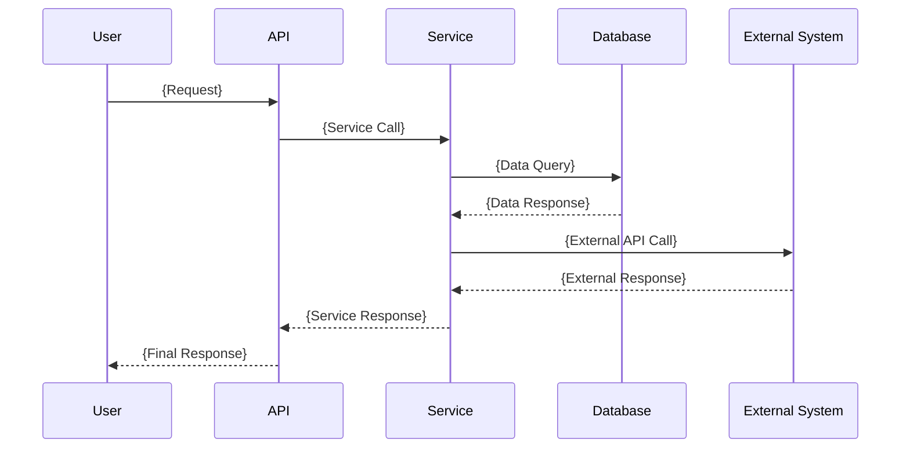
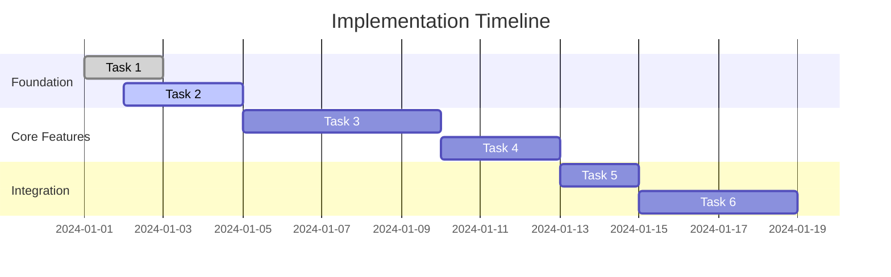

# Comprehensive Development Workflow

## Overview
Full-featured workflow for novel features, architectural changes, and complex integrations requiring research, comprehensive design, and systematic implementation. Based on proven spec-driven development methodology.

**Target Time**: 15-25 minutes total
**Best For**: New feature domains, architectural changes, complex integrations, features requiring research

## Prerequisites  
- Routed here by start-workflow.md with complexity score ≥ 3
- Novel feature domain with limited existing patterns
- Significant unknowns requiring research and comprehensive planning

## Process

### Phase 1: Comprehensive Requirements (5-8 minutes)
Generate detailed EARS requirements with research integration and systematic clarification.

### Phase 2: Research & Design (5-10 minutes)
Conduct targeted research and create comprehensive technical design document.

### Phase 3: Task Breakdown (3-5 minutes)
Create detailed implementation plan with dependencies and sequencing.

### Phase 4: Iterative Implementation (2-5 minutes per task)
Execute tasks one-by-one with approval gates and quality validation.

## Generated Files

Creates four files in `tasks/{issue-name}/`:
1. `requirements.md` - Full EARS requirements with research
2. `design.md` - Technical design with architecture decisions  
3. `tasks.md` - Detailed task breakdown with dependencies
4. `implementation.md` - Implementation execution log

## Phase 1: Comprehensive Requirements

### Interactive Requirements Process
```
I'll help you develop comprehensive requirements for this novel feature.

Let me start by understanding the core concept, then systematically explore each aspect.

Concept Clarification (2-3 questions):
1. {High-level feature understanding question}
2. {Core use cases and user roles question}  
3. {Success criteria and business value question}

[User provides answers]

Functional Requirements Deep-dive (4-6 questions):
4. {Core functionality details}
5. {User interaction patterns}
6. {Data management requirements}
7. {Integration with existing systems}

[User provides answers]

Non-Functional Requirements (3-4 questions):
8. {Performance and scalability needs}
9. {Security and compliance requirements}
10. {Error handling and edge cases}

[User provides answers]

Validation & Acceptance (1-2 questions):
11. {Success measurement criteria}
12. {Acceptance testing approach}
```

### Comprehensive Requirements Template

```markdown
# Comprehensive Requirements: {Feature Name}

## Executive Summary
{High-level overview of the feature, its purpose, and business value}

## Research Context
**Domain Analysis**:
- {Research finding 1}: {Source and implications}
- {Research finding 2}: {Source and implications}
- {Research finding 3}: {Source and implications}

**Technology Investigation**:
- {Technology option 1}: {Pros/cons analysis}
- {Technology option 2}: {Pros/cons analysis}  
- **Recommended Approach**: {Choice with reasoning}

**Existing Patterns Assessment**:
- {Pattern 1}: {Available but needs adaptation for {reasons}}
- {Pattern 2}: {Not applicable because {reasons}}
- **New Patterns Needed**: {List of novel patterns to create}

## Stakeholder Analysis
**Primary Users**:
- {User type 1}: {Needs and expectations}
- {User type 2}: {Needs and expectations}

**Secondary Stakeholders**:
- {Stakeholder 1}: {Requirements and constraints}
- {Stakeholder 2}: {Requirements and constraints}

## Functional Requirements

### FR-001: {Core Feature Category}
**User Story**: As a {detailed role description}, I want {comprehensive feature description}, so that {detailed business benefit}

**Detailed Acceptance Criteria (EARS Format)**:
1. WHEN {specific trigger event with context} THEN system SHALL {detailed expected response} AND {additional system behavior}
2. IF {precondition with specific parameters} THEN system SHALL {primary response} AND SHALL NOT {forbidden behavior}
3. WHEN {edge case scenario} THEN system SHALL {fallback behavior} AND SHALL {recovery action}
4. IF {error condition} THEN system SHALL {error handling} AND SHALL {user notification} AND SHALL {logging action}
5. WHEN {performance condition} THEN system SHALL {performance requirement} WITHIN {specific timeframe}

**Business Rules**:
- {Business rule 1}: {Detailed description and rationale}
- {Business rule 2}: {Detailed description and rationale}
- {Business rule 3}: {Detailed description and rationale}

### FR-002: {Secondary Feature Category}
**User Story**: As a {role}, I want {feature}, so that {benefit}

**Detailed Acceptance Criteria (EARS Format)**:
1. WHEN {trigger} THEN system SHALL {response} following {specific standards or protocols}
2. IF {condition} THEN system SHALL {behavior} consistent with {existing system behavior where applicable}
3. WHEN {integration scenario} THEN system SHALL {integration behavior} using {specified integration method}

[Additional functional requirements continue...]

## Non-Functional Requirements

### NFR-001: Performance Requirements
- **Response Time**: {Specific timing requirements with measurement conditions}
- **Throughput**: {Capacity requirements with load specifications}
- **Scalability**: {Growth expectations and scaling strategy}

### NFR-002: Security Requirements  
- **Authentication**: {Authentication approach and standards}
- **Authorization**: {Access control requirements and role definitions}
- **Data Protection**: {Data security and privacy requirements}
- **Compliance**: {Regulatory and compliance requirements}

### NFR-003: Reliability & Availability
- **Uptime**: {Availability requirements and acceptable downtime}
- **Error Handling**: {Error recovery and graceful degradation requirements}
- **Data Integrity**: {Data consistency and backup requirements}

### NFR-004: Usability & Accessibility
- **User Experience**: {UX requirements and usability standards}
- **Accessibility**: {Accessibility compliance requirements}
- **Internationalization**: {Multi-language and localization requirements}

## Integration Requirements

### INT-001: External System Integration
**System**: {External system name}
**Integration Type**: {API, webhook, batch, etc.}
**Requirements**: 
1. WHEN {integration trigger} THEN system SHALL {integration behavior} using {specified protocol}
2. IF {integration failure} THEN system SHALL {failure handling} and {recovery process}

### INT-002: Internal System Integration  
**System**: {Internal system/module name}
**Integration Points**: {Specific integration points and data flows}
**Requirements**:
1. WHEN {internal trigger} THEN system SHALL {integration response} maintaining {data consistency requirements}

## Data Requirements

### Data Models
**Primary Entities**:
- {Entity 1}: {Attributes, relationships, constraints}
- {Entity 2}: {Attributes, relationships, constraints}

**Data Relationships**:
- {Relationship 1}: {Description and cardinality}
- {Relationship 2}: {Description and cardinality}

### Data Management
- **Storage**: {Storage requirements and technology}
- **Backup**: {Backup strategy and retention}
- **Migration**: {Data migration requirements if applicable}

## Assumptions & Constraints

### Assumptions
- {Assumption 1}: {Description and impact if invalid}
- {Assumption 2}: {Description and impact if invalid}
- {Assumption 3}: {Description and impact if invalid}

### Constraints  
- **Technical**: {Technical limitations and their implications}
- **Business**: {Business constraints and their impact}
- **Resource**: {Resource limitations and workarounds}
- **Timeline**: {Time constraints and their implications}

## Success Criteria & Metrics

### Primary Success Metrics
- {Metric 1}: {Measurement method and target value}
- {Metric 2}: {Measurement method and target value}
- {Metric 3}: {Measurement method and target value}

### Secondary Success Metrics
- {Metric 1}: {Measurement method and target value}
- {Metric 2}: {Measurement method and target value}

## Acceptance Testing Strategy
**Testing Approach**: {Overall testing strategy}
**Test Categories**:
- **Unit Testing**: {Unit test requirements and coverage}
- **Integration Testing**: {Integration test approach and scenarios}
- **System Testing**: {End-to-end testing strategy}
- **User Acceptance Testing**: {UAT approach and criteria}

## Risk Assessment
**High-Risk Areas**:
- {Risk 1}: {Description, impact, mitigation strategy}
- {Risk 2}: {Description, impact, mitigation strategy}

**Medium-Risk Areas**:
- {Risk 1}: {Description, impact, mitigation strategy}
- {Risk 2}: {Description, impact, mitigation strategy}
```

## Phase 2: Research & Design

### Research Integration Process
```
Conducting targeted research for your feature requirements...

Research Areas Identified:
1. {Technology/approach research needed}
2. {Integration pattern research needed}  
3. {Security/compliance research needed}
4. {Performance optimization research needed}

[System conducts research and presents findings]

Key Research Findings:
✓ {Finding 1}: {Implications for design}
✓ {Finding 2}: {Implications for architecture}
✓ {Finding 3}: {Implications for implementation}

Ready to proceed with design based on these findings? (Y/N): ___
```

### Comprehensive Design Template

```markdown
# Comprehensive Design: {Feature Name}

## Design Overview
**Architecture Philosophy**: {High-level architectural approach and reasoning}
**Design Principles**: {Key principles guiding the design decisions}
**Research Integration**: {How research findings influenced the design}

## System Architecture

### High-Level Architecture
```mermaid
graph TB
    subgraph "Client Layer"
        A[{Client Component 1}]
        B[{Client Component 2}]
    end
    
    subgraph "API Layer"  
        C[{API Component 1}]
        D[{API Component 2}]
    end
    
    subgraph "Business Logic Layer"
        E[{Service 1}]
        F[{Service 2}]
        G[{Service 3}]
    end
    
    subgraph "Data Layer"
        H[{Data Store 1}]
        I[{Data Store 2}]
    end
    
    subgraph "External Systems"
        J[{External System 1}]
        K[{External System 2}]
    end
    
    A --> C
    B --> D
    C --> E
    D --> F
    E --> H
    F --> I
    E --> J
    G --> K
```

### Component Architecture
**Core Components**:
1. **{Component Name}**
   - **Responsibility**: {What this component does}
   - **Interface**: {Public interface/API}
   - **Dependencies**: {What it depends on}
   - **Technology**: {Technology choice and reasoning}

2. **{Component Name}**
   - **Responsibility**: {What this component does}
   - **Interface**: {Public interface/API}  
   - **Dependencies**: {What it depends on}
   - **Technology**: {Technology choice and reasoning}

### Data Flow Architecture  


## Detailed Component Design

### {Component 1 Name}
**Purpose**: {Detailed description of component purpose and role}

**Interface Design**:
```{language}
{Detailed interface/API specification with methods, parameters, return types}
```

**Implementation Strategy**:
- **Design Pattern**: {Pattern choice and reasoning}
- **Key Algorithms**: {Important algorithmic decisions}
- **Performance Considerations**: {Performance optimizations and trade-offs}
- **Error Handling**: {Error handling strategy}

**Dependencies & Integration**:
- **Internal Dependencies**: {What it depends on within the system}
- **External Dependencies**: {External libraries or services}
- **Integration Points**: {How it connects to other components}

### {Component 2 Name}
[Similar detailed breakdown for each major component]

## Database Design

### Entity Relationship Model
```mermaid
erDiagram
    {Entity1} {
        {type} {attribute1}
        {type} {attribute2}
        {type} {attribute3}
    }
    
    {Entity2} {
        {type} {attribute1}
        {type} {attribute2}
    }
    
    {Entity3} {
        {type} {attribute1}
        {type} {attribute2}
        {type} {attribute3}
        {type} {attribute4}
    }
    
    {Entity1} ||--o{ {Entity2} : {relationship}
    {Entity2} }o--|| {Entity3} : {relationship}
```

### Data Model Specifications
**{Entity 1}**:
- **Purpose**: {What this entity represents}
- **Attributes**: 
  - `{attribute1}` ({type}): {Description and constraints}
  - `{attribute2}` ({type}): {Description and constraints}
- **Relationships**: {Relationships to other entities}
- **Indexes**: {Required indexes for performance}
- **Constraints**: {Business rules and data constraints}

[Detailed specifications for each entity]

## API Design

### RESTful API Specification
**Base URL**: `{base_url}`
**Authentication**: {Authentication method and requirements}

#### Endpoints

**{HTTP Method} {endpoint_path}**
- **Purpose**: {What this endpoint does}
- **Parameters**:
  - `{param1}` ({type}, {required/optional}): {Description}
  - `{param2}` ({type}, {required/optional}): {Description}
- **Request Body**: 
```json
{
  "{field1}": "{type and description}",
  "{field2}": "{type and description}"
}
```
- **Response**:
```json
{
  "{response_field1}": "{type and description}",
  "{response_field2}": "{type and description}"
}
```
- **Error Responses**: {Possible error codes and meanings}

[Detailed specifications for each endpoint]

## Security Design

### Authentication & Authorization
**Authentication Method**: {Method and implementation details}
**Authorization Strategy**: {RBAC, ABAC, etc. with implementation}
**Token Management**: {Token lifecycle and security}

### Data Security
**Data Classification**: {How data is classified and protected}
**Encryption**: {Encryption at rest and in transit}
**Data Privacy**: {Privacy protection measures}

### Security Controls
- **Input Validation**: {Validation strategy and implementation}
- **Output Encoding**: {Encoding strategy for XSS prevention}
- **SQL Injection Prevention**: {Prevention measures}
- **CSRF Protection**: {CSRF prevention strategy}

## Performance Design

### Performance Requirements
- **Response Time Targets**: {Specific targets for different operations}
- **Throughput Targets**: {Requests per second or transactions per minute}
- **Scalability Targets**: {Expected growth and scaling strategy}

### Performance Optimizations
- **Caching Strategy**: {What to cache and how}
- **Database Optimization**: {Query optimization and indexing}
- **Load Balancing**: {Load distribution strategy}
- **CDN Strategy**: {Content delivery optimization}

## Error Handling & Monitoring

### Error Handling Strategy
**Error Categories**:
- **System Errors**: {How system errors are handled}
- **Business Logic Errors**: {How business rule violations are handled}
- **Integration Errors**: {How external system failures are handled}

### Monitoring & Logging
**Key Metrics**: {What metrics to track}
**Logging Strategy**: {What to log and how}
**Alerting**: {When and how to alert on issues}

## Testing Strategy

### Testing Pyramid
- **Unit Tests**: {Coverage and approach for unit testing}
- **Integration Tests**: {Integration testing strategy}  
- **System Tests**: {End-to-end testing approach}
- **Performance Tests**: {Performance testing strategy}

### Test Data Strategy
**Test Data Requirements**: {What test data is needed}
**Data Generation**: {How test data will be created and managed}
**Data Privacy**: {How to protect sensitive data in testing}

## Deployment Design

### Deployment Architecture
**Environment Strategy**: {Development, staging, production environments}
**Deployment Pipeline**: {CI/CD pipeline design}
**Infrastructure**: {Infrastructure requirements and setup}

### Configuration Management
**Configuration Strategy**: {How configuration is managed across environments}
**Secret Management**: {How secrets and credentials are managed}
**Feature Flags**: {Feature flag strategy if applicable}

## Migration & Rollback Strategy

### Data Migration
**Migration Strategy**: {How existing data will be migrated if applicable}
**Migration Testing**: {How migration will be tested}
**Rollback Plan**: {How to rollback migration if needed}

### Feature Rollback
**Rollback Strategy**: {How to rollback the feature if issues arise}
**Monitoring**: {What to monitor to determine if rollback is needed}
**Communication**: {How rollback will be communicated}

## Design Decisions & Trade-offs

### Key Design Decisions
1. **{Decision 1}**: 
   - **Options Considered**: {Alternative approaches}
   - **Decision**: {Chosen approach}
   - **Reasoning**: {Why this approach was chosen}
   - **Trade-offs**: {What was sacrificed}

2. **{Decision 2}**:
   [Similar breakdown for each major decision]

### Future Considerations
**Potential Enhancements**: {Features that could be added in the future}
**Scalability Considerations**: {How the design can scale}
**Technology Evolution**: {How the design can adapt to new technologies}
```

## Phase 3: Task Breakdown

### Task Generation Process
```
Converting design into actionable implementation tasks...

Analyzing component dependencies...
✓ Identified {N} core components
✓ Mapped {N} integration points  
✓ Found {N} external dependencies

Generating task sequence based on dependencies...
✓ Foundation tasks: {N} tasks
✓ Core feature tasks: {N} tasks
✓ Integration tasks: {N} tasks  
✓ Validation tasks: {N} tasks

Creating detailed task breakdown with acceptance criteria...
```

### Comprehensive Tasks Template

```markdown
# Comprehensive Implementation Tasks: {Feature Name}

## Implementation Strategy
**Development Approach**: {Overall approach - TDD, incremental, etc.}
**Task Sequencing**: {How tasks are ordered and why}
**Quality Gates**: {Quality checkpoints throughout implementation}

## Task Dependencies


## Foundation Phase

### Task 1: Project Structure & Core Interfaces
**Objective**: Establish foundational project structure and define core interfaces that establish system boundaries

**Detailed Implementation**:
- Create directory structure for {specific modules/components}
- Define TypeScript interfaces for {specific data models}
- Set up configuration files for {specific tools/frameworks}
- Establish coding standards and linting rules

**Acceptance Criteria**:
- [ ] Directory structure follows {specific pattern} established in design
- [ ] All core interfaces defined with proper TypeScript definitions
- [ ] Configuration files validate without errors
- [ ] Linting rules enforce {specific coding standards}

**Requirements Reference**: FR-001.1, FR-001.2, NFR-001.1
**Estimated Effort**: {Time estimate}
**Dependencies**: None
**Risk Level**: Low

### Task 2: Database Schema & Models
**Objective**: Implement database schema and data models with validation and relationships

**Detailed Implementation**:
- Create database migration files for {specific entities}
- Implement data model classes with validation
- Set up relationships between entities
- Create database indexes for performance

**Acceptance Criteria**:
- [ ] Database migrations run successfully without errors
- [ ] All entity relationships work as designed
- [ ] Data validation prevents invalid data entry
- [ ] Database indexes improve query performance as measured

**Requirements Reference**: FR-002.1, FR-002.3, NFR-002.1
**Estimated Effort**: {Time estimate}  
**Dependencies**: Task 1
**Risk Level**: Medium

[Continue with detailed tasks...]

## Core Features Phase

### Task 5: {Core Feature Component}
**Objective**: Implement primary feature functionality with comprehensive error handling

**Detailed Implementation**:
- Implement {specific service/component} following design specifications
- Add comprehensive input validation and sanitization  
- Implement error handling with appropriate logging
- Create unit tests with {specific coverage percentage}

**Acceptance Criteria**:
- [ ] {Feature functionality} works as specified in requirements
- [ ] All input validation prevents malicious or invalid data
- [ ] Error conditions are handled gracefully with appropriate user feedback
- [ ] Unit tests achieve {percentage}% code coverage
- [ ] Performance meets {specific metric} under {specific load}

**Requirements Reference**: FR-003.1, FR-003.2, NFR-003.1
**Estimated Effort**: {Time estimate}
**Dependencies**: Tasks 1, 2, 3
**Risk Level**: High

[Continue with all implementation tasks...]

## Integration Phase

### Task 12: External System Integration
**Objective**: Integrate with {specific external system} using {specific protocol/API}

**Detailed Implementation**:
- Implement integration layer with {external system}
- Add authentication and authorization for external API
- Implement retry logic and circuit breaker pattern
- Add comprehensive error handling for integration failures

**Acceptance Criteria**:
- [ ] Integration authenticates successfully with external system
- [ ] Data flows correctly between systems in both directions
- [ ] Integration handles failures gracefully with appropriate fallbacks
- [ ] Circuit breaker prevents cascade failures
- [ ] Integration performance meets {specific SLA requirements}

**Requirements Reference**: INT-001.1, INT-001.2, NFR-004.2
**Estimated Effort**: {Time estimate}
**Dependencies**: Tasks 5, 7, 9
**Risk Level**: High

[Continue with integration tasks...]

## Validation & Quality Phase

### Task 18: Comprehensive Testing Suite
**Objective**: Create comprehensive test suite covering all functionality with automated execution

**Detailed Implementation**:
- Create unit tests for all components with {coverage percentage}
- Implement integration tests for all API endpoints
- Create end-to-end tests for complete user workflows
- Set up automated test execution in CI/CD pipeline

**Acceptance Criteria**:
- [ ] Unit tests achieve {percentage}% code coverage
- [ ] Integration tests validate all API contracts
- [ ] End-to-end tests cover all primary user workflows
- [ ] Tests run automatically on code changes
- [ ] Test suite completes in under {time limit}

**Requirements Reference**: All functional requirements
**Estimated Effort**: {Time estimate}
**Dependencies**: All implementation tasks
**Risk Level**: Medium

### Task 19: Performance & Security Validation
**Objective**: Validate performance meets requirements and security controls are effective

**Detailed Implementation**:
- Run performance tests under expected load conditions
- Conduct security testing including penetration testing
- Validate all security controls are working as designed
- Create performance and security monitoring dashboards

**Acceptance Criteria**:
- [ ] Performance tests demonstrate {specific metrics} under {specific load}
- [ ] Security tests find no critical vulnerabilities
- [ ] All security controls validated as effective
- [ ] Monitoring dashboards provide real-time visibility

**Requirements Reference**: NFR-001, NFR-002, NFR-003
**Estimated Effort**: {Time estimate}
**Dependencies**: Task 18, all implementation tasks
**Risk Level**: Medium

## Deployment & Go-Live Phase

### Task 20: Production Deployment
**Objective**: Deploy feature to production with monitoring and rollback capability

**Detailed Implementation**:
- Deploy to staging environment for final validation
- Execute production deployment with feature flags
- Validate all functionality in production environment
- Monitor system performance and error rates

**Acceptance Criteria**:
- [ ] Staging deployment validates successfully
- [ ] Production deployment completes without errors
- [ ] All functionality verified in production
- [ ] Monitoring shows healthy system metrics
- [ ] Rollback plan tested and ready if needed

**Requirements Reference**: All requirements
**Estimated Effort**: {Time estimate}
**Dependencies**: All previous tasks
**Risk Level**: High

## Task Execution Guidelines

### Quality Gates
Each task must pass these quality gates before proceeding:
- [ ] Code review approved by {reviewer requirements}
- [ ] All tests passing (unit, integration, relevant e2e)
- [ ] Security scan shows no new vulnerabilities
- [ ] Performance impact assessed and acceptable
- [ ] Documentation updated for changes

### Risk Mitigation
**High-Risk Tasks**: {List of high-risk tasks and mitigation strategies}
**Contingency Plans**: {Backup plans for high-risk scenarios}
**Rollback Procedures**: {How to rollback changes if issues arise}

### Communication Plan
**Progress Updates**: {How progress will be communicated}
**Issue Escalation**: {When and how to escalate issues}
**Stakeholder Communication**: {How stakeholders will be kept informed}
```

## Phase 4: Iterative Implementation

### Task Execution Process
```
Ready to begin implementation of Task 1: {Task Name}

Task Details:
- Objective: {Task objective}
- Acceptance Criteria: {Criteria list}
- Estimated Effort: {Time estimate}
- Dependencies: {Dependencies status}

Proceed with Task 1 implementation? (Y/N): ___

[After user confirms]

Implementing Task 1...
{Implementation details and code generation}

Task 1 Complete. 
✓ All acceptance criteria met
✓ Quality gates passed
✓ Ready for next task

Review implementation and approve to continue to Task 2? (Y/N): ___
```

## Key Features

### Research Integration
- **Targeted Research**: Conducts research specific to novel aspects of the feature
- **Source Citations**: Provides sources and links for research findings
- **Design Impact**: Shows how research findings influence design decisions
- **Technology Evaluation**: Compares technology options with pros/cons analysis

### Comprehensive Documentation
- **Complete Requirements**: EARS format with edge cases and error conditions
- **Detailed Design**: Architecture diagrams, component specifications, data models
- **Implementation Roadmap**: Task breakdown with dependencies and risk assessment
- **Quality Assurance**: Built-in testing strategy and quality gates

### Systematic Implementation
- **Task-by-Task Execution**: Implement one task at a time with approval gates
- **Quality Validation**: Each task includes acceptance criteria and quality gates
- **Risk Management**: High-risk tasks identified with mitigation strategies
- **Progress Tracking**: Clear progress indicators and completion validation

### Approval Gates & Control
- **Three Approval Gates**: Requirements, Design, Tasks (before implementation)
- **Task-Level Approval**: User approves each task before proceeding to next
- **Quality Gates**: Automated quality checks at each stage
- **Rollback Capability**: Can return to earlier phases if issues discovered

## Success Criteria
- **Comprehensive Coverage**: All aspects of complex feature thoroughly planned
- **Quality Implementation**: Generated code requires <5% manual corrections
- **Risk Mitigation**: High-risk areas identified and mitigated proactively
- **Maintainable Documentation**: Complete documentation for future maintenance

## Limitations
- **Time Investment**: Requires significant upfront time investment
- **Complexity Management**: May be overkill for simpler features
- **Research Depth**: Research quality depends on available sources and domain complexity

---

*Comprehensive Mode provides the thorough, systematic approach needed for complex features that require research, detailed planning, and careful implementation to ensure success.*