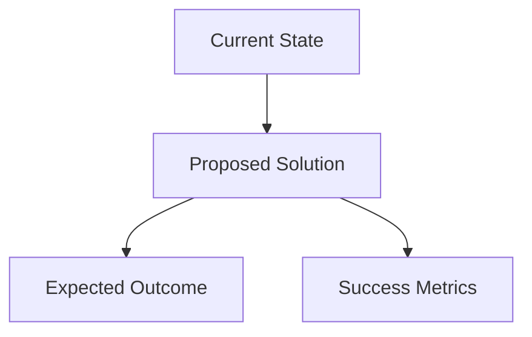

# Concept - Phase 1: Concept Capture & Clarification

## Purpose
Entry point for all workflows. Captures, clarifies, and documents the core problem, opportunity, or idea before moving to detailed requirements.

## Usage
```bash
/concept
```

## Input Parameters
- **Issue name**: `<issue-name>` (will prompt if not provided)
- **Concept source**: User idea, GitHub issue URL, Jira ticket, problem description

## Prerequisites Check
- None (this is the entry point)
- Creates `tasks/<issue-name>/` directory if it doesn't exist

## Validation Logic
```bash
# Check if concept already exists
if [ -f "tasks/<issue-name>/01-concept.md" ]; then
    read -p "Concept already exists for '$issue_name'. Overwrite? (y/n): " confirm
    if [ "$confirm" != "y" ]; then
        echo "Exiting without changes."
        exit 0
    fi
    echo "⚠️ Warning: Overwriting existing concept document"
fi
```

## Process

### 1. Issue Name Collection
```bash
# Prompt for issue name if not provided
if [ -z "$issue_name" ]; then
    echo "Enter issue name (kebab-case, e.g., 'google-auth-integration'):"
    read -p "Issue name: " issue_name
fi

# Validate issue name format
if [[ ! $issue_name =~ ^[a-z0-9-]+$ ]]; then
    echo "❌ Error: Issue name must be lowercase letters, numbers, and hyphens only"
    exit 1
fi

# Create directory structure
mkdir -p "tasks/$issue_name"
echo "📁 Created directory: tasks/$issue_name"
```

### 2. Concept Source Identification
```bash
echo "What is the source of this concept?"
echo "1. User idea/requirement"
echo "2. GitHub issue URL"
echo "3. Jira ticket URL"
echo "4. Bug report or problem description"
echo "5. Enhancement request"

read -p "Select option (1-5): " source_option
```

### 3. Interactive Concept Clarification

#### Problem Scope Questions
- What specific problem are we trying to solve?
- Who is experiencing this problem? (target users/stakeholders)
- How frequently does this problem occur?
- What is the current workaround or solution?
- What happens if we don't solve this problem?

#### Impact Assessment Questions
- What is the business impact of solving this problem?
- How many users/systems will be affected?
- What are the potential risks of the proposed solution?
- What are the success metrics for this solution?

#### Solution Approach Questions
- Do you have a preferred solution approach in mind?
- Are there any technical constraints we should consider?
- Are there any existing systems this needs to integrate with?
- What is the expected timeline for this solution?

#### Context Gathering Questions
- What is the current user workflow that this affects?
- Are there any compliance or security requirements?
- What is the expected scale/volume this solution needs to handle?
- Are there any similar solutions already implemented?

### 4. Concept Document Generation

Create comprehensive concept document with:

#### Problem Statement (ASCII Visualization)
```
Current State:    Desired State:
┌──────────────┐   ┌──────────────┐
│   Problem    │──▶│   Solution   │
│   Context    │   │   Outcome    │
└──────────────┘   └──────────────┘
```

#### Stakeholder Impact Analysis (Table)
| Stakeholder | Current Impact | Expected Benefit | Priority |
|-------------|---------------|------------------|----------|
| End Users   | [description] | [benefit]        | High/Med/Low |
| Developers  | [description] | [benefit]        | High/Med/Low |
| Business    | [description] | [benefit]        | High/Med/Low |

#### Success Criteria Definition
- Measurable outcomes
- Acceptance criteria at high level
- Definition of "done"

#### High-Level Solution Flow (Mermaid)


## Output Files

### `tasks/<issue-name>/01-concept.md`
```markdown
# Concept Document: <Issue Name>

## Problem Statement
[Clear, concise problem description]

## Solution Approach
[High-level solution overview]

## Stakeholders & Impact
[Stakeholder analysis table]

## Success Criteria
- [Measurable outcome 1]
- [Measurable outcome 2]
- [Measurable outcome 3]

## Constraints & Assumptions
### Technical Constraints
- [Constraint 1]
- [Constraint 2]

### Business Constraints
- [Constraint 1]
- [Constraint 2]

### Assumptions
- [Assumption 1]
- [Assumption 2]

## Context & Background
[Additional context, existing systems, current workflows]

## Next Steps
- Proceed to requirements.md for detailed requirement gathering
- Key questions to address in requirements phase: [list]
```

## Error Handling
```bash
# Directory creation failed
if [ ! -d "tasks/$issue_name" ]; then
    echo "❌ Error: Could not create directory tasks/$issue_name"
    echo "Check permissions and try again"
    exit 1
fi

# Invalid issue name format
if [[ ! $issue_name =~ ^[a-z0-9-]+$ ]]; then
    echo "❌ Error: Issue name must be lowercase letters, numbers, and hyphens only"
    echo "Examples: 'user-authentication', 'api-rate-limiting', 'dashboard-redesign'"
    exit 1
fi
```

## Integration Points
- **Next Phase**: `requirements.md` will read `tasks/<issue-name>/01-concept.md`
- **Documentation**: Can be supplemented by `doc-generator.md` for project context
- **Quality**: Can be validated using quality assessment tools

## Tips for Success
1. **Be Specific**: Avoid vague problem statements
2. **Think Users First**: Focus on user impact and experience
3. **Consider Constraints**: Identify technical and business limitations early
4. **Measurable Success**: Define clear, measurable success criteria
5. **Document Assumptions**: Make implicit assumptions explicit

## Example Workflow
```bash
# Start new concept
./concept.md

# System prompts for issue name
Enter issue name: google-oauth-integration

# System creates directory and starts interactive questioning
📁 Created directory: tasks/google-oauth-integration

# After interactive session, concept document is created
✅ Concept document created: tasks/google-oauth-integration/01-concept.md

# Ready for next phase
Next: Run requirements.md with issue name 'google-oauth-integration'
```