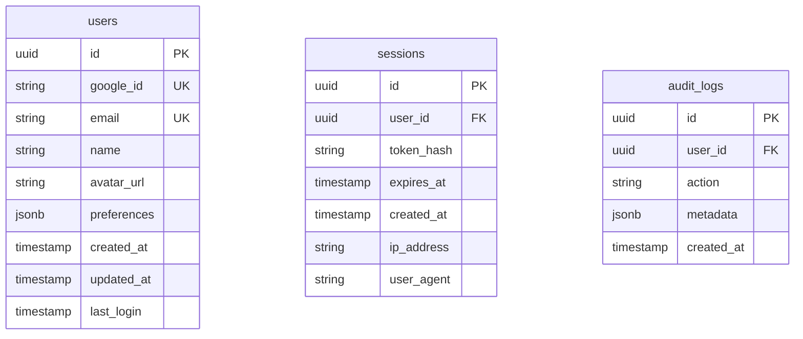
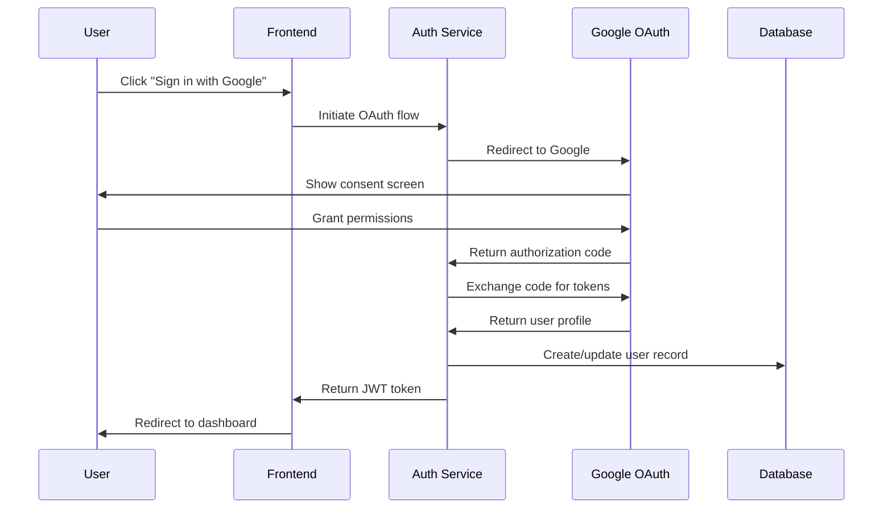
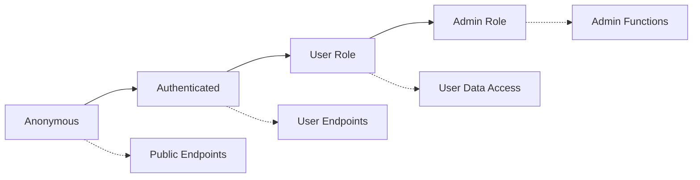
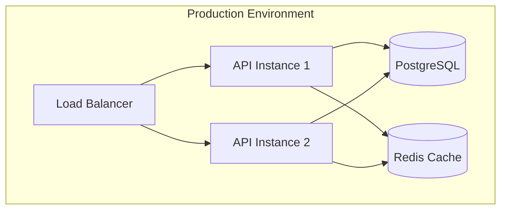

# Design - Phase 3: Design Documentation & Architecture

## Purpose
Create comprehensive technical architecture and UI design specifications. Integrates wireframe-to-code UI flow when interface components are required.

## Prerequisites Check
- **REQUIRED**: `tasks/<issue-name>/01-concept.md`
- **REQUIRED**: `tasks/<issue-name>/02-requirements.md`

## Process

### 1. Requirements Analysis & Context Loading
Read concept document and requirements documentation for context.

### 2. UI Requirement Detection & Interactive Flow
Determine if UI components are needed based on requirements:
1. Interactive UI Design Flow (wireframes → design → interactions → animations)
2. Basic technical specifications only
3. Skip UI design for now

### 3. Interactive Design Questioning

#### Technical Architecture Questions
- What is the overall system architecture approach? (monolith, microservices, serverless)
- Which technology stack components are required?
- What are the integration points with existing systems?
- What are the data flow patterns and storage requirements?
- What are the API design requirements and specifications?

#### Performance & Scalability Design
- What are the expected load patterns and scaling requirements?
- What caching strategies are needed?
- What are the database design and optimization requirements?

#### Security Architecture Questions
- What authentication and authorization patterns are needed?
- What are the data encryption and protection requirements?
- What security boundaries and access controls are required?

#### Integration & API Design
- What external systems need integration?
- What API contracts and data formats are required?
- What error handling and retry strategies are needed?

### 4. Interactive UI Design Flow (if selected)

#### Phase 4a: Wireframe Creation
Interactive wireframe questioning for each screen/component needed.

#### Phase 4b: Visual Design Specification
Define visual design system, color palette, typography, spacing.

#### Phase 4c: Interaction Design
Define user interactions, flows between screens, interactive elements.

#### Phase 4d: Animation & Micro-interactions
Define loading states, transitions, hover states, feedback animations.

#### Phase 4e: User Confirmation & Document Generation
**Complete UI design review and user confirmation:**
- Review all wireframes and visual specifications
- Confirm interaction patterns are complete
- Verify animation requirements are well-defined
- Validate responsive design considerations
- **Ask user for explicit approval before generating UI design documents**

### 5. Final Confirmation & Document Generation
Review all technical architecture and UI specifications with user:
- Confirm system architecture is well-defined
- Verify API specifications are complete
- Validate security design addresses all requirements
- Ensure database design supports all use cases
- **Generate design documents only after explicit user approval**

## Output Files

### `tasks/<issue-name>/03-design.md`
Comprehensive design specification containing:

```markdown
# Technical Design Specification: <Issue Name>

## System Architecture
[High-level system design and component relationships]

## Database Design
[Schema design, relationships, and data models]

## API Design
[Endpoint specifications, request/response formats, authentication]

## UI/UX Design
[Wireframes, user flows, component specifications, responsive design]

## Security Design
[Authentication flows, authorization, data protection, security measures]

## Infrastructure Design
[Deployment architecture, scalability considerations, monitoring]

## Integration Design
[Third-party service integration, external APIs, data flow]

## Task Dependencies
[Critical path analysis and implementation order]
```

## Technology Stack
| Layer | Technology | Purpose | Justification |
|-------|------------|---------|---------------|
| Frontend | React 18 | UI Framework | Existing stack, component reusability |
| State | Redux Toolkit | State Management | Complex auth state handling |
| Backend | Node.js/Express | API Server | Existing infrastructure |
| Database | PostgreSQL | Data Storage | ACID compliance for user data |
| Auth | Passport.js | Authentication | OAuth integration support |

## System Components

### Authentication Service
**Purpose**: Handle Google OAuth integration and session management
**Responsibilities**:
- OAuth flow orchestration
- JWT token generation and validation  
- Session lifecycle management
- User profile synchronization

**Implementation Approach**:
- Create Express.js middleware for OAuth handling
- Implement JWT service with RS256 algorithm
- Set up session management with Redis caching
- Build user profile sync logic for Google accounts

### User Management Service  
**Purpose**: Manage user profiles and preferences
**Responsibilities**:
- User CRUD operations
- Profile data validation
- Preference management
- Account lifecycle events

**Implementation Approach**:
- Build RESTful API endpoints for user operations
- Implement data validation middleware
- Create profile update synchronization
- Set up account event logging

## Data Architecture

### Database Design


### Data Flow Patterns


## API Specifications

### Authentication Endpoints
- GET /auth/google - Initiate Google OAuth flow
- GET /auth/callback - Handle OAuth callback with authorization code
- POST /auth/logout - Terminate user session
- GET /auth/profile - Get current user profile

**Implementation Approach**:
- Use Passport.js Google OAuth 2.0 strategy
- Implement PKCE flow for enhanced security
- Set up proper error handling and validation
- Add rate limiting and security headers

## Security Design

### Authentication Flow Security
- **PKCE Implementation**: Code challenge/verifier for OAuth security
- **State Parameter**: CSRF protection during OAuth flow
- **JWT Security**: Short-lived access tokens with refresh token rotation
- **Session Security**: Secure httpOnly cookies with SameSite=Strict

### Data Protection
- **Encryption at Rest**: Database field-level encryption for PII
- **Encryption in Transit**: TLS 1.3 for all communications
- **Token Security**: JWT signed with RS256, rotating keys
- **Audit Logging**: All authentication events logged

### Access Control


## Performance Design

### Caching Strategy
| Component | Cache Type | TTL | Purpose |
|-----------|------------|-----|---------|
| User Profile | Redis | 1 hour | Reduce DB queries |
| JWT Public Keys | Memory | 24 hours | Token validation |
| OAuth State | Redis | 10 minutes | Temporary state storage |

### Monitoring & Observability
- **Metrics**: Authentication success/failure rates, response times
- **Logging**: Structured logs with correlation IDs
- **Alerting**: Failed authentication threshold alerts
- **Health Checks**: Service availability endpoints

## Deployment Architecture


## Error Handling Strategy
| Error Type | HTTP Status | User Message | System Action |
|------------|-------------|--------------|---------------|
| OAuth Denied | 401 | "Login was cancelled" | Log attempt, show retry |
| Invalid Token | 401 | "Please log in again" | Clear session, redirect |
| Service Unavailable | 503 | "Service temporarily unavailable" | Show retry with backoff |
| Rate Limited | 429 | "Too many attempts, please wait" | Implement exponential backoff |
```

### `tasks/<issue-name>/03-ui-design.md` (if UI components required)

```markdown
# UI Design Document: <Issue Name>

## Design System Overview
### Color Palette
- Primary: #1a73e8 (Google Blue)
- Secondary: #34a853 (Google Green)  
- Error: #ea4335 (Google Red)
- Warning: #fbbc04 (Google Yellow)
- Background: #ffffff
- Surface: #f8f9fa
- Text Primary: #202124
- Text Secondary: #5f6368

### Typography
- **Heading**: Roboto, 24px, 500 weight
- **Subheading**: Roboto, 18px, 400 weight  
- **Body**: Roboto, 14px, 400 weight
- **Caption**: Roboto, 12px, 400 weight

## Screen Designs

### Login Page Wireframe
```
┌─────────────────────────────────────────────────┐
│                   App Logo                      │
│                [Logo Image]                     │
├─────────────────────────────────────────────────┤
│                                                 │
│            Welcome to [App Name]                │
│         Sign in to access your account          │
│                                                 │
│  ┌─────────────────────────────────────────────┐│
│  │  🔍  Continue with Google                   ││ 
│  └─────────────────────────────────────────────┘│
│                                                 │
│                     or                          │
│                                                 │
│  ┌─────────────────────────────────────────────┐│
│  │          Email & Password Login             ││
│  └─────────────────────────────────────────────┘│
│                                                 │
│              [Privacy Policy] [Terms]           │
│                                                 │
└─────────────────────────────────────────────────┘
```

### Google OAuth Button Specifications
- **Dimensions**: 320px × 48px (desktop), full-width (mobile)
- **Background**: #4285f4 (Google brand blue)
- **Text**: "Continue with Google" in Roboto, 14px, white
- **Icon**: Google "G" logo, 18px × 18px, 12px left margin
- **Border Radius**: 4px
- **Hover State**: Background #3367d6
- **Focus State**: 2px outline #4285f4 with 2px offset

### Loading States
```
┌─────────────────────────────────────────────────┐
│  🔍  [Loading Spinner] Connecting to Google...  │
└─────────────────────────────────────────────────┘
```

### Error States
```
┌─────────────────────────────────────────────────┐
│  ⚠️  Authentication failed. Please try again.   │
│                [Retry Button]                   │
└─────────────────────────────────────────────────┘
```

## Responsive Design

### Breakpoints
- **Mobile**: 320px - 767px
- **Tablet**: 768px - 1023px  
- **Desktop**: 1024px+

### Mobile Adaptations
- Full-width OAuth button
- Reduced padding and margins
- Single-column layout
- Touch-friendly target sizes (44px minimum)

## Accessibility Requirements
- **WCAG 2.1 AA Compliance**
- **Keyboard Navigation**: Tab order, enter/space activation
- **Screen Reader Support**: ARIA labels, semantic HTML
- **Color Contrast**: 4.5:1 minimum for normal text
- **Focus Indicators**: Clear visual focus states

## Animation Specifications
### Button Interactions
- Hover transition: background-color change over 0.2s ease-in-out
- Focus transition: outline appearance over 0.15s ease
- Loading spinner: continuous rotation animation

### Success/Error Messages
- Entry animation: slide in from top over 0.3s ease-out
- Exit animation: fade out over 0.2s ease-in
- Auto-dismiss after 5 seconds with fade animation
```

## Integration Points
- **Previous Phases**: Reads concept and requirements documentation
- **Next Phase**: `tasks.md` will read all `03-*.md` design files