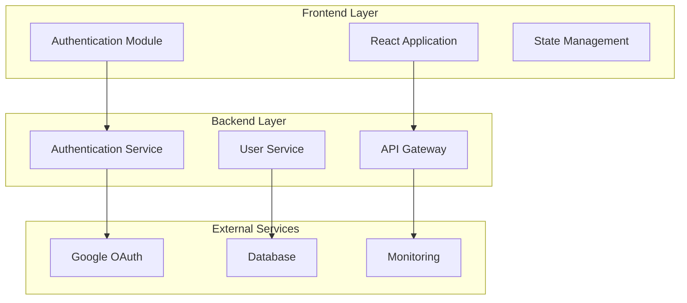
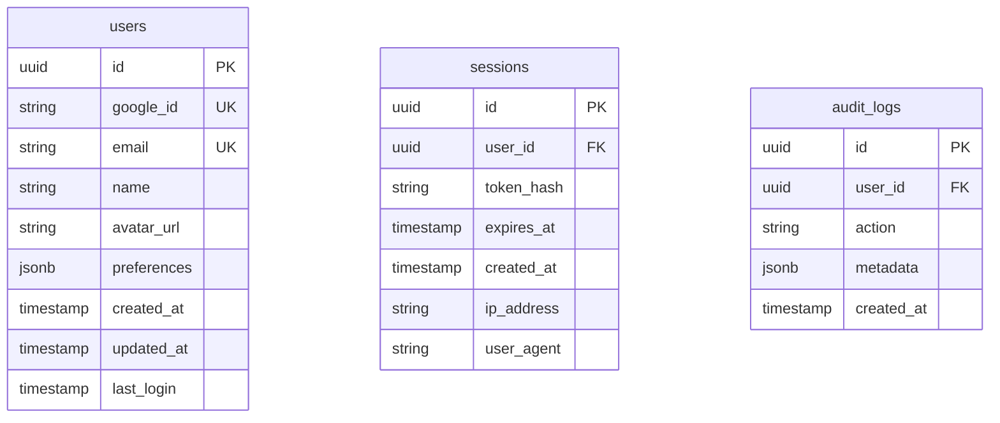
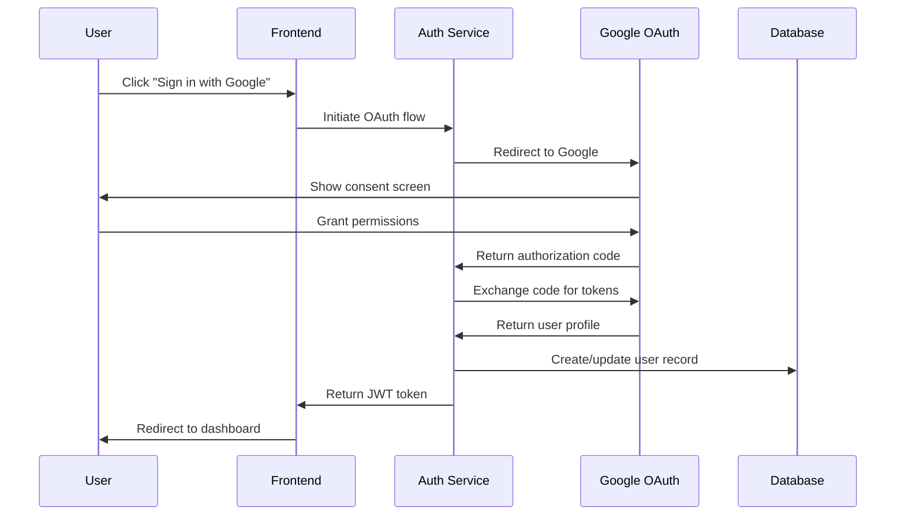
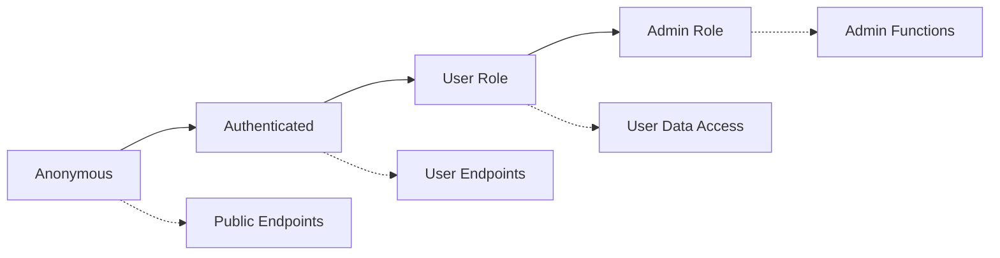
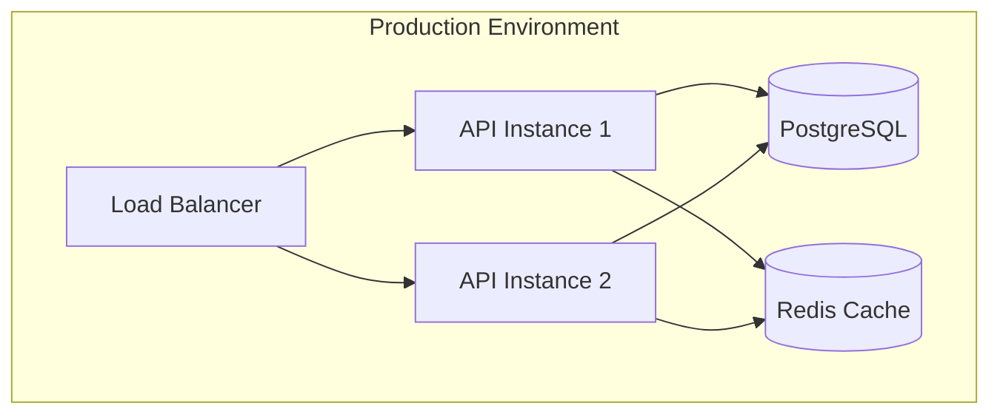

# Design - Phase 3: Design Documentation & Architecture

## Purpose
Create comprehensive technical architecture and UI design specifications. Integrates wireframe-to-code UI flow when interface components are required.

## Usage
```bash
/design
```

## Input Parameters
- **Issue name**: `<issue-name>` (will prompt if not provided)

## Prerequisites Check
- **REQUIRED**: `tasks/<issue-name>/01-concept.md`
- **REQUIRED**: `tasks/<issue-name>/02-requirements.md`
- **OPTIONAL**: All `02-*.md` files for complete requirements context

## Validation Logic
```bash
# Validate issue name provided
if [ -z "$issue_name" ]; then
    echo "Enter issue name for design phase:"
    read -p "Issue name: " issue_name
fi

# Check required prerequisite files
required_files=(
    "tasks/$issue_name/01-concept.md"
    "tasks/$issue_name/02-requirements.md"
)

for file in "${required_files[@]}"; do
    if [ ! -f "$file" ]; then
        echo "❌ Error: Missing prerequisite file: $file"
        echo "📋 Required phases: concept.md → requirements.md → design.md"
        echo "🔧 Complete missing phases before design"
        exit 1
    fi
done

# Load all available requirement files
req_files=($(ls tasks/$issue_name/02-*.md 2>/dev/null))
if [ ${#req_files[@]} -eq 0 ]; then
    echo "❌ Error: No requirements files found for issue: $issue_name"
    exit 1
fi

echo "✅ Prerequisites validated. Loading context files..."
echo "📄 Found ${#req_files[@]} requirements document(s)"
```

## Process

### 1. Requirements Analysis & Context Loading
```bash
# Read concept document
echo "📖 Analyzing concept document..."
concept_content=$(cat "tasks/$issue_name/01-concept.md")

# Read all requirements files
echo "📖 Loading requirements documentation..."
for file in "${req_files[@]}"; do
    echo "  - $(basename $file)"
done

# Analyze requirements for UI components
echo "🔍 Detecting UI/UX requirements..."
ui_detected=$(grep -i "interface\|ui\|frontend\|wireframe\|design\|user experience" tasks/$issue_name/02-*.md | wc -l)
```

### 2. UI Requirement Detection & Interactive Flow
```bash
# Determine if UI components are needed
if [ $ui_detected -gt 0 ]; then
    echo "🎨 UI components detected in requirements"
    echo ""
    echo "This feature requires user interface design. Would you like to:"
    echo "1. Interactive UI Design Flow (wireframes → design → interactions → animations)"
    echo "2. Basic technical specifications only"
    echo "3. Skip UI design for now"
    
    read -p "Select option (1-3): " ui_option
    
    case $ui_option in
        1)
            echo "🚀 Starting interactive UI design flow..."
            run_interactive_ui_flow=true
            ;;
        2)
            echo "📝 Creating basic technical specifications..."
            run_interactive_ui_flow=false
            ;;
        3)
            echo "⏭️ Skipping UI design..."
            run_interactive_ui_flow=false
            ;;
    esac
else
    echo "ℹ️ No UI components detected - focusing on technical architecture"
    run_interactive_ui_flow=false
fi
```

### 3. Interactive Design Questioning

#### Technical Architecture Questions
- What is the overall system architecture approach? (monolith, microservices, serverless)
- Which technology stack components are required?
- What are the integration points with existing systems?
- What are the data flow patterns and storage requirements?
- What are the API design requirements and specifications?

#### Performance & Scalability Design
- What are the expected load patterns and scaling requirements?
- What caching strategies are needed?
- What are the database design and optimization requirements?
- What monitoring and observability is required?

#### Security Architecture Questions
- What authentication and authorization patterns are needed?
- What are the data encryption and protection requirements?
- What security boundaries and access controls are required?
- What audit logging and compliance tracking is needed?

#### Integration & API Design
- What external systems need integration?
- What API contracts and data formats are required?
- What error handling and retry strategies are needed?
- What versioning and backward compatibility is required?

### 4. Interactive UI Design Flow (if selected)

#### Phase 4a: Wireframe Creation
```bash
# Interactive wireframe questioning
echo "📐 WIREFRAME PHASE"
echo "Let's create wireframes for each screen/component:"

# Screen identification
echo "What screens/pages does this feature require?"
# Collect screen list interactively

# For each screen, create ASCII wireframe
echo "Creating wireframe for: [Screen Name]"
# Interactive layout questioning
# Generate ASCII wireframe based on user input
```

#### Phase 4b: Visual Design Specification
```bash
# Design system questions
echo "🎨 DESIGN PHASE"
echo "Let's define the visual design system:"

# Color, typography, spacing questions
# Component styling requirements
# Responsive design considerations
# Accessibility requirements
```

#### Phase 4c: Interaction Design
```bash
# Interaction pattern questions
echo "⚡ INTERACTION PHASE"
echo "Let's define user interactions:"

# User flow between screens
# Interactive elements and behaviors
# State management requirements
# Form validation and feedback
```

#### Phase 4d: Animation & Micro-interactions
```bash
# Animation requirements
echo "✨ ANIMATION PHASE"
echo "Let's define animations and transitions:"

# Loading states and transitions
# Hover and focus states
# Success/error feedback animations
# Performance considerations
```

## Output Files

### `tasks/<issue-name>/03-technical-design.md`
Main technical architecture document:

```markdown
# Technical Design Document: <Issue Name>

## Architecture Overview


## Technology Stack
| Layer | Technology | Purpose | Justification |
|-------|------------|---------|---------------|
| Frontend | React 18 | UI Framework | Existing stack, component reusability |
| State | Redux Toolkit | State Management | Complex auth state handling |
| Backend | Node.js/Express | API Server | Existing infrastructure |
| Database | PostgreSQL | Data Storage | ACID compliance for user data |
| Auth | Passport.js | Authentication | OAuth integration support |

## System Components

### Authentication Service
**Purpose**: Handle Google OAuth integration and session management
**Responsibilities**:
- OAuth flow orchestration
- JWT token generation/validation  
- Session lifecycle management
- User profile synchronization

**API Endpoints**:
```
GET  /auth/google        - Initiate OAuth flow
GET  /auth/callback      - Handle OAuth callback
POST /auth/logout        - Terminate user session
GET  /auth/profile       - Get current user profile
```

### User Management Service  
**Purpose**: Manage user profiles and preferences
**Responsibilities**:
- User CRUD operations
- Profile data validation
- Preference management
- Account lifecycle events

## Data Architecture

### Database Design


### Data Flow Patterns


## API Specifications

### Authentication Endpoints
```yaml
/auth/google:
  method: GET
  description: Initiate Google OAuth flow
  parameters:
    - name: redirect_uri
      type: string
      required: false
  responses:
    302: Redirect to Google OAuth
    400: Invalid redirect URI

/auth/callback:
  method: GET  
  description: Handle OAuth callback
  parameters:
    - name: code
      type: string
      required: true
    - name: state
      type: string
      required: true
  responses:
    200: Authentication successful
    400: Invalid authorization code
    401: Authentication failed
```

## Security Design

### Authentication Flow Security
- **PKCE Implementation**: Code challenge/verifier for OAuth
- **State Parameter**: CSRF protection during OAuth flow
- **JWT Security**: Short-lived access tokens (15min) + refresh tokens
- **Session Security**: Secure, httpOnly cookies with SameSite=Strict

### Data Protection
- **Encryption at Rest**: Database field-level encryption for PII
- **Encryption in Transit**: TLS 1.3 for all communications
- **Token Security**: JWT signed with RS256, rotating keys
- **Audit Logging**: All authentication events logged

### Access Control


## Performance Design

### Caching Strategy
| Component | Cache Type | TTL | Purpose |
|-----------|------------|-----|---------|
| User Profile | Redis | 1 hour | Reduce DB queries |
| JWT Public Keys | Memory | 24 hours | Token validation |
| OAuth State | Redis | 10 minutes | Temporary state storage |

### Monitoring & Observability
- **Metrics**: Authentication success/failure rates, response times
- **Logging**: Structured logs with correlation IDs
- **Alerting**: Failed authentication threshold alerts
- **Health Checks**: Service availability endpoints

## Deployment Architecture


## Error Handling Strategy
| Error Type | HTTP Status | User Message | System Action |
|------------|-------------|--------------|---------------|
| OAuth Denied | 401 | "Login was cancelled" | Log attempt, show retry |
| Invalid Token | 401 | "Please log in again" | Clear session, redirect |
| Service Unavailable | 503 | "Service temporarily unavailable" | Show retry with backoff |
| Rate Limited | 429 | "Too many attempts, please wait" | Implement exponential backoff |

## Migration & Rollback Plan
1. **Database Migration**: Add new tables with backwards compatibility
2. **Feature Flags**: Gradual rollout with ability to disable
3. **Rollback Strategy**: Automated rollback on error threshold
4. **Data Migration**: Existing users mapped to new authentication system
```

### `tasks/<issue-name>/03-ui-design.md` (if UI components required)
Comprehensive UI/UX design specification:

```markdown
# UI Design Document: <Issue Name>

## Design System Overview
### Color Palette
```
Primary:   #1a73e8 (Google Blue)
Secondary: #34a853 (Google Green)  
Error:     #ea4335 (Google Red)
Warning:   #fbbc04 (Google Yellow)
Background: #ffffff
Surface:    #f8f9fa
Text Primary: #202124
Text Secondary: #5f6368
```

### Typography
- **Heading**: Roboto, 24px, 500 weight
- **Subheading**: Roboto, 18px, 400 weight  
- **Body**: Roboto, 14px, 400 weight
- **Caption**: Roboto, 12px, 400 weight

## Screen Designs

### Login Page Wireframe
```
┌─────────────────────────────────────────────────┐
│                   App Logo                      │
│                [Logo Image]                     │
├─────────────────────────────────────────────────┤
│                                                 │
│            Welcome to [App Name]                │
│         Sign in to access your account          │
│                                                 │
│  ┌─────────────────────────────────────────────┐│
│  │  🔍  Continue with Google                   ││ 
│  └─────────────────────────────────────────────┘│
│                                                 │
│                     or                          │
│                                                 │
│  ┌─────────────────────────────────────────────┐│
│  │          Email & Password Login             ││
│  └─────────────────────────────────────────────┘│
│                                                 │
│              [Privacy Policy] [Terms]           │
│                                                 │
└─────────────────────────────────────────────────┘
```

### Google OAuth Button Specifications
- **Dimensions**: 320px × 48px (desktop), full-width (mobile)
- **Background**: #4285f4 (Google brand blue)
- **Text**: "Continue with Google" in Roboto, 14px, white
- **Icon**: Google "G" logo, 18px × 18px, 12px left margin
- **Border Radius**: 4px
- **Hover State**: Background #3367d6
- **Focus State**: 2px outline #4285f4 with 2px offset

### Loading States
```
┌─────────────────────────────────────────────────┐
│  🔍  [Loading Spinner] Connecting to Google...  │
└─────────────────────────────────────────────────┘
```

### Error States
```
┌─────────────────────────────────────────────────┐
│  ⚠️  Authentication failed. Please try again.   │
│                [Retry Button]                   │
└─────────────────────────────────────────────────┘
```

## Responsive Design

### Breakpoints
- **Mobile**: 320px - 767px
- **Tablet**: 768px - 1023px  
- **Desktop**: 1024px+

### Mobile Adaptations
- Full-width OAuth button
- Reduced padding and margins
- Single-column layout
- Touch-friendly target sizes (44px minimum)

## Accessibility Requirements
- **WCAG 2.1 AA Compliance**
- **Keyboard Navigation**: Tab order, enter/space activation
- **Screen Reader Support**: ARIA labels, semantic HTML
- **Color Contrast**: 4.5:1 minimum for normal text
- **Focus Indicators**: Clear visual focus states

## Animation Specifications
### Button Hover Animation
```css
transition: background-color 0.2s ease-in-out;
```

### Loading Spinner
```css
@keyframes spin {
  0% { transform: rotate(0deg); }
  100% { transform: rotate(360deg); }
}
```

### Success/Error Messages
```css
/* Slide in from top */
@keyframes slideIn {
  from { transform: translateY(-20px); opacity: 0; }
  to { transform: translateY(0); opacity: 1; }
}
```
```

### `tasks/<issue-name>/03-api-specs.md`
Detailed API specifications and contracts.

### `tasks/<issue-name>/03-data-models.md`
Database schemas and data validation rules.

### `tasks/<issue-name>/03-security-design.md`
Security architecture and compliance requirements.

## Rich Documentation Features

### Mermaid Diagrams
- **System Architecture**: Component relationships and data flow
- **Database Schemas**: Entity relationship diagrams  
- **Sequence Diagrams**: API interaction flows
- **Deployment Diagrams**: Infrastructure and service topology

### ASCII Wireframes
- **Screen Layouts**: Visual interface structure
- **Component Hierarchy**: UI element organization
- **User Flow Diagrams**: Navigation and interaction paths

### Technical Specifications
- **API Documentation**: Endpoint specifications with examples
- **Database Schemas**: Table structures with constraints
- **Security Patterns**: Authentication and authorization flows

## Error Handling
```bash
# Missing requirements files
if [ ${#req_files[@]} -eq 0 ]; then
    echo "❌ Error: No requirements files found for issue: $issue_name"
    echo "📋 Required files pattern: tasks/$issue_name/02-*.md"
    echo "🔧 Run requirements.md first"
    exit 1
fi

# Concept or requirements missing
for file in "${required_files[@]}"; do
    if [ ! -f "$file" ]; then
        echo "❌ Error: Missing prerequisite: $(basename $file)"
        echo "📋 Workflow order: concept.md → requirements.md → design.md"
        exit 1
    fi
done
```

## Integration Points
- **Previous Phases**: Reads concept + all requirements documentation
- **Next Phase**: `tasks.md` will read all `03-*.md` design files
- **UI Integration**: Seamlessly integrates wireframe-to-code flow when needed
- **Quality Check**: Can be validated with design review tools

## Tips for Success
1. **Architecture First**: Start with high-level system design
2. **UI When Needed**: Use interactive UI flow for interface-heavy features
3. **Document Decisions**: Record architectural choices and rationale
4. **Think Security**: Consider security implications in every design decision
5. **Plan for Scale**: Design for expected growth and load patterns
6. **API-First**: Design clear, versioned API contracts

## Example Workflow
```bash
# Start design phase
./design.md

# System validates prerequisites and detects UI requirements
✅ Prerequisites validated. Loading context files...
🎨 UI components detected in requirements

# User chooses interactive UI design flow
🚀 Starting interactive UI design flow...
📐 WIREFRAME PHASE: Creating wireframes...
🎨 DESIGN PHASE: Defining visual system...
⚡ INTERACTION PHASE: Specifying user interactions...
✨ ANIMATION PHASE: Adding micro-interactions...

# System generates comprehensive design documentation
✅ Design documentation complete:
  - tasks/google-oauth-integration/03-technical-design.md
  - tasks/google-oauth-integration/03-ui-design.md
  - tasks/google-oauth-integration/03-api-specs.md
  - tasks/google-oauth-integration/03-data-models.md
  - tasks/google-oauth-integration/03-security-design.md

Next: Run tasks.md with issue name 'google-oauth-integration'
```