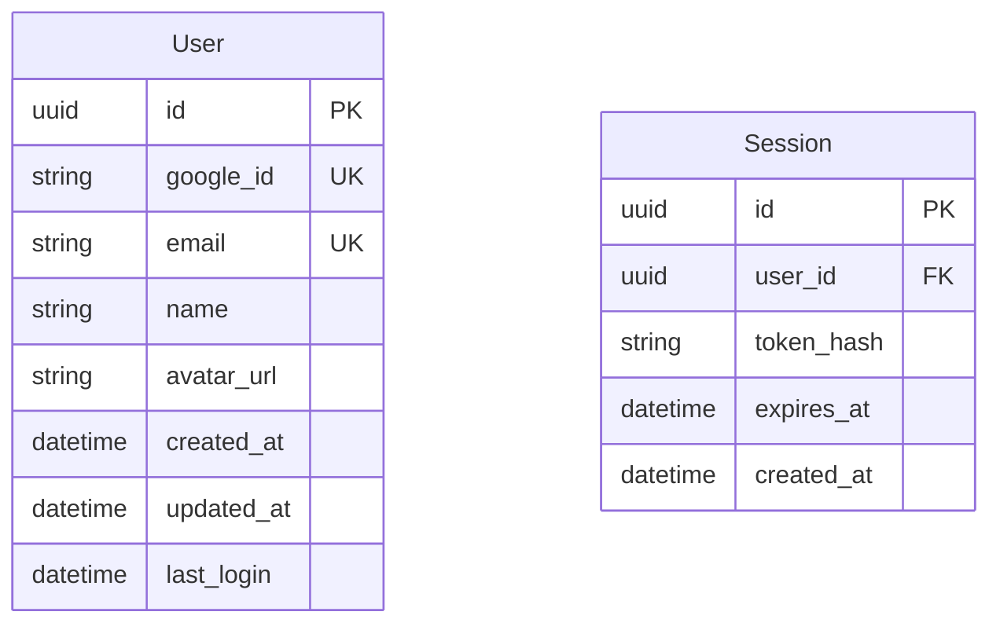

# Requirements - Phase 2: Requirements Documentation & Specification

## Purpose
Transform concept into detailed, structured requirements with comprehensive user stories, acceptance criteria, and functional specifications.

## Prerequisites Check
- **REQUIRED**: `tasks/<issue-name>/01-concept.md`

## Process

### 1. Concept Analysis
Load and analyze concept document for context.

### 2. Interactive Requirements Gathering

#### Functional Requirements Clarification

1. What are the core features/capabilities needed?
   A: User authentication and authorization
   B: Data creation, read, update, delete operations
   C: Search and filtering capabilities
   D: Reporting and analytics features
   E: Integration with external systems
   F: Other - please specify

2. What is the expected user workflow/journey?
   A: Linear step-by-step process
   B: Non-linear with multiple entry points
   C: Role-based workflows for different users
   D: Self-service user-driven workflow
   E: Admin-managed workflow with approvals
   F: Other - please specify

3. What data needs to be captured, stored, or processed?
   A: User profile and authentication data
   B: Business transaction data
   C: Configuration and settings data
   D: Analytics and logging data
   E: File uploads and attachments
   F: Other - please specify

4. What business rules and logic need to be implemented?
   A: Validation rules for data entry
   B: Authorization rules for access control
   C: Workflow approval and notification rules
   D: Calculation and processing logic
   E: Integration and synchronization rules
   F: Other - please specify

5. What validation and error handling is required?
   A: Input validation for all user data
   B: Business rule validation
   C: System error handling and recovery
   D: User-friendly error messages
   E: Audit logging for errors
   F: Other - please specify

#### Non-Functional Requirements

1. What are the performance expectations? (response time, throughput)
   A: Response time <200ms, high throughput
   B: Response time <1s, moderate throughput
   C: Response time <3s, low throughput
   D: Real-time performance required
   E: Performance not critical
   F: Other - please specify

2. What are the availability requirements? (uptime, maintenance windows)
   A: 99.9% uptime (enterprise level)
   B: 99.5% uptime (business level)
   C: 99% uptime (standard level)
   D: 24/7 availability required
   E: Business hours only
   F: Other - please specify

3. What are the scalability requirements? (concurrent users, data volume)
   A: <100 concurrent users, small data
   B: 100-1000 users, medium data
   C: 1000-10000 users, large data
   D: >10000 users, very large data
   E: Auto-scaling capabilities required
   F: Other - please specify

4. What are the security requirements? (authentication, authorization, encryption)
   A: Basic authentication and HTTPS
   B: Role-based access control
   C: Multi-factor authentication
   D: Advanced security with compliance
   E: Enterprise-grade security
   F: Other - please specify

5. What are the compliance requirements? (GDPR, HIPAA, SOC2, etc.)
   A: GDPR compliance for EU users
   B: HIPAA for healthcare data
   C: SOC2 for business customers
   D: Industry-specific compliance
   E: No specific compliance needed
   F: Other - please specify

#### User Story Creation

1. Can you describe the user workflow step by step?
   A: Simple single-step process
   B: Multi-step linear workflow
   C: Complex workflow with branches/conditions
   D: Parallel processes that can run simultaneously
   E: Workflow varies by user role/permissions
   F: Other - please specify

2. What are the different user paths/scenarios?
   A: Single happy path scenario
   B: Happy path plus error scenarios
   C: Multiple user roles with different paths
   D: Guest vs authenticated user paths
   E: Admin vs regular user scenarios
   F: Other - please specify

3. What are the edge cases or exception scenarios?
   A: Invalid input handling
   B: System unavailable/timeout scenarios
   C: Insufficient permissions/access denied
   D: Data not found/empty state scenarios
   E: Concurrent user conflicts
   F: Other - please specify

4. What integrations or external dependencies exist?
   A: Third-party APIs for core functionality
   B: External databases or data sources
   C: Authentication providers (OAuth, LDAP)
   D: Payment processors or financial systems
   E: Email/SMS notification services
   F: Other - please specify

#### Acceptance Criteria Definition

1. How will we know this requirement is complete?
   A: All unit and integration tests pass
   B: User acceptance testing completed successfully
   C: Performance benchmarks achieved
   D: Security review and approval obtained
   E: Feature deployed and stable in production
   F: Other - please specify

2. What are the testable conditions?
   A: Input validation works correctly
   B: Expected outputs are generated
   C: Error scenarios handled appropriately
   D: Performance meets defined metrics
   E: Security controls function as designed
   F: Other - please specify

3. What are the data validation rules?
   A: Required field validation
   B: Format validation (email, phone, etc.)
   C: Business rule validation
   D: Range and boundary validation
   E: Cross-field dependency validation
   F: Other - please specify

4. What are the UI/UX requirements?
   A: Responsive design for all devices
   B: Accessibility compliance (WCAG)
   C: Consistent with existing design system
   D: Intuitive navigation and flow
   E: Loading states and error messaging
   F: Other - please specify

5. What are the error conditions and messages?
   A: Field-level validation errors
   B: System-level error handling
   C: User-friendly error messages
   D: Technical error logging for debugging
   E: Graceful degradation when services unavailable
   F: Other - please specify

#### Business Logic Clarification

1. What are the business rules that must be enforced?
   A: Data access and permission rules
   B: Workflow approval and routing rules
   C: Calculation and pricing rules
   D: Data integrity and consistency rules
   E: Compliance and regulatory rules
   F: Other - please specify

2. What calculations or algorithms are needed?
   A: Mathematical calculations (sum, average, etc.)
   B: Financial calculations (tax, interest, etc.)
   C: Scoring or ranking algorithms
   D: Data transformation and processing
   E: Machine learning or analytics algorithms
   F: Other - please specify

3. What are the data transformation requirements?
   A: Format conversion (JSON, XML, CSV)
   B: Data mapping between systems
   C: Data cleansing and validation
   D: Data aggregation and summarization
   E: Real-time data processing
   F: Other - please specify

4. What are the notification/communication requirements?
   A: Email notifications for key events
   B: SMS notifications for urgent items
   C: In-app notifications and alerts
   D: System-to-system notifications
   E: Reports and scheduled communications
   F: Other - please specify

### 3. User Confirmation & Document Generation

Review all gathered requirements with user before generating documentation:

**Requirements Confirmation Questions:**

1. Are the functional requirements complete and well-defined?
   A: Yes, all functional requirements are captured
   B: Missing core functionality
   C: Need more detail on existing requirements
   D: Need additional functional requirements
   E: Other - please specify

2. Do the non-functional requirements address all concerns?
   A: Yes, all performance, security, and scalability needs covered
   B: Missing performance requirements
   C: Missing security requirements
   D: Missing scalability/availability requirements
   E: Other - please specify

3. Do the user stories cover all scenarios and workflows?
   A: Yes, all user paths and scenarios are covered
   B: Missing user scenarios
   C: Need more detailed user stories
   D: Missing edge cases and error scenarios
   E: Other - please specify

4. Are all acceptance criteria testable and measurable?
   A: Yes, all criteria can be verified and tested
   B: Need more specific acceptance criteria
   C: Some criteria need to be more measurable
   D: Missing acceptance criteria for some requirements
   E: Other - please specify

## Output Files

### `tasks/<issue-name>/02-requirements.md`
Comprehensive requirements document containing:

```markdown
# Requirements Specification: <Issue Name>

## Functional Requirements
[Detailed functional specifications]

## User Stories
[Complete user story breakdown with acceptance criteria]

## Non-Functional Requirements  
[Performance, security, scalability requirements]

## Technical Constraints
[Technology limitations and dependencies]

## API Requirements
[External service integration requirements]

## Acceptance Criteria
[Measurable completion criteria for each requirement]
```

## Functional Requirements

### FR-001: Core Authentication
**Description**: Users must be able to authenticate using Google OAuth
**Priority**: High
**User Story**: As a user, I want to sign in with my Google account so that I can access the application quickly without creating a new password.

**Acceptance Criteria**:
- [ ] Google OAuth 2.0 integration implemented
- [ ] User can initiate Google login from main login page
- [ ] System creates user profile on first login
- [ ] User session maintained across browser sessions
- [ ] User can log out and session is terminated

**Business Rules**:
- Only Google accounts with verified email addresses accepted
- User profile created automatically on first successful login
- Session timeout after 24 hours of inactivity

### FR-002: User Profile Management
[Similar detailed structure for each functional requirement]

## Non-Functional Requirements

### NFR-001: Performance
- **Response Time**: Authentication flow must complete within 3 seconds
- **Throughput**: Support 1000 concurrent authentication requests
- **Availability**: 99.9% uptime during business hours

### NFR-002: Security  
- **Authentication**: OAuth 2.0 with PKCE flow
- **Session Management**: JWT tokens with 24-hour expiration
- **Data Protection**: All PII encrypted at rest and in transit

### NFR-003: Scalability
- **User Growth**: Support up to 100,000 registered users
- **Geographic**: Support users across multiple time zones
- **Integration**: APIs designed for future third-party integrations

## Integration Requirements
| System | Integration Type | Data Exchange | Frequency |
|---------|-----------------|---------------|-----------|
| Google OAuth | Real-time API | User profile data | On-demand |
| User Database | Direct | Full user records | Real-time |
| Analytics | Event streaming | Usage metrics | Continuous |

## Data Requirements

### Data Model


### Data Validation Rules
- Email: Must be valid Google email address
- Name: Required, 2-100 characters
- Google ID: Must be unique across system
- Session tokens: Must be cryptographically secure

## User Interface Requirements

### Login Page Wireframe
```
┌─────────────────────────────────────┐
│             App Logo                │
├─────────────────────────────────────┤
│                                     │
│  ┌─────────────────────────────────┐│
│  │    🔍 Sign in with Google       ││
│  └─────────────────────────────────┘│
│                                     │
│  ┌─────────────────────────────────┐│
│  │         Alternative Login       ││
│  └─────────────────────────────────┘│
│                                     │
│         [Privacy] [Terms]           │
└─────────────────────────────────────┘
```

### UI Components Required
- Google OAuth button (branded per Google guidelines)
- Loading states during authentication
- Error message display area
- Success confirmation feedback
- Logout functionality in header/menu

## Error Handling Requirements
| Error Condition | User Message | System Action | Recovery |
|-----------------|--------------|---------------|----------|
| OAuth denied | "Login cancelled" | Log attempt | Retry button |
| Network timeout | "Connection issue" | Retry logic | Manual retry |
| Invalid account | "Account not supported" | Block access | Contact support |

## Compliance & Legal
- **GDPR**: User consent for profile data storage
- **Privacy**: Clear data usage policy
- **Terms**: User acceptance of service terms
- **Accessibility**: WCAG 2.1 AA compliance

## Dependencies & Assumptions
### Dependencies
- Google OAuth API availability
- SSL certificate for secure redirects
- User database schema updates
- Frontend framework OAuth library

### Assumptions
- Users have Google accounts
- Modern browser with JavaScript enabled
- Stable internet connection during auth flow
- Google OAuth policies remain stable
```

## Integration Points
- **Previous Phase**: Reads `tasks/<issue-name>/01-concept.md` for context
- **Next Phase**: `design.md` will read `02-requirements.md`