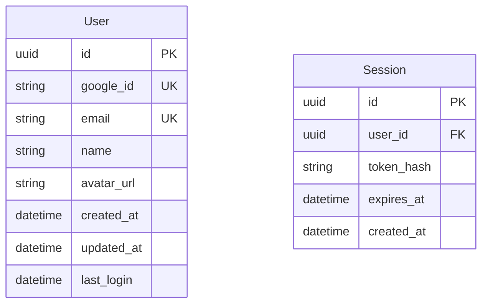

# Requirements - Phase 2: Requirements Documentation & Specification

## Purpose
Transform concept into detailed, structured requirements with comprehensive user stories, acceptance criteria, and functional specifications.

## Prerequisites Check
- **REQUIRED**: `tasks/<issue-name>/01-concept.md`

## Process

### 1. Concept Analysis
Load and analyze concept document for context.

### 2. Interactive Requirements Gathering

**Question Format Instructions for LLM:**
Present each question as a numbered item with contextual multiple-choice answers (A-F) generated from the concept document and user's responses. Always include "F: Other - please specify" as the final option. Users respond with codes like "1-B", "2-A,C", etc.

#### Functional Requirements Clarification
- What are the core features/capabilities needed?
- What is the expected user workflow/journey?
- What data needs to be captured, stored, or processed?
- What business rules and logic need to be implemented?
- What validation and error handling is required?

#### Non-Functional Requirements
- What are the performance expectations? (response time, throughput)
- What are the availability requirements? (uptime, maintenance windows)
- What are the scalability requirements? (concurrent users, data volume)
- What are the security requirements? (authentication, authorization, encryption)
- What are the compliance requirements? (GDPR, HIPAA, SOC2, etc.)

#### User Story Creation
- Can you describe the user workflow step by step?
- What are the different user paths/scenarios?
- What are the edge cases or exception scenarios?
- What integrations or external dependencies exist?

#### Acceptance Criteria Definition
- How will we know this requirement is complete?
- What are the testable conditions?
- What are the data validation rules?
- What are the UI/UX requirements?
- What are the error conditions and messages?

#### Business Logic Clarification
- What are the business rules that must be enforced?
- What calculations or algorithms are needed?
- What are the data transformation requirements?
- What are the notification/communication requirements?

### 3. User Confirmation & Document Generation

**Confirmation Format Instructions for LLM:**
Present confirmation questions in the same numbered format with contextual Yes/No/Other options.

Review all gathered requirements with user before generating documentation:
- Confirm functional requirements are complete
- Verify non-functional requirements address all concerns
- Validate user stories cover all scenarios
- Ensure acceptance criteria are testable
- Generate requirements documents only after explicit user approval

## Output Files

### `tasks/<issue-name>/02-requirements.md`
Comprehensive requirements document containing:

```markdown
# Requirements Specification: <Issue Name>

## Functional Requirements
[Detailed functional specifications]

## User Stories
[Complete user story breakdown with acceptance criteria]

## Non-Functional Requirements  
[Performance, security, scalability requirements]

## Technical Constraints
[Technology limitations and dependencies]

## API Requirements
[External service integration requirements]

## Acceptance Criteria
[Measurable completion criteria for each requirement]
```

## Functional Requirements

### FR-001: Core Authentication
**Description**: Users must be able to authenticate using Google OAuth
**Priority**: High
**User Story**: As a user, I want to sign in with my Google account so that I can access the application quickly without creating a new password.

**Acceptance Criteria**:
- [ ] Google OAuth 2.0 integration implemented
- [ ] User can initiate Google login from main login page
- [ ] System creates user profile on first login
- [ ] User session maintained across browser sessions
- [ ] User can log out and session is terminated

**Business Rules**:
- Only Google accounts with verified email addresses accepted
- User profile created automatically on first successful login
- Session timeout after 24 hours of inactivity

### FR-002: User Profile Management
[Similar detailed structure for each functional requirement]

## Non-Functional Requirements

### NFR-001: Performance
- **Response Time**: Authentication flow must complete within 3 seconds
- **Throughput**: Support 1000 concurrent authentication requests
- **Availability**: 99.9% uptime during business hours

### NFR-002: Security  
- **Authentication**: OAuth 2.0 with PKCE flow
- **Session Management**: JWT tokens with 24-hour expiration
- **Data Protection**: All PII encrypted at rest and in transit

### NFR-003: Scalability
- **User Growth**: Support up to 100,000 registered users
- **Geographic**: Support users across multiple time zones
- **Integration**: APIs designed for future third-party integrations

## Integration Requirements
| System | Integration Type | Data Exchange | Frequency |
|---------|-----------------|---------------|-----------|
| Google OAuth | Real-time API | User profile data | On-demand |
| User Database | Direct | Full user records | Real-time |
| Analytics | Event streaming | Usage metrics | Continuous |

## Data Requirements

### Data Model


### Data Validation Rules
- Email: Must be valid Google email address
- Name: Required, 2-100 characters
- Google ID: Must be unique across system
- Session tokens: Must be cryptographically secure

## User Interface Requirements

### Login Page Wireframe
```
┌─────────────────────────────────────┐
│             App Logo                │
├─────────────────────────────────────┤
│                                     │
│  ┌─────────────────────────────────┐│
│  │    🔍 Sign in with Google       ││
│  └─────────────────────────────────┘│
│                                     │
│  ┌─────────────────────────────────┐│
│  │         Alternative Login       ││
│  └─────────────────────────────────┘│
│                                     │
│         [Privacy] [Terms]           │
└─────────────────────────────────────┘
```

### UI Components Required
- Google OAuth button (branded per Google guidelines)
- Loading states during authentication
- Error message display area
- Success confirmation feedback
- Logout functionality in header/menu

## Error Handling Requirements
| Error Condition | User Message | System Action | Recovery |
|-----------------|--------------|---------------|----------|
| OAuth denied | "Login cancelled" | Log attempt | Retry button |
| Network timeout | "Connection issue" | Retry logic | Manual retry |
| Invalid account | "Account not supported" | Block access | Contact support |

## Compliance & Legal
- **GDPR**: User consent for profile data storage
- **Privacy**: Clear data usage policy
- **Terms**: User acceptance of service terms
- **Accessibility**: WCAG 2.1 AA compliance

## Dependencies & Assumptions
### Dependencies
- Google OAuth API availability
- SSL certificate for secure redirects
- User database schema updates
- Frontend framework OAuth library

### Assumptions
- Users have Google accounts
- Modern browser with JavaScript enabled
- Stable internet connection during auth flow
- Google OAuth policies remain stable
```

## Integration Points
- **Previous Phase**: Reads `tasks/<issue-name>/01-concept.md` for context
- **Next Phase**: `design.md` will read `02-requirements.md`