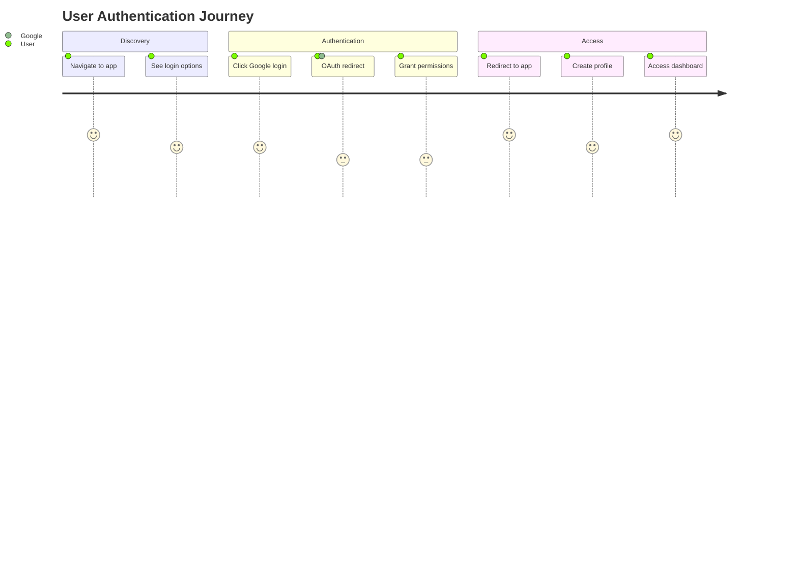
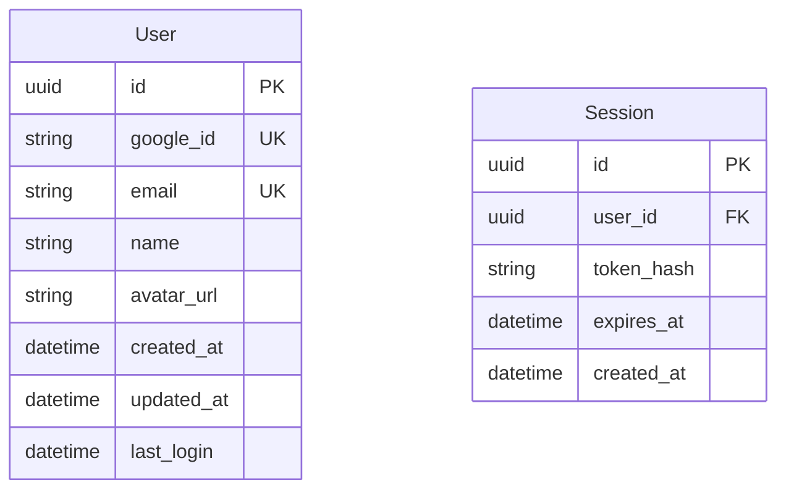

# Requirements - Phase 2: Requirements Documentation & Specification

## Purpose
Transform concept into detailed, structured requirements following industry best practices with comprehensive user stories, acceptance criteria, and functional specifications.

## Usage
```bash
/requirements
```

## Input Parameters
- **Issue name**: `<issue-name>` (will prompt if not provided)

## Prerequisites Check
- **REQUIRED**: `tasks/<issue-name>/01-concept.md`
- **OPTIONAL**: `tasks/<issue-name>/00-project-context.md` (from doc-generator)

## Validation Logic
```bash
# Validate issue name provided
if [ -z "$issue_name" ]; then
    echo "Enter issue name for requirements phase:"
    read -p "Issue name: " issue_name
fi

# Check required prerequisite files
required_file="tasks/$issue_name/01-concept.md"
if [ ! -f "$required_file" ]; then
    echo "❌ Error: Concept phase incomplete for issue: $issue_name"
    echo "📝 Required file missing: $required_file"
    echo "💡 Run: concept.md with issue name '$issue_name'"
    exit 1
fi

# Check optional context file
context_file="tasks/$issue_name/00-project-context.md"
if [ -f "$context_file" ]; then
    echo "📄 Found project context: $context_file"
    has_context=true
else
    echo "ℹ️ No project context found (optional)"
    echo "💡 Consider running: doc-generator.md for better context"
    has_context=false
fi

echo "✅ Prerequisites validated. Reading concept document..."
```

## Process

### 1. Concept Analysis & Context Loading
```bash
# Read and analyze concept document
echo "📖 Analyzing concept document..."
concept_content=$(cat "tasks/$issue_name/01-concept.md")

# Read project context if available
if [ "$has_context" = true ]; then
    echo "📖 Loading project context..."
    context_content=$(cat "tasks/$issue_name/00-project-context.md")
fi

# Extract key information for requirements gathering
echo "🔍 Extracting key information from concept..."
```

### 2. Interactive Requirements Gathering

#### Stakeholder Deep Dive
- Who are the primary users of this solution?
- Who are the secondary stakeholders affected?
- What are the user roles and permissions needed?
- Are there any external system integrations required?
- What are the administrative/management requirements?

#### Functional Requirements Clarification
- What are the core features/capabilities needed?
- What is the expected user workflow/journey?
- What data needs to be captured, stored, or processed?
- What business rules and logic need to be implemented?
- What validation and error handling is required?

#### Non-Functional Requirements
- What are the performance expectations? (response time, throughput)
- What are the availability requirements? (uptime, maintenance windows)
- What are the scalability requirements? (concurrent users, data volume)
- What are the security requirements? (authentication, authorization, encryption)
- What are the compliance requirements? (GDPR, HIPAA, SOC2, etc.)

#### User Story Creation
- Can you describe the user workflow step by step?
- What are the different user paths/scenarios?
- What are the edge cases or exception scenarios?
- What integrations or external dependencies exist?
- What are the success and failure conditions?

#### Acceptance Criteria Definition
- How will we know this requirement is complete?
- What are the testable conditions?
- What are the data validation rules?
- What are the UI/UX requirements?
- What are the error conditions and messages?

#### Business Logic Clarification
- What are the business rules that must be enforced?
- What calculations or algorithms are needed?
- What are the data transformation requirements?
- What are the notification/communication requirements?
- What reporting or analytics are needed?

### 3. Requirements Documentation Generation

## Output Files

### `tasks/<issue-name>/02-requirements.md`
Main requirements document with comprehensive specification:

```markdown
# Requirements Document: <Issue Name>

## Executive Summary
[Brief overview of the requirements and scope]

## Stakeholder Analysis
| Stakeholder | Role | Impact | Influence | Requirements |
|-------------|------|---------|-----------|--------------|
| End Users | Primary | High | Medium | [user needs] |
| Administrators | Secondary | Medium | High | [admin needs] |
| Developers | Implementation | High | Medium | [technical needs] |
| Business | Decision | High | High | [business needs] |

## User Journey Map


## Functional Requirements

### FR-001: Core Authentication
**Description**: Users must be able to authenticate using Google OAuth
**Priority**: High
**User Story**: As a user, I want to sign in with my Google account so that I can access the application quickly without creating a new password.

**Acceptance Criteria**:
- [ ] Google OAuth 2.0 integration implemented
- [ ] User can initiate Google login from main login page
- [ ] System creates user profile on first login
- [ ] User session maintained across browser sessions
- [ ] User can log out and session is terminated

**Business Rules**:
- Only Google accounts with verified email addresses accepted
- User profile created automatically on first successful login
- Session timeout after 24 hours of inactivity

### FR-002: User Profile Management
[Similar detailed structure for each functional requirement]

## Non-Functional Requirements

### NFR-001: Performance
- **Response Time**: Authentication flow must complete within 3 seconds
- **Throughput**: Support 1000 concurrent authentication requests
- **Availability**: 99.9% uptime during business hours

### NFR-002: Security  
- **Authentication**: OAuth 2.0 with PKCE flow
- **Session Management**: JWT tokens with 24-hour expiration
- **Data Protection**: All PII encrypted at rest and in transit

### NFR-003: Scalability
- **User Growth**: Support up to 100,000 registered users
- **Geographic**: Support users across multiple time zones
- **Integration**: APIs designed for future third-party integrations

## Integration Requirements
| System | Integration Type | Data Exchange | Frequency |
|---------|-----------------|---------------|-----------|
| Google OAuth | Real-time API | User profile data | On-demand |
| User Database | Direct | Full user records | Real-time |
| Analytics | Event streaming | Usage metrics | Continuous |

## Data Requirements

### Data Model


### Data Validation Rules
- Email: Must be valid Google email address
- Name: Required, 2-100 characters
- Google ID: Must be unique across system
- Session tokens: Must be cryptographically secure

## User Interface Requirements

### Login Page Wireframe
```
┌─────────────────────────────────────┐
│             App Logo                │
├─────────────────────────────────────┤
│                                     │
│  ┌─────────────────────────────────┐│
│  │    🔍 Sign in with Google       ││
│  └─────────────────────────────────┘│
│                                     │
│  ┌─────────────────────────────────┐│
│  │         Alternative Login       ││
│  └─────────────────────────────────┘│
│                                     │
│         [Privacy] [Terms]           │
└─────────────────────────────────────┘
```

### UI Components Required
- Google OAuth button (branded per Google guidelines)
- Loading states during authentication
- Error message display area
- Success confirmation feedback
- Logout functionality in header/menu

## Error Handling Requirements
| Error Condition | User Message | System Action | Recovery |
|-----------------|--------------|---------------|----------|
| OAuth denied | "Login cancelled" | Log attempt | Retry button |
| Network timeout | "Connection issue" | Retry logic | Manual retry |
| Invalid account | "Account not supported" | Block access | Contact support |

## Compliance & Legal
- **GDPR**: User consent for profile data storage
- **Privacy**: Clear data usage policy
- **Terms**: User acceptance of service terms
- **Accessibility**: WCAG 2.1 AA compliance

## Success Metrics
- **User Adoption**: 80% of new users choose Google login
- **Conversion Rate**: 95% successful authentication completion
- **User Satisfaction**: <2 second authentication flow
- **Error Rate**: <1% authentication failures

## Dependencies & Assumptions
### Dependencies
- Google OAuth API availability
- SSL certificate for secure redirects
- User database schema updates
- Frontend framework OAuth library

### Assumptions
- Users have Google accounts
- Modern browser with JavaScript enabled
- Stable internet connection during auth flow
- Google OAuth policies remain stable
```

### `tasks/<issue-name>/02-stakeholder-matrix.md`
Detailed stakeholder analysis and communication plan.

### `tasks/<issue-name>/02-user-stories.md`
Complete user story collection with acceptance criteria.

### `tasks/<issue-name>/02-acceptance-criteria.md`
Comprehensive acceptance criteria with test scenarios.

### `tasks/<issue-name>/02-data-requirements.md`
Detailed data model and validation requirements.

## Rich Documentation Features

### Mermaid Diagrams
- **User Journey Maps**: Step-by-step user experience flows
- **Entity Relationship Diagrams**: Data model visualization
- **Process Flow Diagrams**: Business logic workflows
- **Integration Architecture**: System interaction patterns

### ASCII Wireframes
- **UI Layout Sketches**: Basic interface structure
- **User Flow Diagrams**: Navigation and interaction patterns
- **Data Flow Visualization**: Information movement through system

### Structured Tables
- **Requirements Traceability Matrix**: Link requirements to business needs
- **Stakeholder Impact Analysis**: Influence and interest mapping
- **Integration Specifications**: External system requirements
- **Error Condition Mapping**: Comprehensive error handling

## Error Handling
```bash
# Missing concept document
if [ ! -f "tasks/$issue_name/01-concept.md" ]; then
    echo "❌ Error: Concept phase incomplete for issue: $issue_name"
    echo "📋 Missing: tasks/$issue_name/01-concept.md"
    echo "🔧 Solution: Run concept.md with issue name '$issue_name'"
    echo ""
    echo "Workflow order: concept.md → requirements.md → design.md → tasks.md → implement.md"
    exit 1
fi

# Invalid issue name or directory issues
if [ ! -d "tasks/$issue_name" ]; then
    echo "❌ Error: Issue directory not found: tasks/$issue_name"
    echo "💡 Tip: Issue names should match those created in concept phase"
    exit 1
fi
```

## Integration Points
- **Previous Phase**: Reads `tasks/<issue-name>/01-concept.md` for context
- **Next Phase**: `design.md` will read all `02-*.md` requirement files
- **Optional Context**: Uses `00-project-context.md` if available
- **Quality Check**: Can be validated with quality assessment tools

## Tips for Success
1. **Be Comprehensive**: Cover all functional and non-functional aspects
2. **Think User-Centered**: Focus on user needs and workflows
3. **Define Measurable Criteria**: Ensure testable acceptance conditions
4. **Consider Edge Cases**: Plan for error conditions and exceptions
5. **Document Assumptions**: Make implicit requirements explicit
6. **Visual Communication**: Use diagrams and wireframes for clarity

## Example Workflow
```bash
# Start requirements phase
./requirements.md

# System validates prerequisites
✅ Prerequisites validated. Reading concept document...

# System loads context and begins interactive questioning
📖 Analyzing concept document for 'google-oauth-integration'
🔍 Starting comprehensive requirements gathering...

# After thorough interactive session
✅ Requirements documentation complete:
  - tasks/google-oauth-integration/02-requirements.md
  - tasks/google-oauth-integration/02-stakeholder-matrix.md  
  - tasks/google-oauth-integration/02-user-stories.md
  - tasks/google-oauth-integration/02-acceptance-criteria.md

Next: Run design.md with issue name 'google-oauth-integration'
```