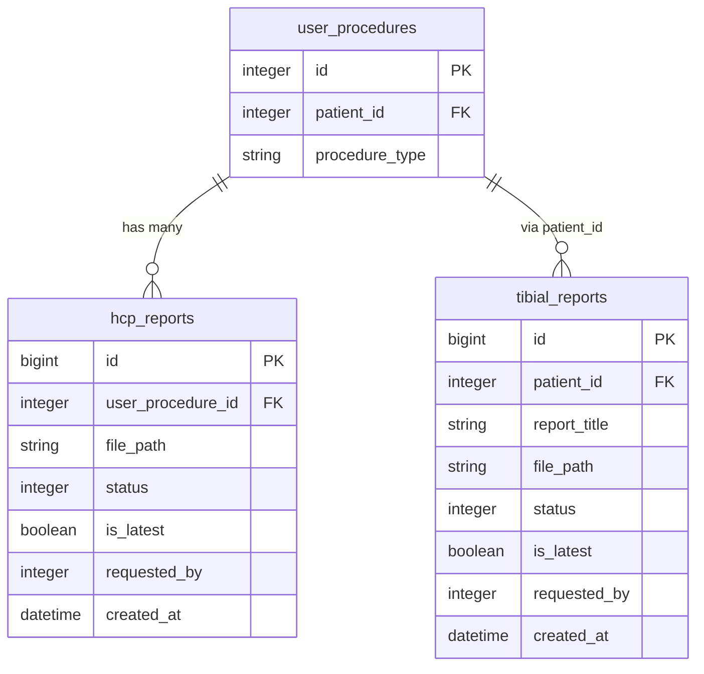
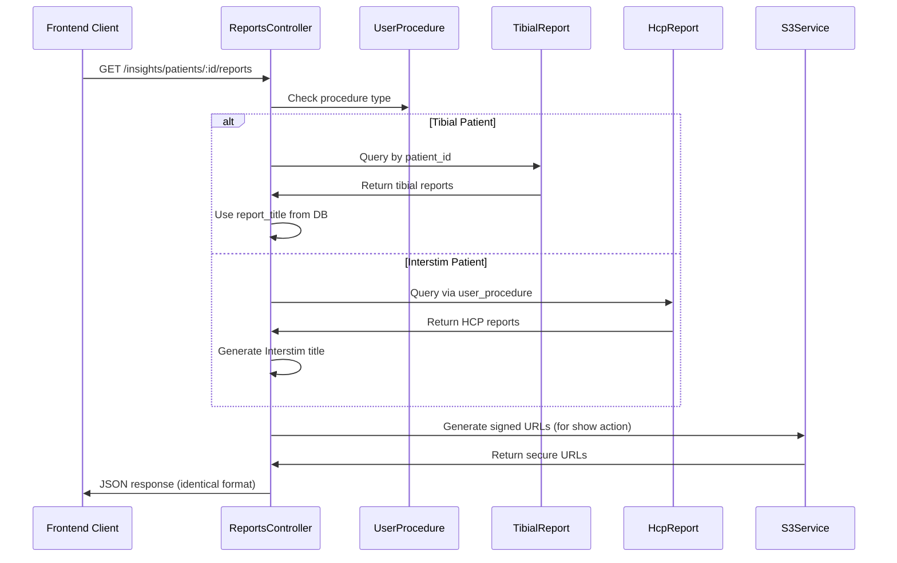

# Technical Design Specification: Tibial Reports API

## System Architecture

### Overview
Extend the existing `Insights::Patients::ReportsController` to support tibial-specific reports while maintaining complete backward compatibility with Interstim reports. The enhancement leverages existing Rails monolith architecture, authentication, authorization, and S3 storage patterns.

### Architecture Approach
- **Pattern**: Conditional logic within existing controller based on procedure type detection
- **Data Access**: Query `TibialReport` model for tibial patients, maintain existing `HcpReport` queries for non-tibial patients
- **API Contract**: Preserve identical endpoint and response format
- **Technology Stack**: Existing Rails application with ActiveRecord ORM

## Database Design

### Existing Schema Integration
The solution integrates with existing database structure:



### Data Access Patterns
- **Procedure Detection**: Query `user_procedures` table to determine patient procedure type
- **Tibial Reports**: Direct query to `tibial_reports` table by `patient_id`
- **Interstim Reports**: Existing query pattern via `user_procedure.hcp_reports`
- **Report Titles**: Use `report_title` column from `tibial_reports` table

## Controller Design

### Enhanced ReportsController Structure

```ruby
module Insights
  module Patients
    class ReportsController < MmsApiController
      # Existing includes and before_actions remain unchanged
      
      def index
        if tibial_patient?
          handle_tibial_reports_index
        else
          # Existing Interstim logic unchanged
          handle_interstim_reports_index
        end
      end
      
      def show
        if tibial_report_request?
          handle_tibial_report_show
        else
          # Existing Interstim logic unchanged  
          handle_interstim_report_show
        end
      end
      
      def create
        # Only extend index and show actions
        # Create remains separate per requirement 13C
        # Existing create logic unchanged
      end
      
      private
      
      def tibial_patient?
        # Determine from user_procedure relationship
      end
      
      def handle_tibial_reports_index
        @can_generate = check_can_generate_report? # Modified method
        @reports = TibialReport.where(patient_id: @patient.id).order(created_at: :desc)
        # Use existing view template with conditional logic
      end
      
      def check_can_generate_report?
        if tibial_patient?
          # Tibial-specific: baseline + diary day summary logic
        else
          # Existing Interstim logic unchanged
        end
      end
    end
  end
end
```

### Procedure Type Detection Logic

```ruby
def tibial_patient?
  @user_procedure&.procedure_type == 'tibial' # Adjust based on actual procedure type field
end
```

### Tibial Report Availability Logic

```ruby
def check_can_generate_report?
  if tibial_patient?
    # Tibial-specific logic: baseline + diary day summary required
    return false if @user_procedure&.baseline_datum.blank?
    
    # Check for at least one diary day summary
    diary_summaries = @user_procedure&.diary_day_summaries # Adjust based on actual relationship
    return false if diary_summaries.blank?
    
    true
  else
    # Existing Interstim logic: baseline + collection_period_data
    return false if @user_procedure&.baseline_datum.blank? || @user_procedure&.collection_period_data.blank?
    
    current_datetime = Time.current
    first_period = @user_procedure.collection_period_data.order(:start_datetime).first
    first_period&.end_datetime && current_datetime > first_period.end_datetime
  end
end
```

## API Design

### Endpoint Specification
**URL**: `/insights/patients/:patient_id/reports` (unchanged)
**Methods**: GET (index, show) - Create functionality separate
**Authentication**: Existing middleware (unchanged)
**Authorization**: Existing `Insights::ReportsPolicy` (unchanged)

### Response Format
Identical structure for both tibial and Interstim reports:

```json
{
  "is_report_generation_available": boolean,
  "data": [
    {
      "id": "report_id",
      "title": "Report Title from DB", // tibial_reports.report_title or generated Interstim title
      "status": "completed|pending|failed",
      "created_at": "formatted_datetime", 
      "created_by": "user_full_name",
      "is_latest": boolean
    }
  ]
}
```

### View Template Enhancement

```ruby
# app/views/insights/patients/reports/index.jbuilder
json.is_report_generation_available @can_generate
json.data @reports.each_with_index.to_a do |(report, index)|
  timezone = report.user_procedure&.location&.timezone || 'UTC' # Handle tibial reports
  
  json.id report.id
  
  # Conditional title logic
  if tibial_patient?
    json.title report.report_title # Use report_title column from tibial_reports
  else
    json.title "#{I18n.t('hcp_report.interstim_report')} #{@reports.count - index}" # Existing logic
  end
  
  json.status report.status
  json.created_at report.created_at&.in_time_zone(timezone).strftime(Constant::REPORT_CREATED_ON_FORMAT)
  json.created_by @requested_by_users[report.requested_by]&.full_name
  json.is_latest report.is_latest
end
```

## Security Design

### Authentication & Authorization
- **Pattern**: Reuse existing authentication middleware completely unchanged
- **Policy**: Maintain existing `Insights::ReportsPolicy` authorization
- **Permissions**: Preserve provider and patient advocate access control
- **Patient Access**: Existing patient-specific authorization through `set_patient_and_user_procedure`

### Data Protection
- **S3 Integration**: Use existing `S3Service.new.signed_url(file_key)` pattern
- **File Security**: Maintain existing file path and security token generation
- **Audit Logging**: Preserve existing `track_report_event` analytics tracking
- **Error Handling**: Follow existing error response patterns and status codes

## Integration Design

### Model Integration
```ruby
# TibialReport model (already exists in remote)
class TibialReport < ApplicationRecord
  # Expected to follow similar pattern as HcpReport
  enum status: { failed: 0, requested: 1, in_progress: 2, generated: 3, saved: 4 }
  # Direct patient relationship via patient_id
end
```

### Service Integration
- **S3 Service**: Reuse existing `S3Service` for file URL generation
- **Analytics**: Maintain existing `track_report_event` calls for tibial reports
- **Error Handling**: Follow existing exception handling patterns
- **Background Jobs**: If needed, follow existing `GenerateHcpReportJob` pattern

### Data Flow Architecture



## Performance Design

### Database Optimization
- **Tibial Queries**: Direct `patient_id` lookup for efficient filtering
- **Existing Queries**: Maintain current `user_procedure.hcp_reports` pattern
- **Indexing**: Leverage existing indexes on both models
- **Eager Loading**: Preserve existing `@requested_by_users` eager loading pattern

### Caching Strategy
- **Approach**: Maintain existing Rails caching patterns
- **Report Data**: Follow current caching behavior for report lists
- **S3 URLs**: Use existing S3 URL caching if implemented
- **Performance Target**: Match existing reports API response times (under 2-3 seconds)

## Implementation Strategy

### Development Phases

#### Phase 1: Controller Enhancement
1. Add procedure type detection logic to existing controller
2. Implement conditional branching for tibial vs Interstim handling
3. Modify `check_can_generate_report?` method for tibial availability logic

#### Phase 2: View Template Updates  
1. Update `index.jbuilder` with conditional title logic
2. Handle timezone and user lookup for tibial reports
3. Ensure identical JSON response format

#### Phase 3: Show Action Enhancement
1. Add tibial report support to show action for file downloads
2. Maintain existing S3 URL generation pattern
3. Preserve existing analytics tracking

### Testing Strategy
- **Unit Tests**: Test procedure type detection and availability logic
- **Integration Tests**: Verify both tibial and Interstim report flows
- **Regression Tests**: Ensure existing Interstim functionality unchanged
- **Performance Tests**: Confirm response times match existing API

## Task Dependencies

### Critical Path
1. **Prerequisite**: Pull remote changes to get `TibialReport` model and `tibial_reports` table
2. **Controller Logic**: Implement procedure type detection and conditional branching
3. **Availability Logic**: Modify report generation availability check for tibial patients
4. **View Template**: Update title rendering logic for tibial reports
5. **Show Action**: Add tibial report download support
6. **Testing**: Comprehensive testing of both report types

### Implementation Order
1. Analyze existing `TibialReport` model structure after pulling remote changes
2. Implement `tibial_patient?` detection method
3. Add conditional logic to `index` action
4. Modify `check_can_generate_report?` for tibial availability
5. Update view template for tibial title handling
6. Extend `show` action for tibial report downloads
7. Test both tibial and Interstim report functionality

## Risk Mitigation

### Backward Compatibility
- **Interstim Reports**: All existing functionality preserved unchanged
- **API Contract**: Identical response format maintained
- **Authentication**: No changes to existing security patterns
- **Performance**: Match existing response times

### Error Handling
- **Unknown Procedure Types**: Default to existing Interstim behavior
- **Missing Data**: Follow existing error response patterns
- **S3 Failures**: Use existing S3 error handling
- **Database Issues**: Maintain existing exception handling patterns