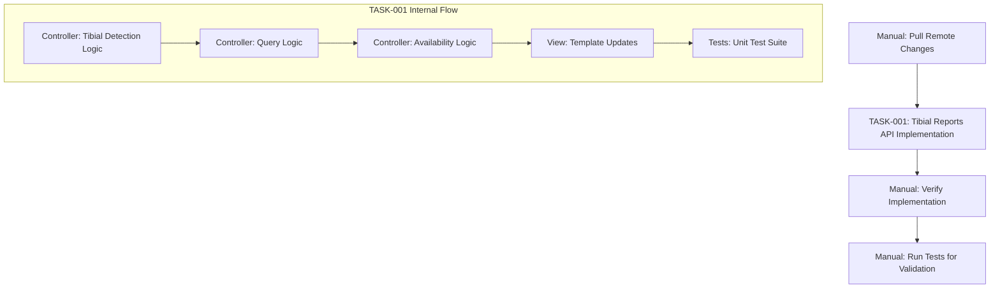

# Task Breakdown: Tibial Reports API

## Implementation Overview
**Approach**: Feature-complete implementation as single comprehensive task
**Critical Path**: Controller Logic → View Template → Unit Tests
**Dependencies**: Sequential development with TibialReport model assumption

## Task Dependencies


## Single Task Implementation

### 🎯 TASK-001: Complete Tibial Reports API Implementation
**Priority**: Critical Path  
**Dependencies**: Manual pull of remote changes to obtain TibialReport model
**Effort Estimate**: 4-6 hours
**Type**: Feature-complete implementation

**User Story Integration**:
- **Primary**: "As a provider or patient advocate, I want to fetch tibial reports via API so that I can display the list of available reports for tibial patients"
- **Supporting**: "As a frontend developer, I want tibial reports to use the same API format as existing reports so that I can reuse existing UI components"
- **Quality**: "As a provider, I want to know when tibial reports can be generated so that I understand data availability for my patients"

**Description**: Complete implementation of tibial-specific reports functionality within existing `Insights::Patients::ReportsController`, including procedure detection, conditional querying, availability logic, view template updates, and comprehensive unit test coverage.

### Implementation Components

#### A. Controller Logic Enhancement
**File**: `app/controllers/insights/patients/reports_controller.rb`

**Subtasks**:
- [ ] Add `tibial_patient?` method for procedure type detection via user_procedure relationship
- [ ] Modify `index` action with conditional logic for tibial vs Interstim report querying
- [ ] Extend `show` action to handle tibial report downloads using TibialReport model
- [ ] Update `check_can_generate_report?` method with tibial-specific availability logic (baseline + diary day summary)
- [ ] Maintain all existing Interstim functionality unchanged

**Implementation Details**:
```ruby
# Procedure Detection Logic
def tibial_patient?
  # Determine from user_procedure relationship
  @user_procedure&.procedure_type == 'tibial' # Adjust based on actual field
end

# Index Action Enhancement
def index
  if tibial_patient?
    handle_tibial_reports_index
  else
    # Existing Interstim logic unchanged
    handle_existing_interstim_logic
  end
end

# Tibial-Specific Availability Logic
def check_can_generate_report?
  if tibial_patient?
    # Baseline + diary day summary required for tibial
    return false if @user_procedure&.baseline_datum.blank?
    diary_summaries = @user_procedure&.diary_day_summaries
    return false if diary_summaries.blank?
    true
  else
    # Existing Interstim logic: baseline + collection_period_data
    existing_interstim_availability_logic
  end
end
```

#### B. View Template Updates
**File**: `app/views/insights/patients/reports/index.jbuilder`

**Subtasks**:
- [ ] Add conditional title logic for tibial vs Interstim reports
- [ ] Use `report_title` column from tibial_reports table for tibial patients
- [ ] Maintain existing Interstim title generation logic unchanged
- [ ] Handle timezone and user lookup for tibial reports
- [ ] Ensure identical JSON response format for both report types

**Implementation Details**:
```ruby
# Conditional Title Logic
if tibial_patient?
  json.title report.report_title # Use report_title column from tibial_reports
else
  json.title "#{I18n.t('hcp_report.interstim_report')} #{@reports.count - index}"
end
```

#### C. Unit Test Suite
**File**: `test/controllers/insights/patients/reports_controller_test.rb`

**Subtasks**:
- [ ] Test `tibial_patient?` method with various user_procedure configurations
- [ ] Test `index` action for tibial patients returns correct tibial reports
- [ ] Test `index` action for Interstim patients maintains existing behavior
- [ ] Test `show` action handles tibial report downloads correctly
- [ ] Test `check_can_generate_report?` method for tibial availability logic
- [ ] Test edge cases: no reports, mixed procedure types, missing data
- [ ] Test response format consistency between tibial and Interstim reports

**Test Coverage Areas**:
```ruby
# Tibial Patient Detection Tests
test "tibial_patient? returns true for tibial procedures"
test "tibial_patient? returns false for interstim procedures"

# Index Action Tests  
test "index returns tibial reports for tibial patients"
test "index maintains interstim behavior for interstim patients"
test "index returns empty array when no tibial reports exist"

# Availability Logic Tests
test "tibial reports available when baseline and diary summaries exist"
test "tibial reports unavailable when baseline missing"
test "tibial reports unavailable when diary summaries missing"

# Response Format Tests
test "response format identical for tibial and interstim reports"
test "tibial report titles use report_title column"
```

## Acceptance Criteria

### Functional Requirements
- [ ] API filters reports by querying TibialReport table directly by patient_id for tibial patients
- [ ] API maintains existing HcpReport queries for non-tibial patients
- [ ] Reports are sorted by generation date (newest first) for both report types
- [ ] Response follows existing format with `is_report_generation_available` and `data` fields
- [ ] Report titles use `report_title` column from tibial_reports table for tibial patients
- [ ] API returns empty data array when no tibial reports exist
- [ ] Existing Interstim reports functionality remains completely unchanged

### Technical Requirements
- [ ] Procedure type detection works correctly via user_procedures relationship
- [ ] Tibial availability logic checks baseline existence and diary day summary presence
- [ ] S3 URL generation follows existing security patterns for tibial reports
- [ ] View template handles both tibial and Interstim reports with identical JSON structure
- [ ] All existing authentication and authorization patterns preserved

### Quality Requirements
- [ ] Unit tests cover all new tibial-specific methods and logic paths
- [ ] Tests verify backward compatibility with existing Interstim functionality  
- [ ] Edge cases handled: no reports, missing data, mixed procedure types
- [ ] Code follows existing Rails conventions and patterns
- [ ] No breaking changes to existing API contract

## Risk Assessment

### High Risk Areas
- **Procedure Type Detection**: Critical to correctly identify tibial vs Interstim patients
  - *Mitigation*: Thorough testing with various user_procedure configurations
- **Data Structure Assumptions**: TibialReport model structure must match design expectations
  - *Mitigation*: Manual verification after pulling remote changes, comprehensive tests
- **Backward Compatibility**: Existing Interstim functionality must remain unchanged
  - *Mitigation*: Extensive regression testing and careful conditional logic

### Medium Risk Areas
- **Availability Logic**: Tibial-specific baseline + diary day summary requirements
  - *Mitigation*: Clear documentation of data relationship assumptions
- **View Template Logic**: Conditional title handling for different report types
  - *Mitigation*: Test both report type scenarios thoroughly

## Quality Gates

### Development Gates
- [ ] Controller modifications preserve all existing Interstim behavior
- [ ] Procedure type detection logic works reliably
- [ ] Tibial report queries return expected data structure
- [ ] View template produces identical JSON format for both report types

### Testing Gates
- [ ] Unit tests written for all new methods and conditional logic paths
- [ ] Test coverage includes edge cases and error conditions
- [ ] Regression tests verify Interstim functionality unchanged
- [ ] Tests assume TibialReport model exists and validate behavior

### Integration Gates
- [ ] Manual pull of remote changes completed successfully
- [ ] TibialReport model structure verified against implementation assumptions
- [ ] Tibial report queries work with actual database structure
- [ ] End-to-end testing with actual tibial patient data

## Implementation Notes

### Assumptions
- **TibialReport Model**: Exists with expected structure (patient_id, report_title, status, etc.)
- **Database Table**: `tibial_reports` table available with required columns
- **Data Relationships**: Baseline and diary day summary relationships accessible via user_procedure
- **Procedure Detection**: User_procedure table contains procedure type information for identification

### Manual Prerequisites
1. **Remote Pull**: Execute `git pull origin main` to obtain TibialReport model and tibial_reports table
2. **Model Verification**: Confirm TibialReport model structure matches design expectations
3. **Data Verification**: Verify baseline and diary day summary relationship patterns
4. **Test Validation**: Run test suite after implementation to validate assumptions

### Success Metrics
- **Functionality**: Both tibial and Interstim reports work correctly via same API endpoint
- **Compatibility**: Zero regression in existing Interstim reports functionality
- **Code Quality**: Implementation follows existing Rails patterns and conventions
- **Test Coverage**: Comprehensive unit tests cover all new conditional logic paths

## External Dependencies

### Critical Dependencies
- **Remote Changes**: TibialReport model and tibial_reports table must be available
- **Data Structures**: Baseline and diary day summary data relationships must be accessible
- **User Procedure Data**: Procedure type information must be available for patient identification

### Risk Mitigation
- **Model Assumptions**: Write tests that validate expected TibialReport model behavior
- **Data Assumptions**: Document expected data relationship patterns in test cases
- **Manual Verification**: Use test failures to identify and resolve assumption mismatches