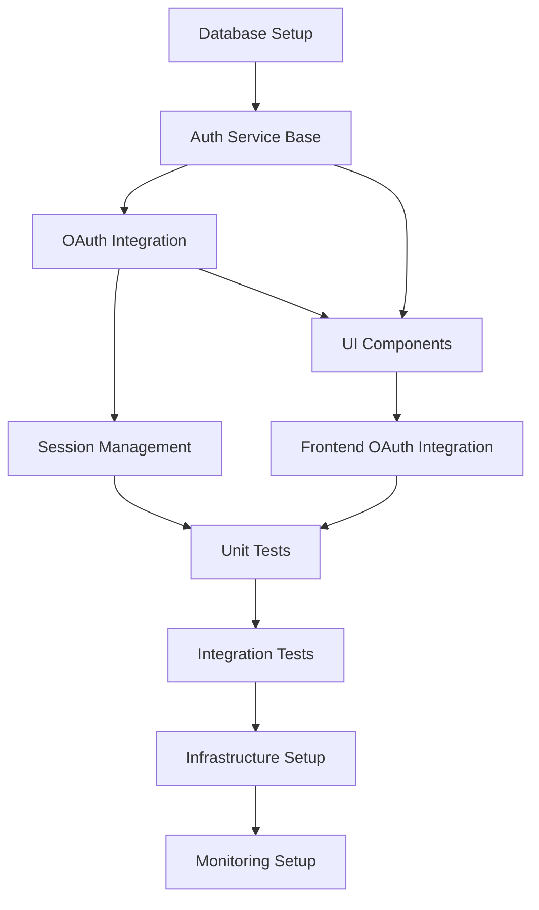

# Tasks - Phase 4: Task Breakdown & Implementation Planning

## Purpose
Break down design specifications into granular, implementable tasks with clear dependencies and priorities.

## Prerequisites Check
- **REQUIRED**: All files from phases 1-3
- **Pattern**: `tasks/<issue-name>/01-*.md`, `tasks/<issue-name>/02-*.md`, `tasks/<issue-name>/03-*.md`

## Process

### 1. Comprehensive Documentation Analysis
Read and analyze all previous phase documents for context.

### 2. Interactive Task Planning Session

#### Implementation Approach Questions
- What is your preferred development approach? (incremental, feature-complete, MVP-first)
- Should tasks be organized by: component, feature, or layer?
- Are there any specific technical constraints or dependencies?
- What is the testing strategy preference? (unit, integration, E2E)

#### Task Granularity Questions
- How granular should individual tasks be?
- Should UI and backend tasks be separated or combined?
- Do you want separate tasks for testing and documentation?
- Should database migrations be standalone tasks?

#### Dependency Analysis Questions
- Which components can be developed in parallel?
- What are the critical path dependencies?
- Are there any external dependencies or integrations?
- What foundation/infrastructure tasks must come first?

#### Risk Assessment Questions
- What are the highest risk/complexity areas?
- Which tasks require the most research or investigation?
- Are there any tasks that might require iteration/refinement?
- What tasks have external dependencies that could delay progress?

### 3. User Confirmation & Task Generation

Review all task planning information with user before generating breakdown:
- Confirm implementation approach is appropriate
- Verify task dependencies are correctly identified
- Validate risk assessment covers all concerns
- Ensure task organization meets development preferences
- **Generate task breakdown documents only after explicit user approval**

## Output Files

### `tasks/<issue-name>/04-tasks.md`
Comprehensive task breakdown with integrated user stories:

```markdown
# Task Breakdown: <Issue Name>

## Implementation Overview
**Critical Path**: Database → Authentication → Frontend Integration  
**Parallel Development**: UI Components can be developed alongside API endpoints

## Task Dependencies


## Task Categories

### 🏗️ Foundation Tasks (Priority: High)
**Must be completed before other development can begin**

#### TASK-001: Database Schema Setup
**Priority**: Critical Path  
**Dependencies**: None  

**User Story Integration**:
- Supports: "As a system, I need secure user data storage"
- Enables: All authentication-related user stories

**Description**: Create database tables and indexes for user authentication system

**Subtasks**:
- [ ] Create `users` table with Google OAuth fields
- [ ] Create `sessions` table for JWT token management  
- [ ] Create `audit_logs` table for security tracking
- [ ] Add database indexes for performance
- [ ] Create migration scripts for schema deployment
- [ ] Set up database constraints and validation rules

**Acceptance Criteria**:
- [ ] All tables created with proper data types and constraints
- [ ] Database indexes improve query performance
- [ ] Migration scripts run successfully on clean database
- [ ] Foreign key relationships properly established
- [ ] Database passes validation tests for data integrity

[Continue with all tasks integrating relevant user stories...]

## Quality Gates

### Foundation Gates
- [ ] Database schema passes migration tests
- [ ] OAuth flow completes successfully in development
- [ ] Security headers properly configured
- [ ] Code review completed for all authentication logic

### Integration Gates  
- [ ] Session management handles concurrent users
- [ ] Frontend components pass accessibility tests
- [ ] Integration between frontend and backend tested
- [ ] Error handling covers all identified scenarios

### Testing Gates
- [ ] Unit test coverage >90% for critical paths
- [ ] Integration tests cover all user scenarios  
- [ ] Performance tests meet established benchmarks
- [ ] Security scanning shows no critical vulnerabilities

### Deployment Gates
- [ ] Production deployment successful
- [ ] Monitoring dashboards show green status
- [ ] Rollback procedures tested and documented
- [ ] Operational procedures documented
```

## Rich Documentation Features

### Mermaid Diagrams
- **Gantt Charts**: Project timeline and task dependencies
- **Flowcharts**: Task decision trees and workflows  
- **Network Diagrams**: Resource allocation and team coordination

### Task Management Tables
- **Priority Matrices**: Task importance and urgency mapping
- **Resource Allocation**: Skills and time requirements per task
- **Risk Assessment**: Risk probability and impact analysis

### Implementation Tracking
- **Progress Dashboards**: Visual task completion status
- **Dependency Chains**: Critical path identification
- **Quality Gates**: Milestone completion criteria

## Error Handling
```bash
# Missing design files
if [ ${#design_files[@]} -eq 0 ]; then
    echo "❌ Error: No design files found for issue: $issue_name"  
    echo "📋 Required files pattern: tasks/$issue_name/03-*.md"
    echo "🔧 Run design.md first to create technical specifications"
    exit 1
fi

# Incomplete previous phases
for phase in "${required_phases[@]}"; do
    phase_files=($(ls tasks/$issue_name/$phase-*.md 2>/dev/null))
    if [ ${#phase_files[@]} -eq 0 ]; then
        echo "❌ Error: Phase $phase incomplete"
        echo "📋 Workflow order: concept → requirements → design → tasks"
        exit 1
    fi
done
```

## Integration Points
- **Previous Phases**: Reads all documentation from concept, requirements, and design phases
- **Next Phase**: `implement.md` will read all `04-*.md` task files for execution
- **Quality Assurance**: Task definitions include built-in quality gates
- **Documentation**: Creates multiple specialized documents for comprehensive planning

## Tips for Success
1. **Granular Tasks**: Break complex work into manageable chunks  
2. **Clear Dependencies**: Identify and document all prerequisite relationships
3. **Parallel Opportunities**: Find tasks that can be developed simultaneously
4. **Risk Assessment**: Identify high-risk tasks early and plan mitigation
5. **Quality Gates**: Build testing and validation into the task structure

## Example Workflow
```bash
# Start task breakdown phase
./tasks.md

# System validates all prerequisites
✅ Prerequisites validated. Loading documentation...
📄 Found 8 documentation files
🔍 Complexity Analysis:
  - UI/UX complexity: 12 indicators
  - API/Service complexity: 8 indicators
  - Database complexity: 6 indicators

# Interactive planning session
🎯 Starting comprehensive task breakdown session...
📋 Implementation approach questions...
⚖️ Task granularity preferences...  
🔗 Dependency analysis...
⚠️ Risk assessment...
👥 Resource planning...

# System generates comprehensive task documentation
✅ Task breakdown complete:
  - tasks/google-oauth-integration/04-task-breakdown.md
  - tasks/google-oauth-integration/04-dependencies.md
  - tasks/google-oauth-integration/04-quality-gates.md

Next: Run implement.md with issue name 'google-oauth-integration'
```