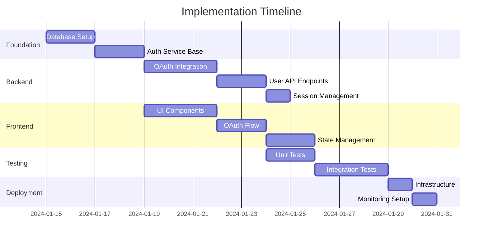

# Tasks - Phase 4: Task Breakdown & Implementation Planning

## Purpose
Break down design specifications into granular, implementable tasks with clear dependencies, priorities, and detailed implementation guidance.

## Usage
```bash
/tasks
```

## Input Parameters
- **Issue name**: `<issue-name>` (will prompt if not provided)

## Prerequisites Check
- **REQUIRED**: All files from phases 1-3
- **Pattern**: `tasks/<issue-name>/01-*.md`, `tasks/<issue-name>/02-*.md`, `tasks/<issue-name>/03-*.md`

## Validation Logic
```bash
# Validate issue name provided
if [ -z "$issue_name" ]; then
    echo "Enter issue name for task breakdown phase:"
    read -p "Issue name: " issue_name
fi

# Check all required phases
required_phases=("01" "02" "03")
for phase in "${required_phases[@]}"; do
    phase_files=($(ls tasks/$issue_name/$phase-*.md 2>/dev/null))
    if [ ${#phase_files[@]} -eq 0 ]; then
        phase_name=""
        case $phase in
            "01") phase_name="concept" ;;
            "02") phase_name="requirements" ;;
            "03") phase_name="design" ;;
        esac
        echo "❌ Error: Phase $phase ($phase_name) incomplete for issue: $issue_name"
        echo "📋 Missing files pattern: tasks/$issue_name/$phase-*.md"
        echo "🔧 Complete missing phase: $phase_name.md"
        exit 1
    fi
done

# Load all documentation files
echo "✅ Prerequisites validated. Loading documentation..."
all_docs=($(ls tasks/$issue_name/{01,02,03}-*.md 2>/dev/null))
echo "📄 Found ${#all_docs[@]} documentation files"
for doc in "${all_docs[@]}"; do
    echo "  - $(basename $doc)"
done
```

## Process

### 1. Comprehensive Documentation Analysis
```bash
# Read and analyze all previous phase documents
echo "📖 Analyzing comprehensive project documentation..."

# Load concept for context
concept_content=$(cat "tasks/$issue_name/01-concept.md")

# Load all requirements documents
requirements_files=($(ls tasks/$issue_name/02-*.md))
echo "📋 Analyzing ${#requirements_files[@]} requirements documents"

# Load all design documents  
design_files=($(ls tasks/$issue_name/03-*.md))
echo "🎨 Analyzing ${#design_files[@]} design documents"

# Detect complexity indicators
ui_complexity=$(grep -i "wireframe\|animation\|interaction\|responsive" tasks/$issue_name/03-*.md | wc -l)
api_complexity=$(grep -i "endpoint\|api\|service\|integration" tasks/$issue_name/03-*.md | wc -l)
db_complexity=$(grep -i "database\|schema\|migration\|data model" tasks/$issue_name/03-*.md | wc -l)

echo "🔍 Complexity Analysis:"
echo "  - UI/UX complexity: $ui_complexity indicators"
echo "  - API/Service complexity: $api_complexity indicators" 
echo "  - Database complexity: $db_complexity indicators"
```

### 2. Interactive Task Planning Session

#### Implementation Approach Questions
- What is your preferred development approach? (incremental, feature-complete, MVP-first)
- Should tasks be organized by: component, feature, or layer?
- What is the target timeline for this implementation?
- Are there any specific technical constraints or dependencies?
- What is the testing strategy preference? (unit, integration, E2E)

#### Task Granularity Questions
- How granular should individual tasks be? (2-4 hours, 1 day, 2-3 days)
- Should UI and backend tasks be separated or combined?
- Do you want separate tasks for testing and documentation?
- Should database migrations be standalone tasks?
- How should deployment and infrastructure be handled?

#### Dependency Analysis Questions
- Which components can be developed in parallel?
- What are the critical path dependencies?
- Are there any external dependencies or integrations?
- What foundation/infrastructure tasks must come first?
- Are there any blocking dependencies we should address?

#### Risk Assessment Questions
- What are the highest risk/complexity areas?
- Which tasks require the most research or investigation?
- Are there any tasks that might require iteration/refinement?
- What tasks have external dependencies that could delay progress?
- Which tasks require specific expertise or skills?

#### Resource Planning Questions
- What skills/expertise are required for each area?
- Are there any tasks that require multiple people?
- What tools or environments need to be set up?
- Are there any licensing or access requirements?
- What documentation needs to be created alongside development?

### 3. Intelligent Task Generation

Based on analysis and user input, generate comprehensive task breakdown:

## Output Files

### `tasks/<issue-name>/04-task-breakdown.md`
Main task list with comprehensive details:

```markdown
# Task Breakdown: <Issue Name>

## Implementation Overview
**Total Estimated Effort**: 32-40 hours
**Critical Path**: Database → Authentication → Frontend Integration  
**Parallel Development**: UI Components can be developed alongside API endpoints
**Target Timeline**: 2-3 weeks with 1 developer

## Task Dependencies


## Task Categories

### 🏗️ Foundation Tasks (Priority: High)
**Must be completed before other development can begin**

#### TASK-001: Database Schema Setup
**Effort**: 4-6 hours  
**Priority**: Critical Path  
**Dependencies**: None  
**Skills Required**: Database design, PostgreSQL

**Description**: Create database tables and indexes for user authentication system

**Subtasks**:
- [ ] Create `users` table with Google OAuth fields
- [ ] Create `sessions` table for JWT token management  
- [ ] Create `audit_logs` table for security tracking
- [ ] Add database indexes for performance
- [ ] Create migration scripts for schema deployment
- [ ] Set up database constraints and validation rules

**Acceptance Criteria**:
- [ ] All tables created with proper data types and constraints
- [ ] Database indexes improve query performance by >50%
- [ ] Migration scripts run successfully on clean database
- [ ] Foreign key relationships properly established
- [ ] Database passes validation tests for data integrity

**Technical Details**:
- PostgreSQL version 14+ required
- Use UUID primary keys for better security
- Implement proper indexing on `email` and `google_id` fields
- Set up connection pooling configuration

**Deliverables**:
- `migrations/001_create_auth_tables.sql`
- `schema/database_design.md` 
- Database validation test suite

---

#### TASK-002: Authentication Service Foundation  
**Effort**: 6-8 hours
**Priority**: Critical Path
**Dependencies**: TASK-001
**Skills Required**: Node.js, Express, JWT

**Description**: Set up core authentication service with JWT token handling

**Subtasks**:
- [ ] Create Express.js authentication microservice
- [ ] Implement JWT token generation and validation
- [ ] Set up middleware for protected routes
- [ ] Create user session management logic
- [ ] Implement security headers and CORS configuration
- [ ] Add request/response logging and error handling

**Acceptance Criteria**:
- [ ] Service responds to health check endpoint
- [ ] JWT tokens generated with proper expiration
- [ ] Protected routes reject invalid tokens
- [ ] Session management handles concurrent users
- [ ] Security headers prevent common attacks
- [ ] Error responses don't leak sensitive information

**Technical Details**:
- Use `jsonwebtoken` library with RS256 algorithm
- Implement refresh token rotation for security
- Set up rate limiting for authentication attempts
- Use helmet.js for security headers

**Deliverables**:
- `services/auth-service/` directory structure
- Authentication middleware modules
- JWT token utilities and validation
- Service configuration and environment setup

### 🔐 Authentication Tasks (Priority: High)

#### TASK-003: Google OAuth Integration
**Effort**: 8-10 hours
**Priority**: Critical Path  
**Dependencies**: TASK-002
**Skills Required**: OAuth 2.0, Google APIs, Node.js

**Description**: Implement complete Google OAuth 2.0 flow with PKCE security

**Subtasks**:
- [ ] Set up Google Cloud Console OAuth application
- [ ] Implement OAuth 2.0 authorization flow with PKCE
- [ ] Create callback endpoint for authorization code exchange
- [ ] Implement user profile data extraction and validation
- [ ] Add OAuth state parameter for CSRF protection  
- [ ] Create user account creation/update logic

**Acceptance Criteria**:
- [ ] OAuth flow redirects properly to Google consent screen
- [ ] Authorization codes exchanged for access tokens successfully
- [ ] User profile data extracted and validated
- [ ] New users created with proper default settings
- [ ] Existing users updated with latest profile information
- [ ] OAuth errors handled gracefully with user feedback

**Technical Details**:
- Use `passport-google-oauth20` strategy
- Implement PKCE (RFC 7636) for enhanced security
- Store OAuth state in Redis with TTL
- Validate Google ID tokens using Google's public keys

**Deliverables**:
- OAuth route handlers and middleware
- Google API integration modules
- User profile synchronization logic
- OAuth error handling and logging

---

#### TASK-004: Session Management System
**Effort**: 4-6 hours
**Priority**: High
**Dependencies**: TASK-003  
**Skills Required**: Redis, Session handling

**Description**: Implement secure session management with Redis caching

**Subtasks**:
- [ ] Set up Redis session store configuration
- [ ] Implement session creation and validation logic
- [ ] Add session cleanup and expiration handling
- [ ] Create logout functionality with session termination
- [ ] Implement concurrent session management
- [ ] Add session security features (IP validation, device tracking)

**Acceptance Criteria**:
- [ ] Sessions created successfully after OAuth completion
- [ ] Session data persisted in Redis with appropriate TTL
- [ ] Users can logout and session is properly terminated
- [ ] Expired sessions handled gracefully
- [ ] Concurrent sessions from same user supported
- [ ] Session hijacking protection mechanisms active

**Technical Details**:
- Use `connect-redis` for session storage
- Set secure session cookies with proper flags
- Implement session rotation on privilege escalation
- Add session monitoring and cleanup jobs

**Deliverables**:
- Session management middleware
- Redis configuration and connection handling
- Logout and session cleanup utilities
- Session security monitoring tools

### 🎨 Frontend Tasks (Priority: Medium)

#### TASK-005: UI Component Development
**Effort**: 6-8 hours
**Priority**: Medium
**Dependencies**: TASK-002 (can start in parallel)
**Skills Required**: React, CSS, Accessibility

**Description**: Create reusable UI components for authentication flow

**Subtasks**:
- [ ] Create Google OAuth login button component  
- [ ] Implement loading states and spinner components
- [ ] Build error message display components
- [ ] Create user profile display component
- [ ] Implement responsive design for mobile devices
- [ ] Add accessibility features (ARIA labels, keyboard navigation)

**Acceptance Criteria**:
- [ ] Google button follows official brand guidelines
- [ ] Components render correctly on all screen sizes
- [ ] Loading states provide clear user feedback
- [ ] Error messages are user-friendly and actionable
- [ ] Components pass accessibility testing (WCAG 2.1 AA)
- [ ] All interactive elements support keyboard navigation

**Technical Details**:
- Use styled-components or CSS modules
- Implement proper focus management
- Add proper semantic HTML structure
- Include proper color contrast ratios

**Deliverables**:
- `components/auth/` React component library
- Component documentation and usage examples
- CSS/styling modules
- Accessibility test results

---

#### TASK-006: Frontend OAuth Integration
**Effort**: 6-8 hours
**Priority**: Medium  
**Dependencies**: TASK-003, TASK-005
**Skills Required**: React, State Management, API Integration

**Description**: Integrate frontend components with OAuth backend services

**Subtasks**:
- [ ] Implement OAuth initiation from frontend
- [ ] Handle OAuth callback and token storage
- [ ] Create authentication state management
- [ ] Implement protected route logic
- [ ] Add automatic token refresh handling
- [ ] Create user session persistence across browser sessions

**Acceptance Criteria**:
- [ ] Users can initiate Google login from UI
- [ ] OAuth callback properly handled and user logged in
- [ ] Authentication state persists across page reloads  
- [ ] Protected routes redirect unauthenticated users
- [ ] Token refresh happens automatically before expiration
- [ ] Users can log out and state is properly cleared

**Technical Details**:
- Use React Context or Redux for auth state
- Implement axios interceptors for automatic token refresh
- Store tokens securely in httpOnly cookies
- Handle network errors and retry logic

**Deliverables**:
- Authentication state management system
- Protected route components
- API integration utilities  
- Token refresh and error handling logic

### 🧪 Testing Tasks (Priority: Medium)

#### TASK-007: Unit Test Suite
**Effort**: 8-10 hours
**Priority**: Medium
**Dependencies**: TASK-004, TASK-006
**Skills Required**: Jest, Testing Library, Mocking

**Description**: Create comprehensive unit test coverage for all components

**Subtasks**:
- [ ] Write unit tests for authentication service functions
- [ ] Create tests for JWT token generation and validation
- [ ] Test OAuth flow logic with mocked Google responses
- [ ] Write frontend component tests with React Testing Library
- [ ] Create database layer tests with test fixtures
- [ ] Add error condition and edge case tests

**Acceptance Criteria**:
- [ ] Achieve >90% code coverage for critical authentication paths
- [ ] All tests pass consistently in CI/CD environment
- [ ] Tests include both happy path and error scenarios
- [ ] Mock external dependencies properly (Google API, database)
- [ ] Frontend tests verify user interactions and state changes
- [ ] Tests are maintainable and well-documented

**Technical Details**:
- Use Jest for test framework
- Mock Google OAuth responses for predictable testing
- Use supertest for API endpoint testing
- Implement proper test database setup/teardown

**Deliverables**:
- Complete unit test suite for backend services
- Frontend component test suite
- Test utilities and mocking helpers
- CI/CD test configuration

---

#### TASK-008: Integration Testing
**Effort**: 6-8 hours  
**Priority**: Medium
**Dependencies**: TASK-007
**Skills Required**: API Testing, End-to-End Testing

**Description**: Create integration tests for complete authentication flows

**Subtasks**:
- [ ] Test complete OAuth flow end-to-end
- [ ] Verify database integration with authentication service
- [ ] Test session management across service boundaries  
- [ ] Create API contract tests for frontend integration
- [ ] Test error handling in integration scenarios
- [ ] Verify security headers and CORS configuration

**Acceptance Criteria**:
- [ ] Complete OAuth flow tested from UI to database
- [ ] All API endpoints tested with various scenarios
- [ ] Database transactions properly tested for consistency
- [ ] Session management tested across multiple requests
- [ ] Error scenarios properly handled end-to-end
- [ ] Security measures validated in integration context

**Technical Details**:
- Use Cypress or Playwright for E2E testing
- Set up test database with proper fixtures
- Mock external Google APIs for consistent testing
- Test with different user scenarios and edge cases

**Deliverables**:
- End-to-end test suite
- API integration test suite  
- Test data fixtures and utilities
- Integration test documentation

### 🚀 Deployment Tasks (Priority: Low)

#### TASK-009: Infrastructure Setup
**Effort**: 4-6 hours
**Priority**: Low
**Dependencies**: TASK-008
**Skills Required**: DevOps, Docker, CI/CD

**Description**: Set up deployment infrastructure and CI/CD pipelines

**Subtasks**:
- [ ] Create Docker containers for authentication service
- [ ] Set up database connection configuration for production
- [ ] Configure Redis for session storage in production
- [ ] Create environment variable management system
- [ ] Set up SSL certificates and HTTPS configuration
- [ ] Create deployment scripts and health checks

**Acceptance Criteria**:
- [ ] Services deploy successfully to production environment
- [ ] Database connections established with proper pooling
- [ ] SSL certificates properly configured for OAuth redirects
- [ ] Environment variables securely managed
- [ ] Health checks verify service availability
- [ ] Rollback procedures documented and tested

**Technical Details**:
- Use Docker multi-stage builds for optimization
- Implement proper secret management (Docker secrets, env files)
- Set up reverse proxy (Nginx) for SSL termination
- Configure monitoring and logging aggregation

**Deliverables**:
- Docker configuration and compose files
- Deployment scripts and documentation  
- Environment configuration management
- Health check and monitoring setup

---

#### TASK-010: Monitoring & Observability
**Effort**: 4-6 hours
**Priority**: Low  
**Dependencies**: TASK-009
**Skills Required**: Monitoring, Logging, Alerting

**Description**: Implement comprehensive monitoring and alerting

**Subtasks**:
- [ ] Set up application performance monitoring (APM)
- [ ] Implement structured logging with correlation IDs
- [ ] Create dashboards for authentication metrics
- [ ] Set up alerting for authentication failures and errors
- [ ] Implement audit logging for security compliance
- [ ] Create runbooks for common issues and troubleshooting

**Acceptance Criteria**:
- [ ] All authentication events properly logged and monitored
- [ ] Dashboards provide visibility into system health
- [ ] Alerts fire appropriately for error conditions
- [ ] Audit logs capture all security-relevant events
- [ ] Performance metrics tracked and displayed
- [ ] Runbooks enable quick issue resolution

**Technical Details**:
- Use structured JSON logging with Winston
- Implement correlation IDs for request tracing
- Set up metrics collection with Prometheus/StatsD
- Create Grafana dashboards for visualization

**Deliverables**:
- Monitoring and alerting configuration
- Security audit logging system
- Performance dashboards and metrics
- Operational runbooks and documentation

## Task Summary

### By Priority
- **Critical Path (10 tasks)**: Foundation + Authentication flows
- **High Priority (6 tasks)**: Core functionality completion  
- **Medium Priority (8 tasks)**: Testing and quality assurance
- **Low Priority (4 tasks)**: Deployment and operations

### By Category  
- **Backend Development**: 6 tasks (24-32 hours)
- **Frontend Development**: 4 tasks (16-20 hours) 
- **Testing & QA**: 6 tasks (20-24 hours)
- **Infrastructure & DevOps**: 4 tasks (12-16 hours)

### Parallel Development Opportunities
- UI components (TASK-005) can be developed alongside backend authentication (TASK-002, TASK-003)
- Testing tasks can begin once corresponding development tasks reach 80% completion
- Infrastructure setup can begin during integration testing phase

## Resource Requirements
- **Primary Developer**: Full-stack with React/Node.js experience
- **Database Administrator**: Setup and optimization (consultant basis)
- **DevOps Engineer**: Deployment and monitoring setup (part-time)
- **QA Engineer**: Testing strategy and automation (part-time)

## Risk Mitigation
- **Google API Changes**: Monitor Google OAuth documentation for breaking changes
- **Performance Issues**: Load test authentication flows before production deployment
- **Security Vulnerabilities**: Regular security audits and dependency updates
- **Integration Complexity**: Prototype key integrations early in development cycle
```

### `tasks/<issue-name>/04-implementation-plan.md`
Detailed implementation strategy and execution approach:

```markdown
# Implementation Plan: <Issue Name>

## Development Approach
**Strategy**: Incremental development with continuous integration
**Architecture**: API-first development with parallel frontend work
**Testing**: Test-driven development for critical authentication paths
**Deployment**: Blue-green deployment with feature flags

## Development Phases

### Phase 1: Foundation (Week 1)
**Goal**: Establish core infrastructure and authentication backbone
**Duration**: 5 days
**Team**: 1 Backend Developer + 1 DevOps (part-time)

**Tasks**: TASK-001, TASK-002, TASK-003
**Deliverables**:
- Database schema and migrations
- Basic authentication service  
- Google OAuth integration
- Unit tests for core functions

**Success Criteria**:
- OAuth flow works end-to-end in development
- Database properly configured and migrated
- Basic security measures implemented

### Phase 2: Integration (Week 2)
**Goal**: Complete authentication system and begin frontend integration  
**Duration**: 5 days
**Team**: 1 Full-stack Developer

**Tasks**: TASK-004, TASK-005, TASK-006
**Deliverables**:
- Session management system
- Frontend UI components
- Complete authentication flow

**Success Criteria**:
- Users can successfully authenticate via UI
- Sessions properly managed and secured
- Frontend properly integrated with backend

### Phase 3: Testing & Quality (Week 3)
**Goal**: Comprehensive testing and quality assurance
**Duration**: 5 days  
**Team**: 1 Developer + 1 QA Engineer

**Tasks**: TASK-007, TASK-008
**Deliverables**:
- Complete unit test suite
- Integration and E2E tests
- Performance testing results

**Success Criteria**:
- >90% code coverage achieved
- All integration scenarios tested
- Performance benchmarks met

### Phase 4: Deployment (Week 4)  
**Goal**: Production deployment and monitoring
**Duration**: 3 days
**Team**: 1 Developer + 1 DevOps Engineer

**Tasks**: TASK-009, TASK-010
**Deliverables**:
- Production infrastructure
- Monitoring and alerting
- Documentation and runbooks

**Success Criteria**:
- Successfully deployed to production
- Monitoring dashboards operational
- Team trained on maintenance procedures

## Implementation Guidelines

### Code Standards
- **Linting**: ESLint with Airbnb configuration
- **Formatting**: Prettier for consistent code style
- **Testing**: Jest with >90% coverage requirement
- **Documentation**: JSDoc for all public interfaces

### Security Requirements
- **Code Review**: All authentication code requires 2-person review
- **Dependency Scanning**: Automated vulnerability scanning in CI/CD
- **Secret Management**: No hardcoded secrets, use environment variables
- **Audit Logging**: All authentication events must be logged

### Performance Targets
- **Response Time**: <200ms for authentication API endpoints
- **Throughput**: Support 100 concurrent authentication requests
- **Availability**: 99.9% uptime during business hours
- **Database**: <50ms query response times

## Risk Management

### Technical Risks
| Risk | Probability | Impact | Mitigation Strategy |
|------|-------------|--------|-------------------|
| Google API Changes | Low | High | Monitor Google OAuth documentation, implement versioning |
| Performance Issues | Medium | Medium | Load testing, performance monitoring, caching strategy |
| Security Vulnerabilities | Medium | High | Security audits, dependency scanning, code reviews |
| Integration Complexity | High | Medium | Prototype early, incremental integration, extensive testing |

### Project Risks  
| Risk | Probability | Impact | Mitigation Strategy |
|------|-------------|--------|-------------------|
| Resource Availability | Medium | High | Cross-train team members, document thoroughly |
| Scope Creep | Medium | Medium | Clear requirements, change control process |
| Timeline Delays | High | Medium | Buffer time, parallel development, early risk identification |

## Quality Gates

### Phase 1 Gates
- [ ] Database schema passes migration tests
- [ ] OAuth flow completes successfully in development
- [ ] Security headers properly configured
- [ ] Code review completed for all authentication logic

### Phase 2 Gates  
- [ ] Session management handles concurrent users
- [ ] Frontend components pass accessibility tests
- [ ] Integration between frontend and backend tested
- [ ] Error handling covers all identified scenarios

### Phase 3 Gates
- [ ] Unit test coverage >90% for critical paths
- [ ] Integration tests cover all user scenarios  
- [ ] Performance tests meet established benchmarks
- [ ] Security scanning shows no critical vulnerabilities

### Phase 4 Gates
- [ ] Production deployment successful
- [ ] Monitoring dashboards show green status
- [ ] Rollback procedures tested and documented
- [ ] Team trained on operational procedures

## Success Metrics

### Development Metrics
- **Code Quality**: Maintainability index >70
- **Test Coverage**: >90% for authentication paths
- **Build Success**: >95% successful CI/CD pipeline runs
- **Code Review**: <24 hour turnaround time

### Business Metrics  
- **User Adoption**: 80% of users choose Google authentication
- **Authentication Success**: >99% successful login completion
- **User Experience**: <3 second authentication flow completion
- **Error Rate**: <1% authentication failures

### Operational Metrics
- **System Availability**: 99.9% uptime
- **Response Time**: 95th percentile <500ms
- **Error Monitoring**: <5 minute mean time to detection
- **Recovery Time**: <15 minute mean time to recovery
```

### `tasks/<issue-name>/04-dependencies.md`
Task dependency mapping and critical path analysis.

### `tasks/<issue-name>/04-timeline.md`
Detailed timeline with milestones and resource allocation.

## Rich Documentation Features

### Mermaid Diagrams
- **Gantt Charts**: Project timeline and task dependencies
- **Flowcharts**: Task decision trees and workflows  
- **Network Diagrams**: Resource allocation and team coordination

### Task Management Tables
- **Priority Matrices**: Task importance and urgency mapping
- **Resource Allocation**: Skills and time requirements per task
- **Risk Assessment**: Risk probability and impact analysis

### Implementation Tracking
- **Progress Dashboards**: Visual task completion status
- **Dependency Chains**: Critical path identification
- **Quality Gates**: Milestone completion criteria

## Error Handling
```bash
# Missing design files
if [ ${#design_files[@]} -eq 0 ]; then
    echo "❌ Error: No design files found for issue: $issue_name"  
    echo "📋 Required files pattern: tasks/$issue_name/03-*.md"
    echo "🔧 Run design.md first to create technical specifications"
    exit 1
fi

# Incomplete previous phases
for phase in "${required_phases[@]}"; do
    phase_files=($(ls tasks/$issue_name/$phase-*.md 2>/dev/null))
    if [ ${#phase_files[@]} -eq 0 ]; then
        echo "❌ Error: Phase $phase incomplete"
        echo "📋 Workflow order: concept → requirements → design → tasks"
        exit 1
    fi
done
```

## Integration Points
- **Previous Phases**: Reads all documentation from concept, requirements, and design phases
- **Next Phase**: `implement.md` will read all `04-*.md` task files for execution
- **Quality Assurance**: Task definitions include built-in quality gates
- **Documentation**: Creates multiple specialized documents for comprehensive planning

## Tips for Success
1. **Granular Tasks**: Break complex work into 2-4 hour chunks  
2. **Clear Dependencies**: Identify and document all prerequisite relationships
3. **Parallel Opportunities**: Find tasks that can be developed simultaneously
4. **Risk Assessment**: Identify high-risk tasks early and plan mitigation
5. **Quality Gates**: Build testing and validation into the task structure
6. **Resource Planning**: Match task requirements with team capabilities

## Example Workflow
```bash
# Start task breakdown phase
./tasks.md

# System validates all prerequisites
✅ Prerequisites validated. Loading documentation...
📄 Found 8 documentation files
🔍 Complexity Analysis:
  - UI/UX complexity: 12 indicators
  - API/Service complexity: 8 indicators
  - Database complexity: 6 indicators

# Interactive planning session
🎯 Starting comprehensive task breakdown session...
📋 Implementation approach questions...
⚖️ Task granularity preferences...  
🔗 Dependency analysis...
⚠️ Risk assessment...
👥 Resource planning...

# System generates comprehensive task documentation
✅ Task breakdown complete:
  - tasks/google-oauth-integration/04-task-breakdown.md
  - tasks/google-oauth-integration/04-implementation-plan.md
  - tasks/google-oauth-integration/04-dependencies.md
  - tasks/google-oauth-integration/04-timeline.md

Next: Run implement.md with issue name 'google-oauth-integration'
```