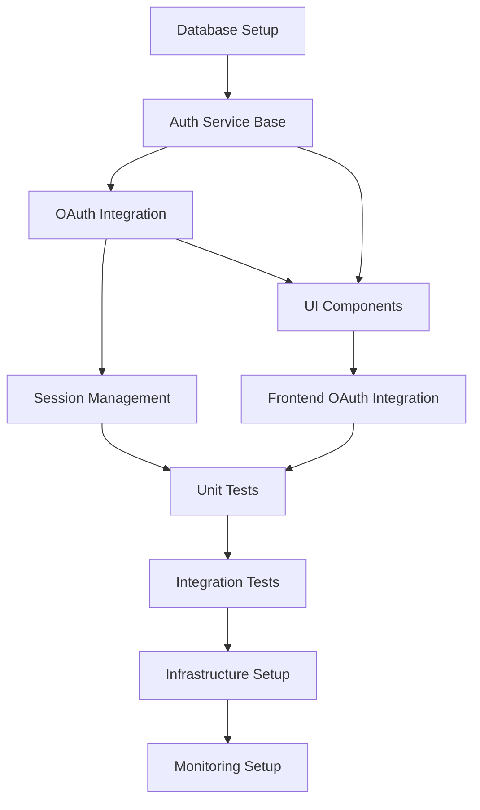

# Tasks - Phase 4: Task Breakdown & Implementation Planning

## Purpose
Break down design specifications into granular, implementable tasks with clear dependencies and priorities.

## Prerequisites Check
- **REQUIRED**: All files from phases 1-3
- **Pattern**: `tasks/<issue-name>/01-*.md`, `tasks/<issue-name>/02-*.md`, `tasks/<issue-name>/03-*.md`

## Process

### 1. Comprehensive Documentation Analysis
Read and analyze all previous phase documents for context.

### 2. Interactive Task Planning Session

#### Implementation Approach Questions

1. What is your preferred development approach?
   A: Incremental development with frequent releases
   B: Feature-complete development before release
   C: MVP-first approach with iterative improvements
   D: Prototype-driven development
   E: Test-driven development (TDD)
   F: Other - please specify

2. Should tasks be organized by: component, feature, or layer?
   A: Organize by UI components and features
   B: Organize by backend services and APIs
   C: Organize by application layers (frontend, backend, database)
   D: Organize by user stories and workflows
   E: Organize by technical dependencies
   F: Other - please specify

3. Are there any specific technical constraints or dependencies?
   A: Existing system integration requirements
   B: Technology stack limitations
   C: Performance requirements that affect implementation
   D: Security requirements that impact design
   E: Timeline constraints affecting approach
   F: Other - please specify

4. What is the testing strategy preference?
   A: Unit tests for individual components
   B: Integration tests for system interactions
   C: End-to-end tests for user workflows
   D: Combination of unit, integration, and E2E tests
   E: Manual testing with documented test cases
   F: Other - please specify

#### Task Granularity Questions

1. How granular should individual tasks be?
   A: Large tasks spanning multiple days
   B: Medium tasks that can be completed in 1-2 days
   C: Small tasks that can be completed in hours
   D: Very granular tasks for detailed tracking
   E: Variable granularity based on complexity
   F: Other - please specify

2. Should UI and backend tasks be separated or combined?
   A: Separate tasks for frontend and backend work
   B: Combined full-stack tasks for features
   C: Separate by component/service boundaries
   D: Organize by user story completion
   E: Flexible based on team structure
   F: Other - please specify

3. Do you want separate tasks for testing and documentation?
   A: Include testing within development tasks
   B: Separate tasks for test creation and execution
   C: Dedicated documentation tasks
   D: Combined implementation and testing tasks
   E: Testing and docs integrated throughout
   F: Other - please specify

4. Should database migrations be standalone tasks?
   A: Separate tasks for each database change
   B: Combined with related feature implementation
   C: Bundled database migrations per release
   D: Standalone tasks only for major schema changes
   E: Include migrations within development tasks
   F: Other - please specify

#### Dependency Analysis Questions

1. Which components can be developed in parallel?
   A: Frontend and backend can be developed simultaneously
   B: Different microservices can be built in parallel
   C: UI components can be developed independently
   D: Database and API layers can be parallel
   E: Most components have sequential dependencies
   F: Other - please specify

2. What are the critical path dependencies?
   A: Database schema must be completed first
   B: Authentication system blocks other features
   C: Core APIs must be ready before frontend
   D: Infrastructure setup is the bottleneck
   E: External integrations control the timeline
   F: Other - please specify

3. Are there any external dependencies or integrations?
   A: Third-party APIs that may have delays
   B: External team dependencies for shared components
   C: Vendor software or license approvals needed
   D: Infrastructure provisioning requirements
   E: Compliance or security reviews required
   F: Other - please specify

4. What foundation/infrastructure tasks must come first?
   A: Database setup and schema creation
   B: Development environment and CI/CD setup
   C: Authentication and authorization framework
   D: Logging, monitoring, and observability setup
   E: Core libraries and shared utilities
   F: Other - please specify

#### Risk Assessment Questions

1. What are the highest risk/complexity areas?
   A: Complex integrations with external systems
   B: Performance-critical components
   C: Security-sensitive authentication/authorization
   D: Data migration or transformation tasks
   E: New technology or unfamiliar frameworks
   F: Other - please specify

2. Which tasks require the most research or investigation?
   A: Technology selection and evaluation
   B: Architecture design and patterns
   C: Performance optimization strategies
   D: Security implementation approaches
   E: Integration with legacy systems
   F: Other - please specify

3. Are there any tasks that might require iteration/refinement?
   A: User interface design and usability
   B: API design and contract definition
   C: Database schema and performance tuning
   D: Algorithm implementation and optimization
   E: Integration testing and debugging
   F: Other - please specify

4. What tasks have external dependencies that could delay progress?
   A: Third-party API access or approvals
   B: Infrastructure provisioning and setup
   C: External team deliverables or reviews
   D: Vendor software licensing or installation
   E: Compliance or legal approvals
   F: Other - please specify

### 3. User Confirmation & Task Generation

Review all task planning information with user before generating breakdown:

**Task Planning Confirmation Questions:**

1. Is the implementation approach appropriate for your needs?
   A: Yes, the approach fits our development style
   B: Need to adjust development methodology
   C: Need to change task organization approach
   D: Need different testing strategy
   E: Other - please specify

2. Are task dependencies correctly identified and prioritized?
   A: Yes, all dependencies are accurate
   B: Missing some task dependencies
   C: Dependencies need reordering
   D: Critical path needs adjustment
   E: Other - please specify

3. Does the risk assessment cover all concerns?
   A: Yes, all risks are identified and addressed
   B: Missing technical risks
   C: Missing project/timeline risks
   D: Need different risk mitigation strategies
   E: Other - please specify

4. Does the task organization meet your development preferences?
   A: Yes, tasks are organized optimally
   B: Need different task granularity
   C: Need different grouping approach
   D: Need parallel vs sequential adjustments
   E: Other - please specify

## Output Files

### `tasks/<issue-name>/04-tasks.md`
Comprehensive task breakdown with integrated user stories:

```markdown
# Task Breakdown: <Issue Name>

## Implementation Overview
**Critical Path**: Database → Authentication → Frontend Integration  
**Parallel Development**: UI Components can be developed alongside API endpoints

## Task Dependencies


## Task Categories

### 🏗️ Foundation Tasks (Priority: High)
**Must be completed before other development can begin**

#### TASK-001: Database Schema Setup
**Priority**: Critical Path  
**Dependencies**: None  

**User Story Integration**:
- Supports: "As a system, I need secure user data storage"
- Enables: All authentication-related user stories

**Description**: Create database tables and indexes for user authentication system

**Subtasks**:
- [ ] Create `users` table with Google OAuth fields
- [ ] Create `sessions` table for JWT token management  
- [ ] Create `audit_logs` table for security tracking
- [ ] Add database indexes for performance
- [ ] Create migration scripts for schema deployment
- [ ] Set up database constraints and validation rules

**Acceptance Criteria**:
- [ ] All tables created with proper data types and constraints
- [ ] Database indexes improve query performance
- [ ] Migration scripts run successfully on clean database
- [ ] Foreign key relationships properly established
- [ ] Database passes validation tests for data integrity

[Continue with all tasks integrating relevant user stories...]

## Quality Gates

### Foundation Gates
- [ ] Database schema passes migration tests
- [ ] OAuth flow completes successfully in development
- [ ] Security headers properly configured
- [ ] Code review completed for all authentication logic

### Integration Gates  
- [ ] Session management handles concurrent users
- [ ] Frontend components pass accessibility tests
- [ ] Integration between frontend and backend tested
- [ ] Error handling covers all identified scenarios

### Testing Gates
- [ ] Unit test coverage >90% for critical paths
- [ ] Integration tests cover all user scenarios  
- [ ] Performance tests meet established benchmarks
- [ ] Security scanning shows no critical vulnerabilities

### Deployment Gates
- [ ] Production deployment successful
- [ ] Monitoring dashboards show green status
- [ ] Rollback procedures tested and documented
- [ ] Operational procedures documented
```

## Rich Documentation Features

### Mermaid Diagrams
- **Gantt Charts**: Project timeline and task dependencies
- **Flowcharts**: Task decision trees and workflows  
- **Network Diagrams**: Resource allocation and team coordination

### Task Management Tables
- **Priority Matrices**: Task importance and urgency mapping
- **Resource Allocation**: Skills and time requirements per task
- **Risk Assessment**: Risk probability and impact analysis

### Implementation Tracking
- **Progress Dashboards**: Visual task completion status
- **Dependency Chains**: Critical path identification
- **Quality Gates**: Milestone completion criteria

## Error Handling
```bash
# Missing design files
if [ ${#design_files[@]} -eq 0 ]; then
    echo "❌ Error: No design files found for issue: $issue_name"  
    echo "📋 Required files pattern: tasks/$issue_name/03-*.md"
    echo "🔧 Run design.md first to create technical specifications"
    exit 1
fi

# Incomplete previous phases
for phase in "${required_phases[@]}"; do
    phase_files=($(ls tasks/$issue_name/$phase-*.md 2>/dev/null))
    if [ ${#phase_files[@]} -eq 0 ]; then
        echo "❌ Error: Phase $phase incomplete"
        echo "📋 Workflow order: concept → requirements → design → tasks"
        exit 1
    fi
done
```

## Integration Points
- **Previous Phases**: Reads all documentation from concept, requirements, and design phases
- **Next Phase**: `implement.md` will read all `04-*.md` task files for execution
- **Quality Assurance**: Task definitions include built-in quality gates
- **Documentation**: Creates multiple specialized documents for comprehensive planning

## Tips for Success
1. **Granular Tasks**: Break complex work into manageable chunks  
2. **Clear Dependencies**: Identify and document all prerequisite relationships
3. **Parallel Opportunities**: Find tasks that can be developed simultaneously
4. **Risk Assessment**: Identify high-risk tasks early and plan mitigation
5. **Quality Gates**: Build testing and validation into the task structure

## Example Workflow
```bash
# Start task breakdown phase
./tasks.md

# System validates all prerequisites
✅ Prerequisites validated. Loading documentation...
📄 Found 8 documentation files
🔍 Complexity Analysis:
  - UI/UX complexity: 12 indicators
  - API/Service complexity: 8 indicators
  - Database complexity: 6 indicators

# Interactive planning session
🎯 Starting comprehensive task breakdown session...
📋 Implementation approach questions...
⚖️ Task granularity preferences...  
🔗 Dependency analysis...
⚠️ Risk assessment...
👥 Resource planning...

# System generates comprehensive task documentation
✅ Task breakdown complete:
  - tasks/google-oauth-integration/04-task-breakdown.md
  - tasks/google-oauth-integration/04-dependencies.md
  - tasks/google-oauth-integration/04-quality-gates.md

Next: Run implement.md with issue name 'google-oauth-integration'
```