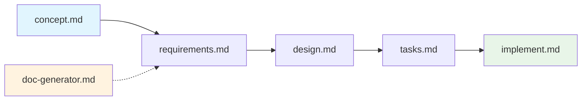

# Workflow Guide - Structured Development System

## Overview
This system implements a structured 5-phase development workflow with a proven concept → requirements → design → tasks → implementation approach, with comprehensive documentation generation and interactive quality control.

## 🚀 Quick Reference

### Starting Points
- **Any New Work** → `concept.md` (universal entry point)
- **Need Documentation** → `doc-generator.md` (independent tool)
- **Workflow Questions** → `workflow.md` (reference guide)

### 5-Phase Development Flow
```
concept.md → requirements.md → design.md → tasks.md → implement.md
```

## Complete Workflow

### The Structured Process


**When to use**: All development work - features, bugs, enhancements, new projects

**Process**:
1. **Concept**: Capture and clarify the problem or opportunity (30-60 min)
2. **Requirements**: Create detailed specifications with user stories (1-3 hours)
3. **Design**: Generate technical architecture and UI design (2-4 hours)
4. **Tasks**: Break down into implementable tasks with dependencies (1-2 hours)
5. **Implementation**: Execute with interactive validation and quality gates (variable)

## Phase Details

### Phase 1: Concept (`concept.md`)
**Purpose**: Problem definition and solution approach
- Universal entry point for all workflows
- Creates `tasks/<issue-name>/01-concept.md`
- Interactive clarification of problem scope and success criteria
- Stakeholder impact analysis with ASCII visualizations

### Phase 2: Requirements (`requirements.md`)
**Purpose**: Comprehensive requirements documentation  
- Validates concept completion before proceeding
- Creates multiple requirement documents (`02-*.md`)
- Industry-standard requirements with user stories and acceptance criteria
- Mermaid user journey diagrams and stakeholder matrices

### Phase 3: Design (`design.md`)
**Purpose**: Technical architecture and UI specifications
- Validates concept + requirements before proceeding
- Creates comprehensive design documentation (`03-*.md`)
- **Integrated UI Flow**: Interactive wireframe → design → interactions → animations
- System architecture, API specs, database design, security architecture

### Phase 4: Tasks (`tasks.md`)
**Purpose**: Granular task breakdown with dependencies
- Validates all previous phases before proceeding
- Creates detailed implementation plan (`04-*.md`)
- Tasks broken into 2-4 hour chunks with clear dependencies
- Gantt charts, resource allocation, risk assessment

### Phase 5: Implementation (`implement.md`)
**Purpose**: Interactive execution with quality validation
- Validates complete planning before proceeding
- Multiple execution modes: Interactive, Autonomous, Custom
- Task-by-task approval with modification capabilities
- Comprehensive implementation logging (`05-*.md`)

## File Organization

### Issue-Based Structure
```
project-root/
├── tasks/
│   └── <issue-name>/           # All files for one issue
│       ├── 00-project-context.md    (optional, from doc-generator)
│       ├── 01-concept.md             (Phase 1)
│       ├── 02-requirements.md        (Phase 2)
│       ├── 02-stakeholder-matrix.md
│       ├── 02-user-stories.md
│       ├── 03-technical-design.md    (Phase 3)
│       ├── 03-ui-design.md          (if UI needed)
│       ├── 03-api-specs.md
│       ├── 04-task-breakdown.md      (Phase 4)
│       ├── 04-implementation-plan.md
│       ├── 05-implementation-log.md  (Phase 5)
│       └── 05-code-changes.md
└── [workflow command files]
```

## Command Reference

### Core Workflow Commands
| Command | Phase | Prerequisites | Duration | Output Files |
|---------|-------|---------------|----------|--------------|
| `concept.md` | 1 | None | 30-60 min | `01-concept.md` |
| `requirements.md` | 2 | Phase 1 | 1-3 hours | `02-*.md` files |
| `design.md` | 3 | Phases 1-2 | 2-4 hours | `03-*.md` files |
| `tasks.md` | 4 | Phases 1-3 | 1-2 hours | `04-*.md` files |
| `implement.md` | 5 | Phases 1-4 | Variable | `05-*.md` + code |

### Supporting Tools
| Command | Purpose | Dependencies | Usage |
|---------|---------|--------------|-------|
| `doc-generator.md` | Create README.md | None | Independent documentation |
| `workflow.md` | Reference guide | None | Process documentation |

## Key Features

### 🔒 Phase Validation
- Each phase validates prerequisites before starting
- Clear error messages with suggested actions
- No phase can proceed without completing previous phases

### 📊 Rich Documentation  
- **Mermaid Diagrams**: Architecture, user journeys, Gantt charts
- **ASCII Wireframes**: UI layouts and system diagrams
- **Structured Tables**: Requirements matrices, API specs, task breakdowns

### 🤖 Interactive Questioning
- Comprehensive clarification loops in each phase
- Context-aware follow-up questions
- No gaps in understanding before proceeding

### 📁 Issue Organization
- All files stored in `tasks/<issue-name>/` directories
- Multiple issues can be developed simultaneously
- Clean separation and context preservation

### ⚡ Execution Modes
- **Interactive Mode**: Task-by-task approval and modification
- **Autonomous Mode**: Automated execution with oversight
- **Custom Mode**: Choose specific tasks to execute

## Usage Patterns

### 1. New Feature Development
```bash
# Complete workflow for new feature
./concept.md          # Define the problem and solution
./requirements.md     # Detailed functional requirements
./design.md          # Technical architecture + UI design  
./tasks.md           # Break down implementation
./implement.md       # Execute with quality gates
```

### 2. Bug Fix or Issue Resolution
```bash
# Same workflow applies to problems
./concept.md          # Analyze root cause and approach
./requirements.md     # Define fix requirements
./design.md          # Plan technical changes
./tasks.md           # Break down fix tasks
./implement.md       # Execute with testing
```

### 3. UI-Heavy Features
```bash
./concept.md          # Include UI requirements in concept
./requirements.md     # Document UX requirements
./design.md          # Choose interactive UI flow
# → Wireframes → Design → Interactions → Animations
./tasks.md           # UI + backend task breakdown
./implement.md       # Integrated implementation
```

### 4. Documentation Only
```bash
./doc-generator.md    # Independent README generation
# Can create project context for main workflow
```

## Decision Tree

### What are you working on?

**🎯 Any Development Work**
- Always start with: `concept.md`
- Follow through all 5 phases for best results
- Use interactive modes for maximum quality

**📚 Documentation Only**  
- Use: `doc-generator.md`
- Creates comprehensive README.md
- Independent of main workflow

**❓ Process Questions**
- Refer to: `workflow.md`
- Complete reference guide
- Troubleshooting and tips

## Best Practices

### Workflow Discipline
1. **Never Skip Phases**: Each phase builds critical context
2. **Answer All Questions**: Comprehensive input leads to better output
3. **Review Before Proceeding**: Validate each phase before continuing
4. **Use Descriptive Issue Names**: Clear kebab-case names (e.g., 'google-auth-integration')

### Quality Assurance
1. **Interactive Mode First**: Use interactive mode for unfamiliar workflows
2. **Validate Early**: Review generated documentation before proceeding
3. **Iterative Refinement**: Return to earlier phases if requirements change
4. **Comprehensive Testing**: Implementation phase includes quality gates

### Team Collaboration
1. **Consistent Issue Names**: Team members can collaborate on same issues
2. **Documentation Review**: Share phase outputs with appropriate stakeholders
3. **Parallel Development**: Multiple issues can be developed simultaneously
4. **Knowledge Sharing**: Generated docs serve as team knowledge base

## Comparison with Previous System

### What Changed
- **Linear Structure**: Replaced flexible entry points with structured 5-phase flow
- **Comprehensive Documentation**: Every phase generates rich, visual documentation
- **Interactive Questioning**: Deep clarification in each phase prevents gaps
- **Issue Organization**: Clean file organization in `tasks/<issue-name>/` directories
- **Prerequisite Validation**: Each phase validates previous phases before proceeding

### What's Better
- **Structured Flow**: Proven concept → requirements → design → tasks → implementation approach
- **Quality Focus**: Built-in validation and quality gates throughout
- **Rich Documentation**: Mermaid diagrams, ASCII wireframes, structured tables
- **Context Preservation**: All issue documentation in one location
- **Interactive Control**: User validation and modification at every step

## Getting Started

### First Time Usage
```bash
# Start with any new work
./concept.md

# System will prompt for issue name
# Follow interactive questioning
# Review generated documentation
# Proceed to next phase when ready
```

### Example: Google OAuth Integration
```bash
./concept.md          # Issue name: "google-oauth-integration"
# → Creates tasks/google-oauth-integration/01-concept.md

./requirements.md     # Validates concept, creates detailed requirements  
# → Creates tasks/google-oauth-integration/02-*.md files

./design.md          # Validates requirements, creates technical design
# → Detects UI needs, offers interactive design flow
# → Creates tasks/google-oauth-integration/03-*.md files

./tasks.md           # Validates design, creates implementation plan
# → Creates tasks/google-oauth-integration/04-*.md files

./implement.md       # Validates planning, executes tasks
# → Interactive mode with task-by-task approval
# → Creates implementation log and actual code
```

This structured system provides comprehensive, quality-focused development workflows with rich documentation and interactive control throughout the entire process.