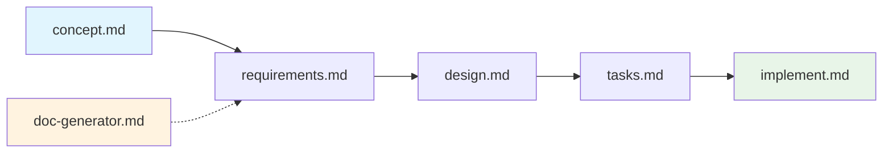

# Workflow Guide - Structured Development System

## Overview
This system implements a structured 5-phase development workflow with comprehensive interactive questioning, rich documentation generation, and quality-focused implementation. Each phase builds critical context for the next, ensuring thorough analysis and high-quality outcomes.

## 🚀 Quick Reference

### Starting Points
- **Any New Work** → `concept.md` (universal entry point with interactive clarification)
- **Need Documentation** → `doc-generator.md` (independent README generation)
- **Process Questions** → this workflow guide (comprehensive reference)

### 5-Phase Development Flow
```
concept.md → requirements.md → design.md → tasks.md → implement.md
```

Each phase includes **interactive questioning**, **user confirmation**, and **rich documentation generation**.

## Complete Workflow

### The Structured Process


**When to use**: All development work - features, bugs, enhancements, new projects

**Key Features**:
- **Interactive Questioning**: Deep clarification sessions in each phase
- **User Confirmation**: Explicit approval before document generation
- **Rich Documentation**: Mermaid diagrams, ASCII wireframes, structured tables
- **Quality Gates**: Built-in validation and quality checkpoints

**Process**:
1. **Concept**: Interactive problem clarification with technical constraint identification (30-60 min)
2. **Requirements**: Product Requirements Document (PRD) creation with acceptance criteria (1-3 hours)  
3. **Design**: Technical Design Document (TDD) with architecture, UI, API, data models, security (2-4 hours)
4. **Tasks**: User stories (tasks) with subtasks and dependencies in single tasks.md (1-2 hours)
5. **Implementation**: Interactive execution with implementation planning and task-by-task approval (variable)

### Enhanced Interactive Questioning System

#### Question Format Standards
All questions use numbered format with alphabetical answers:

**Select One Example:**
```
Question 1: What authentication method do you prefer?
A) JWT tokens
B) Session-based cookies  
C) OAuth integration
D) Multi-factor authentication
E) Other, I'll specify

Your answer: 1-B
```

**Select Multiple Example:**
```
Question 2: Which security features are required? (Select multiple)
A) Password complexity requirements
B) Rate limiting for login attempts
C) Account lockout after failed attempts
D) Email verification for registration
E) Two-factor authentication
F) Password reset functionality
G) Other, I'll specify

Your answer: 2-A, C, D, F
```

**Text Entry Example:**
```
Question 3: Describe your specific password complexity requirements:

Your answer: 3-Minimum 8 characters with uppercase, lowercase, and numbers
```

#### Logical Question Groups
Questions are organized in related groups (3-5 questions per group) for efficiency:

**Phase 1 Groups:**
- Problem Definition & Scope (3-4 questions)
- Solution Approach & Technical Constraints (2-3 questions)

**Phase 2 Groups:**
- Authentication & Security Requirements (4-5 questions)
- User Registration & Profile Management (3-4 questions)
- Business Rules & Validation Logic (3-4 questions)

**Phase 3 Groups:**
- System Architecture & Technology Stack (4-5 questions)
- UI Components Identification (2-3 questions)
- Component-by-Component UI Design (wireframe→flow→interactions→animations)
- API Design & Specifications (3-4 questions)
- Data Models & Database Design (3-4 questions)
- Security Implementation Details (2-3 questions)

**Phase 4 Groups:**
- Task Breakdown Approach (2-3 questions)
- User Story Creation & Complexity (3-4 questions)
- Dependencies & Implementation Order (2-3 questions)

#### Phase Progression Confirmations
Between each logical group and major phase sections:
```
Question 5: ✓ Authentication requirements complete. Ready to move on to user registration requirements? (Y/N)

#### Component-by-Component UI Design Flow
**Imperative Process** - Must complete all identified UI components before proceeding:

```
UI Components Identified: Login Form, Registration Form, User Profile (3 components)

Question X: Ready to begin detailed UI design for all 3 components? (Y/N)
Your answer: X-Y

Working on component 1 of 3: Login Form
- Wireframe design for Login Form... ✓
- User flow for Login Form... ✓  
- Interactions for Login Form... ✓
- Animations for Login Form... ✓

Question X+1: Component 1 complete. Ready to move to component 2 of 3: Registration Form? (Y/N)
Your answer: X+1-Y

Working on component 2 of 3: Registration Form
- Wireframe design for Registration Form... ✓
- User flow for Registration Form... ✓
- Interactions for Registration Form... ✓
- Animations for Registration Form... ✓

[Continues for all components...]

All UI components complete (3 of 3). 

Question X+4: Ready to proceed to API specifications? (Y/N)
Your answer: X+4-Y
```

**UI Design Requirements:**
- Each component gets complete wireframe→flow→interactions→animations treatment
- Cannot proceed to next TDD section until ALL UI components are finished
- User confirms completion of each component before moving to next
- Final confirmation before leaving UI design section

## Phase Details


### Phase 1: Concept (`concept.md`)
**Purpose**: Interactive problem definition and solution approach analysis
- Universal entry point with no prerequisites  
- Creates `tasks/<issue-name>/01-concept.md`
- **Interactive Process**: Logical question groups for problem scope, solution approach, and acceptance criteria
- **Question Groups**: Problem Definition & Scope (3-4 questions), Solution Approach & Technical Constraints (2-3 questions)
- **User Confirmation**: Explicit approval before generating concept document
- Technical constraint identification

### Phase 2: Requirements (`requirements.md`)
**Purpose**: Comprehensive requirements documentation as Product Requirements Document (PRD)
- **Prerequisites**: Validates concept completion before proceeding
- Creates single PRD file (`02-prd.md`)
- **Interactive Process**: Logical question groups for functional/non-functional requirements, business rules
- **Question Groups**: Authentication & Security (4-5 questions), User Registration & Profile (3-4 questions), Business Rules & Validation (3-4 questions)
- **Rich Documentation**: Comprehensive requirements with acceptance criteria included at the end
- **User Confirmation**: Complete review and approval before document generation

### Phase 3: Design (`design.md`)
**Purpose**: Technical Design Document (TDD) creation with comprehensive design specifications
- **Prerequisites**: Validates concept + requirements before proceeding  
- **Interactive Process**: Logical question groups for architecture, technology stack, security design
- **Question Groups**: System Architecture (4-5 questions), UI Components Identification (2-3 questions), API Design (3-4 questions), Data Models (3-4 questions), Security Implementation (2-3 questions)
- **Component-by-Component UI Flow**: **IMPERATIVE** - Each UI component gets wireframe→flow→interactions→animations before proceeding
- **Rich Documentation**: Single consolidated TDD with system architecture, database design, API specs, UI wireframes, and security design
- **User Confirmation**: Full design review and approval before generation

### Phase 4: Tasks (`tasks.md`)
**Purpose**: Task breakdown with user stories and subtasks, including dependency analysis
- **Prerequisites**: Validates all previous phases before proceeding
- **Interactive Process**: Logical question groups for implementation approach, task granularity, risk assessment
- **Question Groups**: Task Breakdown Approach (2-3 questions), User Story Creation & Complexity (3-4 questions), Dependencies & Implementation Order (2-3 questions)
- **Rich Documentation**: Single tasks.md with user stories (tasks) and their subtasks for complexity management, plus dependencies
- **User Confirmation**: Complete planning review before task generation

### Phase 5: Implementation (`implement.md`)
**Purpose**: Interactive execution with multiple modes, implementation planning, and quality validation
- **Prerequisites**: Validates complete planning documentation
- **Execution Modes**: Interactive (task-by-task approval), Autonomous, Custom selection  
- **Interactive Process**: Implementation plan analysis, task-by-task review, modification options, real-time validation
- **Quality Gates**: Comprehensive testing, validation, and deployment readiness

## File Organization

### Issue-Based Structure
```
project-root/
├── tasks/
│   └── <issue-name>/           # All files for one issue
│       ├── 00-project-context.md    (optional, from doc-generator)
│       ├── 01-concept.md             (Phase 1)
│       ├── 02-prd.md                 (Phase 2 - Product Requirements Document)
│       ├── 03-tdd.md                 (Phase 3 - Technical Design Document)
│       ├── 04-tasks.md               (Phase 4 - User stories with subtasks and dependencies)
│       ├── 05-implementation-log.md  (Phase 5)
│       └── 05-code-changes.md
└── [workflow command files]
```

## Command Reference

### Core Workflow Commands
| Command | Phase | Prerequisites | Duration | Output Files |
|---------|-------|---------------|----------|--------------|
| `concept.md` | 1 | None | 30-60 min | `01-concept.md` |
| `requirements.md` | 2 | Phase 1 | 1-3 hours | `02-prd.md` |
| `design.md` | 3 | Phases 1-2 | 2-4 hours | `03-tdd.md` |
| `tasks.md` | 4 | Phases 1-3 | 1-2 hours | `04-tasks.md` |
| `implement.md` | 5 | Phases 1-4 | Variable | `05-*.md` + code |

### Supporting Tools
| Command | Purpose | Dependencies | Usage |
|---------|---------|--------------|-------|
| `doc-generator.md` | Create README.md | None | Independent documentation |

## Key Features

### Phase Validation
- Each phase validates prerequisites with clear error messages
- **Pattern Matching**: Validates required files exist (e.g., `01-*.md`, `02-*.md`)
- **Context Loading**: Reads all previous phase documentation for context
- **Interactive Confirmation**: User must approve before proceeding to document generation

### 📊 Rich Documentation Features
- **Mermaid Diagrams**: Architecture flows, user journeys, Gantt charts, dependency graphs
- **ASCII Wireframes**: UI layouts, system diagrams, data flows  
- **Structured Tables**: Requirements matrices, API specs, task breakdowns, quality gates
- **Visual Elements**: Progress indicators, decision trees, implementation tracking

### 🤖 Enhanced Interactive Process Control
- **Logical Question Groups**: Questions organized in related groups for efficiency (3-5 questions per group)
- **Numbered Questions with Alphabetical Answers**: Clear format (Question 1: A/B/C/D/E, always includes "Other, I'll specify")
- **Three Answer Types**: Select one, select multiple, or enter text
- **Context-Aware Follow-ups**: Smart follow-up questions based on previous answers
- **Phase Progression Confirmations**: Yes/No confirmations before moving to next phase section
- **Component-by-Component UI Design**: Individual wireframe→flow→interactions→animations for each UI component
- **Easy-to-Answer Questions**: MCQ format preferred, minimal long-text requirements
- **User Confirmation Gates**: Explicit approval required before generating any documentation

### 📁 Issue Organization
- All files stored in `tasks/<issue-name>/` directories
- Multiple issues can be developed simultaneously
- Clean separation and context preservation

### ⚡ Implementation Execution Modes
- **Interactive Mode**: Task-by-task approval and modification (recommended for quality)
- **Autonomous Mode**: Automated execution with comprehensive logging
- **Custom Mode**: Selective task execution with user-defined priority

## Usage Patterns

### 1. New Feature Development
```bash
# Complete workflow for new feature
./concept.md          # Define the problem and solution
./requirements.md     # Detailed functional requirements
./design.md          # Technical architecture + UI design  
./tasks.md           # Break down implementation
./implement.md       # Execute with quality gates
```

### 2. Bug Fix or Issue Resolution
```bash
# Same workflow applies to problems
./concept.md          # Analyze root cause and approach
./requirements.md     # Define fix requirements
./design.md          # Plan technical changes
./tasks.md           # Break down fix tasks
./implement.md       # Execute with testing
```

### 3. UI-Heavy Features with Interactive Design Flow
```bash
./concept.md          # Include UI requirements in concept phase
./requirements.md     # Document comprehensive UX requirements  
./design.md          # Select interactive UI design flow
# → Interactive Flow: Wireframes → Visual Design → Interactions → Animations
./tasks.md           # UI + backend integrated task breakdown
./implement.md       # Coordinated implementation with quality gates
```

### 4. Documentation Generation (Independent)
```bash
./doc-generator.md    # Independent README.md generation for any directory
# Creates comprehensive project documentation
# Can generate 00-project-context.md for main workflow integration
```

## Decision Tree

### What are you working on?

**🎯 Any Development Work**
- Always start with: `concept.md`
- Follow through all 5 phases for best results
- Use interactive modes for maximum quality

**📚 Documentation Only**  
- Use: `doc-generator.md`
- Creates comprehensive README.md
- Independent of main workflow

**❓ Process Questions**
- Refer to: This guide
- Complete reference guide
- Troubleshooting and tips

## Best Practices

### Workflow Excellence
1. **Never Skip Phases**: Each phase builds critical context and validation
2. **Embrace Interactive Questioning**: Complete answers lead to superior documentation  
3. **Use Confirmation Gates**: Review and approve each phase before proceeding
4. **Leverage Rich Documentation**: Visual elements improve understanding and communication
5. **Choose Appropriate Implementation Mode**: Interactive for quality, autonomous for speed

### Quality Assurance Best Practices
1. **Interactive Mode for Complex Work**: Use interactive mode for unfamiliar or complex workflows
2. **Comprehensive Input**: Answer all clarification questions thoroughly for better outcomes
3. **Validate Early and Often**: Review generated documentation before proceeding to next phase
4. **Iterative Refinement**: Return to earlier phases when requirements evolve
5. **Quality Gates**: Use built-in validation and testing checkpoints

### Team Collaboration Excellence
1. **Consistent Issue Naming**: Use kebab-case for clear organization (e.g., 'user-auth-system')
2. **Stakeholder Review Integration**: Share appropriate phase outputs with relevant stakeholders
3. **Parallel Development Support**: Multiple issues can be developed simultaneously with clean separation
4. **Knowledge Base Creation**: Generated documentation serves as comprehensive team knowledge base
5. **Context Preservation**: All issue-related files organized in single directories

## Comparison with Previous System

### What's New
- **Interactive Questioning**: Deep clarification sessions in every phase prevent information gaps
- **User Confirmation Gates**: Explicit approval required before generating any documentation
- **Rich Visual Documentation**: Comprehensive Mermaid diagrams, ASCII wireframes, structured tables
- **Implementation Modes**: Multiple execution approaches (Interactive, Autonomous, Custom)
- **Quality Gate Integration**: Built-in validation checkpoints throughout all phases

### Enhanced Features
- **Context-Aware Processing**: Each phase loads and analyzes all previous documentation
- **Prerequisites Validation**: Robust checking ensures proper phase completion before proceeding  
- **Interactive UI Design Flow**: Optional comprehensive wireframe-to-animation design process
- **Task Integration**: User stories integrated throughout task breakdown and implementation
- **Implementation Flexibility**: Task-by-task approval, modification, and selective execution

## Getting Started

### First Time Usage
```bash
# Start with any new work using interactive approach
./concept.md

# System prompts for issue name and begins interactive questioning
# Example session:
# Issue name: "user-authentication-system"
# Problem definition questions...
# Solution approach clarification...
# Acceptance criteria validation...
# User confirmation and document generation
```

### Example: Complete OAuth Integration Workflow
```bash
./concept.md          # Issue name: "google-oauth-integration"
# Interactive clarification session
# → Creates tasks/google-oauth-integration/01-concept.md

./requirements.md     # Validates concept, begins requirements gathering  
# Comprehensive questioning on functional/non-functional requirements
# → Creates tasks/google-oauth-integration/02-*.md files

./design.md          # Validates requirements, starts design process
# Detects UI components needed, offers interactive UI design flow
# Technical architecture and security design questions
# → Creates tasks/google-oauth-integration/03-*.md files

./tasks.md           # Validates design, creates implementation plan
# Task granularity preferences, dependency analysis, risk assessment
# → Creates tasks/google-oauth-integration/04-*.md files

./implement.md       # Validates planning, offers execution modes
# Interactive mode: task-by-task approval and modification
# Quality gates and validation throughout implementation
# → Creates implementation logs and actual code changes
```

This enhanced structured system provides comprehensive, quality-focused development workflows with rich documentation, interactive control, and multiple execution modes for maximum flexibility and quality assurance.