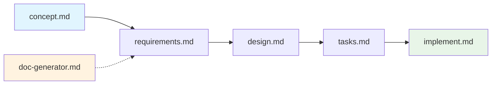

# Workflow Guide - Structured Development System

## Overview
This system implements a structured 5-phase development workflow with comprehensive interactive questioning, rich documentation generation, and quality-focused implementation. Each phase builds critical context for the next, ensuring thorough analysis and high-quality outcomes.

## 🚀 Quick Reference

### Starting Points
- **Any New Work** → `concept.md` (universal entry point with interactive clarification)
- **Need Documentation** → `doc-generator.md` (independent README generation)
- **Process Questions** → `workflow.md` (comprehensive reference guide)

### 5-Phase Development Flow
```
concept.md → requirements.md → design.md → tasks.md → implement.md
```

Each phase includes **interactive questioning**, **user confirmation**, and **rich documentation generation**.

## Complete Workflow

### The Structured Process


**When to use**: All development work - features, bugs, enhancements, new projects

**Key Features**:
- **Interactive Questioning**: Deep clarification sessions in each phase
- **User Confirmation**: Explicit approval before document generation
- **Rich Documentation**: Mermaid diagrams, ASCII wireframes, structured tables
- **Quality Gates**: Built-in validation and quality checkpoints

**Process**:
1. **Concept**: Interactive problem clarification with stakeholder analysis (30-60 min)
2. **Requirements**: Comprehensive requirements gathering with user stories (1-3 hours)  
3. **Design**: Technical architecture with optional interactive UI design flow (2-4 hours)
4. **Tasks**: Granular task breakdown with dependency analysis (1-2 hours)
5. **Implementation**: Interactive execution with task-by-task approval (variable)

## Phase Details

### Phase 1: Concept (`concept.md`)
**Purpose**: Interactive problem definition and solution approach analysis
- Universal entry point with no prerequisites  
- Creates `tasks/<issue-name>/01-concept.md`
- **Interactive Process**: Deep clarification of problem scope, solution approach, and acceptance criteria
- **User Confirmation**: Explicit approval before generating concept document
- Stakeholder impact analysis and constraint identification

### Phase 2: Requirements (`requirements.md`)
**Purpose**: Comprehensive requirements documentation with user story integration
- **Prerequisites**: Validates concept completion before proceeding
- Creates multiple requirement documents (`02-*.md` files)
- **Interactive Process**: Functional/non-functional requirements, business rules, user workflows
- **Rich Documentation**: User stories with acceptance criteria, data models, API requirements
- **User Confirmation**: Complete review and approval before document generation

### Phase 3: Design (`design.md`)
**Purpose**: Technical architecture and comprehensive design specifications
- **Prerequisites**: Validates concept + requirements before proceeding  
- **Interactive UI Flow**: Optional wireframes → design → interactions → animations for UI components
- **Interactive Process**: Architecture decisions, technology stack, security design
- **Rich Documentation**: System architecture, database design, API specs, UI wireframes
- **User Confirmation**: Full design review and approval before generation

### Phase 4: Tasks (`tasks.md`)
**Purpose**: Granular task breakdown with comprehensive dependency analysis
- **Prerequisites**: Validates all previous phases before proceeding
- **Interactive Process**: Implementation approach, task granularity, risk assessment
- **Rich Documentation**: Task breakdown with user story integration, Gantt charts, quality gates
- **User Confirmation**: Complete planning review before task generation

### Phase 5: Implementation (`implement.md`)
**Purpose**: Interactive execution with multiple modes and quality validation
- **Prerequisites**: Validates complete planning documentation
- **Execution Modes**: Interactive (task-by-task approval), Autonomous, Custom selection  
- **Interactive Process**: Task-by-task review, modification options, real-time validation
- **Quality Gates**: Comprehensive testing, validation, and deployment readiness

## File Organization

### Issue-Based Structure
```
project-root/
├── tasks/
│   └── <issue-name>/           # All files for one issue
│       ├── 00-project-context.md    (optional, from doc-generator)
│       ├── 01-concept.md             (Phase 1)
│       ├── 02-requirements.md        (Phase 2)
│       ├── 02-stakeholder-matrix.md
│       ├── 02-user-stories.md
│       ├── 03-technical-design.md    (Phase 3)
│       ├── 03-ui-design.md          (if UI needed)
│       ├── 03-api-specs.md
│       ├── 04-task-breakdown.md      (Phase 4)
│       ├── 04-implementation-plan.md
│       ├── 05-implementation-log.md  (Phase 5)
│       └── 05-code-changes.md
└── [workflow command files]
```

## Command Reference

### Core Workflow Commands
| Command | Phase | Prerequisites | Duration | Output Files |
|---------|-------|---------------|----------|--------------|
| `concept.md` | 1 | None | 30-60 min | `01-concept.md` |
| `requirements.md` | 2 | Phase 1 | 1-3 hours | `02-*.md` files |
| `design.md` | 3 | Phases 1-2 | 2-4 hours | `03-*.md` files |
| `tasks.md` | 4 | Phases 1-3 | 1-2 hours | `04-*.md` files |
| `implement.md` | 5 | Phases 1-4 | Variable | `05-*.md` + code |

### Supporting Tools
| Command | Purpose | Dependencies | Usage |
|---------|---------|--------------|-------|
| `doc-generator.md` | Create README.md | None | Independent documentation |
| `workflow.md` | Reference guide | None | Process documentation |

## Key Features

### Phase Validation
- Each phase validates prerequisites with clear error messages
- **Pattern Matching**: Validates required files exist (e.g., `01-*.md`, `02-*.md`)
- **Context Loading**: Reads all previous phase documentation for context
- **Interactive Confirmation**: User must approve before proceeding to document generation

### 📊 Rich Documentation Features
- **Mermaid Diagrams**: Architecture flows, user journeys, Gantt charts, dependency graphs
- **ASCII Wireframes**: UI layouts, system diagrams, data flows  
- **Structured Tables**: Requirements matrices, API specs, task breakdowns, quality gates
- **Visual Elements**: Progress indicators, decision trees, implementation tracking

### 🤖 Interactive Process Control
- **Deep Questioning**: Comprehensive clarification loops prevent information gaps
- **Context-Aware Follow-ups**: Smart follow-up questions based on previous answers
- **User Confirmation Gates**: Explicit approval required before generating any documentation
- **Modification Support**: Edit and refine approaches during implementation

### 📁 Issue Organization
- All files stored in `tasks/<issue-name>/` directories
- Multiple issues can be developed simultaneously
- Clean separation and context preservation

### ⚡ Implementation Execution Modes
- **Interactive Mode**: Task-by-task approval and modification (recommended for quality)
- **Autonomous Mode**: Automated execution with comprehensive logging
- **Custom Mode**: Selective task execution with user-defined priority

## Usage Patterns

### 1. New Feature Development
```bash
# Complete workflow for new feature
./concept.md          # Define the problem and solution
./requirements.md     # Detailed functional requirements
./design.md          # Technical architecture + UI design  
./tasks.md           # Break down implementation
./implement.md       # Execute with quality gates
```

### 2. Bug Fix or Issue Resolution
```bash
# Same workflow applies to problems
./concept.md          # Analyze root cause and approach
./requirements.md     # Define fix requirements
./design.md          # Plan technical changes
./tasks.md           # Break down fix tasks
./implement.md       # Execute with testing
```

### 3. UI-Heavy Features with Interactive Design Flow
```bash
./concept.md          # Include UI requirements in concept phase
./requirements.md     # Document comprehensive UX requirements  
./design.md          # Select interactive UI design flow
# → Interactive Flow: Wireframes → Visual Design → Interactions → Animations
./tasks.md           # UI + backend integrated task breakdown
./implement.md       # Coordinated implementation with quality gates
```

### 4. Documentation Generation (Independent)
```bash
./doc-generator.md    # Independent README.md generation for any directory
# Creates comprehensive project documentation
# Can generate 00-project-context.md for main workflow integration
```

## Decision Tree

### What are you working on?

**🎯 Any Development Work**
- Always start with: `concept.md`
- Follow through all 5 phases for best results
- Use interactive modes for maximum quality

**📚 Documentation Only**  
- Use: `doc-generator.md`
- Creates comprehensive README.md
- Independent of main workflow

**❓ Process Questions**
- Refer to: `workflow.md`
- Complete reference guide
- Troubleshooting and tips

## Best Practices

### Workflow Excellence
1. **Never Skip Phases**: Each phase builds critical context and validation
2. **Embrace Interactive Questioning**: Complete answers lead to superior documentation  
3. **Use Confirmation Gates**: Review and approve each phase before proceeding
4. **Leverage Rich Documentation**: Visual elements improve understanding and communication
5. **Choose Appropriate Implementation Mode**: Interactive for quality, autonomous for speed

### Quality Assurance Best Practices
1. **Interactive Mode for Complex Work**: Use interactive mode for unfamiliar or complex workflows
2. **Comprehensive Input**: Answer all clarification questions thoroughly for better outcomes
3. **Validate Early and Often**: Review generated documentation before proceeding to next phase
4. **Iterative Refinement**: Return to earlier phases when requirements evolve
5. **Quality Gates**: Use built-in validation and testing checkpoints

### Team Collaboration Excellence
1. **Consistent Issue Naming**: Use kebab-case for clear organization (e.g., 'user-auth-system')
2. **Stakeholder Review Integration**: Share appropriate phase outputs with relevant stakeholders
3. **Parallel Development Support**: Multiple issues can be developed simultaneously with clean separation
4. **Knowledge Base Creation**: Generated documentation serves as comprehensive team knowledge base
5. **Context Preservation**: All issue-related files organized in single directories

## Comparison with Previous System

### What's New
- **Interactive Questioning**: Deep clarification sessions in every phase prevent information gaps
- **User Confirmation Gates**: Explicit approval required before generating any documentation
- **Rich Visual Documentation**: Comprehensive Mermaid diagrams, ASCII wireframes, structured tables
- **Implementation Modes**: Multiple execution approaches (Interactive, Autonomous, Custom)
- **Quality Gate Integration**: Built-in validation checkpoints throughout all phases

### Enhanced Features
- **Context-Aware Processing**: Each phase loads and analyzes all previous documentation
- **Prerequisites Validation**: Robust checking ensures proper phase completion before proceeding  
- **Interactive UI Design Flow**: Optional comprehensive wireframe-to-animation design process
- **Task Integration**: User stories integrated throughout task breakdown and implementation
- **Implementation Flexibility**: Task-by-task approval, modification, and selective execution

## Getting Started

### First Time Usage
```bash
# Start with any new work using interactive approach
./concept.md

# System prompts for issue name and begins interactive questioning
# Example session:
# Issue name: "user-authentication-system"
# Problem definition questions...
# Solution approach clarification...
# Acceptance criteria validation...
# User confirmation and document generation
```

### Example: Complete OAuth Integration Workflow
```bash
./concept.md          # Issue name: "google-oauth-integration"
# Interactive clarification session
# → Creates tasks/google-oauth-integration/01-concept.md

./requirements.md     # Validates concept, begins requirements gathering  
# Comprehensive questioning on functional/non-functional requirements
# → Creates tasks/google-oauth-integration/02-*.md files

./design.md          # Validates requirements, starts design process
# Detects UI components needed, offers interactive UI design flow
# Technical architecture and security design questions
# → Creates tasks/google-oauth-integration/03-*.md files

./tasks.md           # Validates design, creates implementation plan
# Task granularity preferences, dependency analysis, risk assessment
# → Creates tasks/google-oauth-integration/04-*.md files

./implement.md       # Validates planning, offers execution modes
# Interactive mode: task-by-task approval and modification
# Quality gates and validation throughout implementation
# → Creates implementation logs and actual code changes
```

This enhanced structured system provides comprehensive, quality-focused development workflows with rich documentation, interactive control, and multiple execution modes for maximum flexibility and quality assurance.