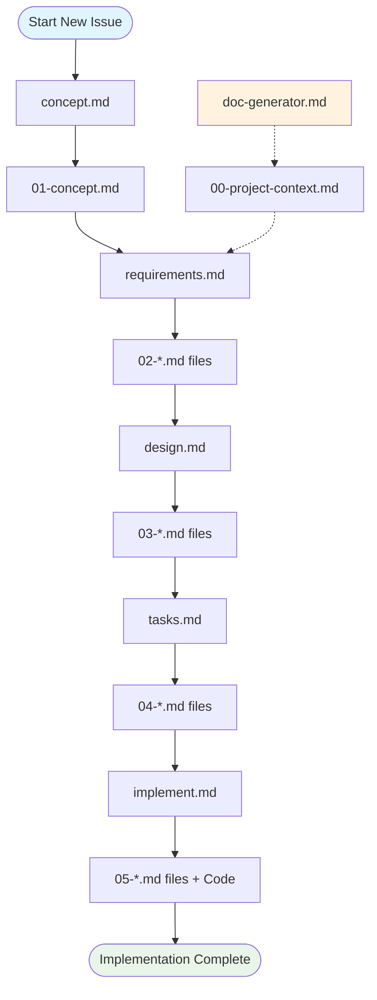

# Workflow - Execution Order & Phase Management

## Purpose
Reference guide outlining the proper execution order of workflow phases, dependencies, and transition requirements for the structured development system.

## Workflow Overview

### 5-Phase Development Process
```
Concept → Requirements → Design → Tasks → Implementation
   01         02          03       04         05
```

Each phase builds upon the previous, creating comprehensive documentation and implementation guidance.

## Phase Execution Order

### Phase 1: Concept Capture
**Command**: `concept.md`
**Purpose**: Capture and clarify the core problem or opportunity
**Prerequisites**: None (entry point)
**Duration**: 30-60 minutes

**Output Files**:
- `tasks/<issue-name>/01-concept.md`

**Success Criteria**:
- Clear problem statement defined
- Success criteria established  
- Stakeholders identified
- Constraints documented

**Transition Requirements**: Concept document must exist before proceeding to requirements

---

### Phase 2: Requirements Documentation
**Command**: `requirements.md`
**Purpose**: Transform concept into detailed, structured requirements
**Prerequisites**: Phase 1 completed
**Duration**: 1-3 hours

**Input Dependencies**:
- **REQUIRED**: `tasks/<issue-name>/01-concept.md`
- **OPTIONAL**: `tasks/<issue-name>/00-project-context.md`

**Output Files**:
- `tasks/<issue-name>/02-requirements.md`
- `tasks/<issue-name>/02-stakeholder-matrix.md`
- `tasks/<issue-name>/02-user-stories.md`
- `tasks/<issue-name>/02-acceptance-criteria.md`

**Success Criteria**:
- Functional requirements documented
- Non-functional requirements specified
- User stories with acceptance criteria
- Business rules defined

**Transition Requirements**: All 02-* files must exist before proceeding to design

---

### Phase 3: Design Documentation
**Command**: `design.md`
**Purpose**: Create comprehensive technical and UI design specifications
**Prerequisites**: Phases 1-2 completed
**Duration**: 2-4 hours

**Input Dependencies**:
- **REQUIRED**: `tasks/<issue-name>/01-concept.md`
- **REQUIRED**: `tasks/<issue-name>/02-requirements.md`
- **OPTIONAL**: All `tasks/<issue-name>/02-*.md` files

**Output Files**:
- `tasks/<issue-name>/03-technical-design.md`
- `tasks/<issue-name>/03-ui-design.md` (if UI components needed)
- `tasks/<issue-name>/03-api-specs.md`
- `tasks/<issue-name>/03-data-models.md`
- `tasks/<issue-name>/03-security-design.md`

**Success Criteria**:
- System architecture defined
- API specifications documented
- Database design completed
- UI wireframes and designs (if applicable)
- Security considerations addressed

**Transition Requirements**: All 03-* files must exist before proceeding to task breakdown

---

### Phase 4: Task Breakdown
**Command**: `tasks.md`
**Purpose**: Break down design into granular, implementable tasks
**Prerequisites**: Phases 1-3 completed
**Duration**: 1-2 hours

**Input Dependencies**:
- **REQUIRED**: All files from phases 1-3
- **PATTERN**: `tasks/<issue-name>/{01,02,03}-*.md`

**Output Files**:
- `tasks/<issue-name>/04-task-breakdown.md`
- `tasks/<issue-name>/04-implementation-plan.md`
- `tasks/<issue-name>/04-dependencies.md`
- `tasks/<issue-name>/04-timeline.md`

**Success Criteria**:
- Tasks broken into 2-4 hour chunks
- Dependencies clearly identified
- Priority and timeline established
- Resource requirements defined

**Transition Requirements**: All 04-* files must exist before proceeding to implementation

---

### Phase 5: Implementation
**Command**: `implement.md`
**Purpose**: Execute tasks with user validation and approval
**Prerequisites**: Phases 1-4 completed
**Duration**: Variable (based on task complexity)

**Input Dependencies**:
- **REQUIRED**: All files from phases 1-4
- **PATTERN**: `tasks/<issue-name>/{01,02,03,04}-*.md`

**Output Files**:
- `tasks/<issue-name>/05-implementation-log.md`
- `tasks/<issue-name>/05-code-changes.md`
- `tasks/<issue-name>/05-test-results.md`
- Actual code files in project structure

**Success Criteria**:
- All tasks completed or explicitly skipped
- Code generated and tested
- Quality gates passed
- Documentation updated

**Transition Requirements**: Ready for deployment and production use

## File Organization Structure

### Directory Layout
```
project-root/
├── tasks/
│   └── <issue-name>/
│       ├── 00-project-context.md    (optional, from doc-generator)
│       ├── 01-concept.md             (Phase 1 output)
│       ├── 02-requirements.md        (Phase 2 outputs)
│       ├── 02-stakeholder-matrix.md
│       ├── 02-user-stories.md
│       ├── 02-acceptance-criteria.md
│       ├── 03-technical-design.md    (Phase 3 outputs)
│       ├── 03-ui-design.md
│       ├── 03-api-specs.md
│       ├── 03-data-models.md
│       ├── 03-security-design.md
│       ├── 04-task-breakdown.md      (Phase 4 outputs)
│       ├── 04-implementation-plan.md
│       ├── 04-dependencies.md
│       ├── 04-timeline.md
│       ├── 05-implementation-log.md  (Phase 5 outputs)
│       ├── 05-code-changes.md
│       └── 05-test-results.md
├── concept.md                        (Phase commands)
├── requirements.md
├── design.md
├── tasks.md
├── implement.md
├── doc-generator.md                  (Independent tool)
└── workflow.md                       (This file)
```

## Dependency Flow Chart



## Validation Logic

### Phase Prerequisites Check
Each phase includes built-in validation:

```bash
# Example validation pattern used by each phase
validate_prerequisites() {
    local issue_name=$1
    local required_phases=("$@")
    
    for phase in "${required_phases[@]}"; do
        phase_files=($(ls tasks/$issue_name/$phase-*.md 2>/dev/null))
        if [ ${#phase_files[@]} -eq 0 ]; then
            echo "❌ Error: Phase $phase incomplete for issue: $issue_name"
            echo "📋 Required files pattern: tasks/$issue_name/$phase-*.md"
            exit 1
        fi
    done
    
    echo "✅ Prerequisites validated"
}
```

### File Existence Patterns
| Phase | Required Pattern | Description |
|-------|------------------|-------------|
| **concept.md** | None | Entry point - creates first files |
| **requirements.md** | `01-*.md` | Needs concept completion |
| **design.md** | `01-*.md`, `02-*.md` | Needs concept + requirements |
| **tasks.md** | `01-*.md`, `02-*.md`, `03-*.md` | Needs all previous phases |
| **implement.md** | `01-*.md` through `04-*.md` | Needs complete planning |

## Common Workflow Patterns

### 1. Complete Feature Development
```bash
# Full workflow for new feature
./concept.md          # 30-60 min: Problem definition
./requirements.md     # 1-3 hours: Detailed requirements  
./design.md          # 2-4 hours: Technical design
./tasks.md           # 1-2 hours: Task breakdown
./implement.md       # Variable: Implementation
```

### 2. UI-Heavy Feature
```bash
# Workflow with enhanced UI design
./concept.md          # Define UI requirements in concept
./requirements.md     # Document UI/UX requirements
./design.md          # Choose interactive UI flow
# → Wireframe → Design → Interactions → Animations
./tasks.md           # Break down UI + backend tasks
./implement.md       # Interactive implementation
```

### 3. Bug Fix or Issue Resolution
```bash
# Start with problem analysis
./concept.md          # Analyze root cause and solution
./requirements.md     # Define fix requirements
./design.md          # Plan technical changes
./tasks.md           # Break down fix into tasks
./implement.md       # Execute with validation
```

### 4. Documentation Generation
```bash
# Independent documentation creation
./doc-generator.md    # Creates README.md in any directory
# Can be used to create 00-project-context.md for main workflow
```

## Error Handling & Recovery

### Common Error Scenarios

#### Missing Prerequisites
```
❌ Error: Phase 02 (requirements) incomplete for issue: user-auth
📋 Required files pattern: tasks/user-auth/02-*.md
🔧 Run requirements.md with issue name 'user-auth'
```

**Resolution**: Complete the missing phase before proceeding

#### Invalid Issue Names
```
❌ Error: Issue name must be lowercase letters, numbers, and hyphens only
Examples: 'user-authentication', 'api-rate-limiting', 'dashboard-redesign'
```

**Resolution**: Use kebab-case naming convention

#### Directory Creation Failures
```
❌ Error: Could not create directory tasks/issue-name
Check permissions and try again
```

**Resolution**: Verify write permissions in project directory

### Recovery Procedures

#### Partial Completion Recovery
If a phase is interrupted:
1. Check existing files in `tasks/<issue-name>/`
2. Identify which phase was incomplete
3. Re-run the incomplete phase
4. System will detect existing files and offer to continue or restart

#### File Corruption Recovery
If documentation files become corrupted:
1. Use git history to recover previous versions
2. Re-run affected phases with existing context
3. System validation will identify missing or invalid content

## Quality Gates & Checkpoints

### Phase Transition Checkpoints
- **After Concept**: Stakeholders agree on problem definition
- **After Requirements**: Technical team validates feasibility
- **After Design**: Architecture review completed
- **After Tasks**: Resource allocation confirmed
- **After Implementation**: Quality gates passed, ready for deployment

### Documentation Quality Standards
- All phases must generate required output files
- Mermaid diagrams must render correctly
- ASCII wireframes must be properly formatted
- Tables must be complete and well-structured

## Integration with External Tools

### Version Control Integration
```bash
# Recommended git workflow with phases
git checkout -b feature/issue-name
./concept.md
git add tasks/issue-name/01-*.md && git commit -m "Add concept for issue-name"

./requirements.md
git add tasks/issue-name/02-*.md && git commit -m "Add requirements for issue-name"

# Continue for each phase...
```

### Project Management Integration
- Issue names can match Jira ticket IDs or GitHub issue numbers
- Documentation can be linked from project management tools
- Task breakdowns can be imported into project tracking systems

## Tips for Success

### Workflow Best Practices
1. **Don't Skip Phases**: Each phase builds critical context for the next
2. **Use Descriptive Issue Names**: Clear names improve organization
3. **Review Before Proceeding**: Validate each phase output before continuing
4. **Iterate When Needed**: Return to earlier phases if requirements change
5. **Maintain Documentation**: Keep generated docs updated as implementation evolves

### Collaboration Guidelines
1. **Share Issue Names**: Team members can work on same issues using consistent naming
2. **Review Documentation**: Have technical and business stakeholders review appropriate phases  
3. **Parallel Development**: Multiple issues can be developed simultaneously
4. **Knowledge Sharing**: Generated documentation serves as team knowledge base

### Performance Optimization
1. **Batch Questions**: Answer all clarification questions in one session per phase
2. **Reuse Context**: Use `doc-generator.md` to create reusable project context
3. **Template Responses**: Develop standard responses for common question patterns
4. **Incremental Updates**: Update only changed sections rather than regenerating everything

## Troubleshooting Guide

| Issue | Cause | Solution |
|-------|-------|----------|
| Command not found | File permissions or path issues | Check file permissions, use `./command.md` |
| Prerequisites not met | Skipped phase or incomplete execution | Run missing phases in order |
| Files not generated | Process interrupted or error occurred | Check error messages, re-run phase |
| Documentation quality issues | Incomplete answers or technical errors | Review generated content, re-run with better input |
| Issue name conflicts | Multiple people using same issue name | Coordinate team naming or use prefixes |

This workflow system provides a structured, thorough approach to software development that ensures comprehensive documentation, thoughtful design, and quality implementation.